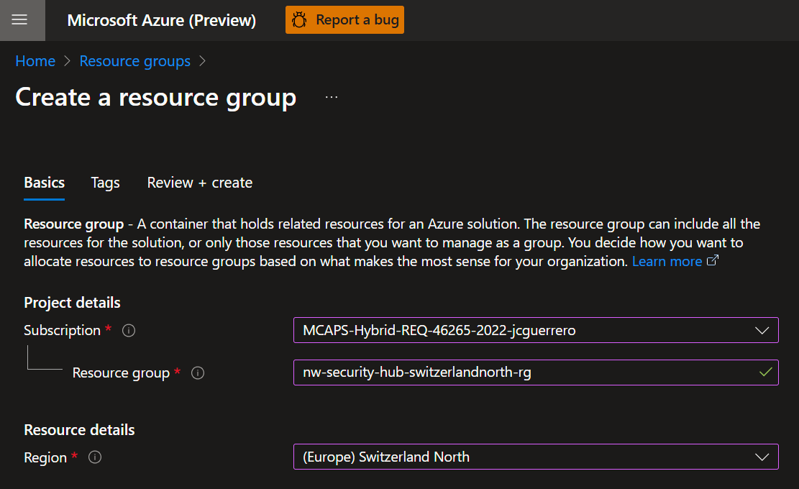
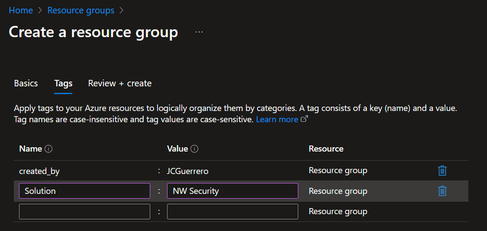
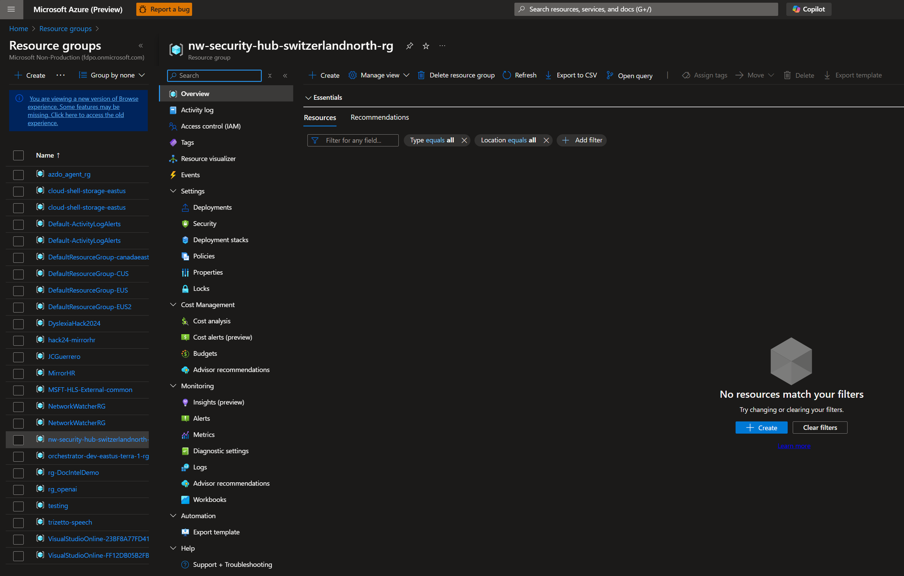
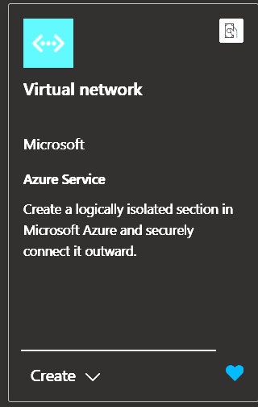
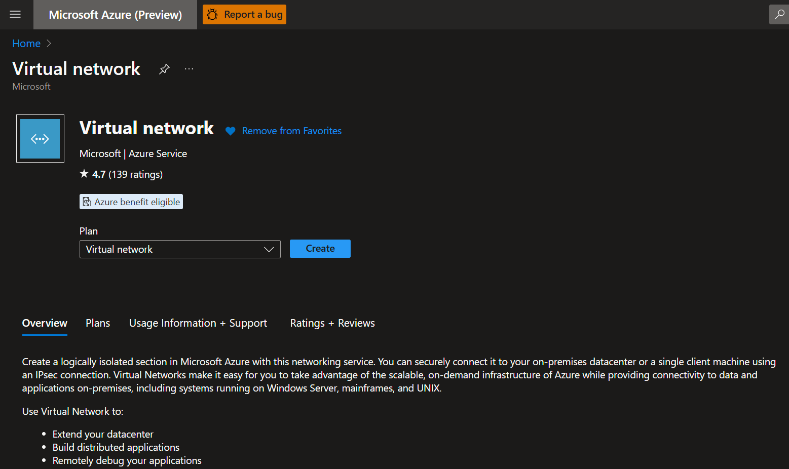
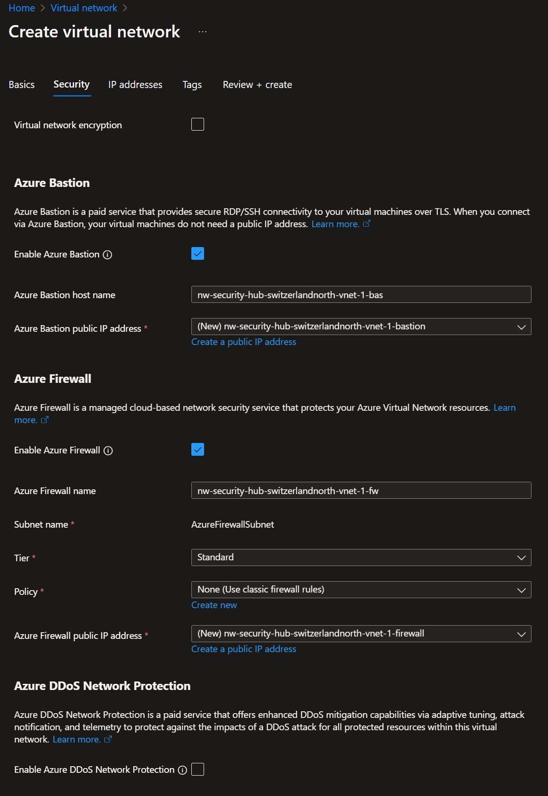
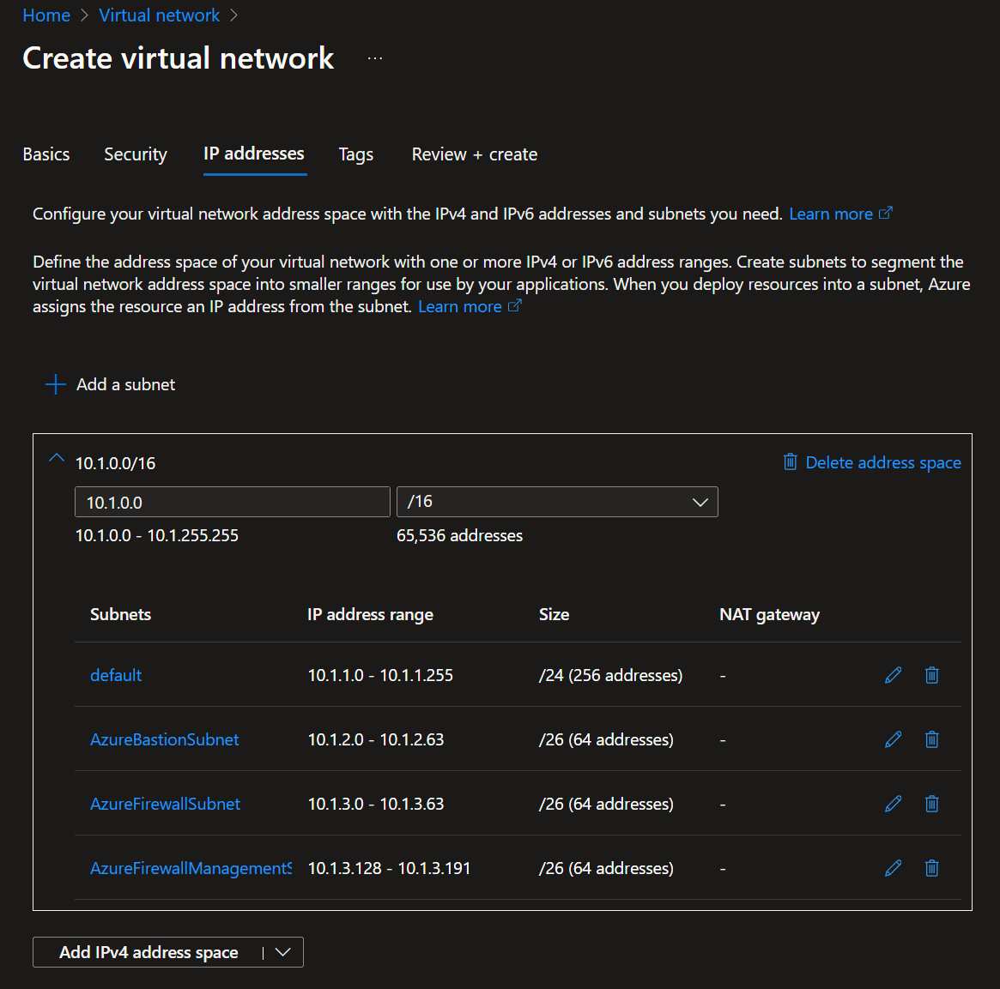

# Step 1: Virtual Networks

Before creating resources, see [Naming conventions](./tutorial.md#naming-conventions).

## Hub Resources

When doing a multi-region Hub-Spoke network architecture, you want your hub resources to be deployed in a region that is central to your spoke regions. In this case, we will deploy the hub resources in Switzerland North, but only because there is a joke to be made about "Switzerland's neutral role".

### Resoruce group

#### Create

##### Basic

Create a `nw-security-hub-switzerlandnorth-1-rg` resource group in Switzerland North.

##### Tags

Add tags as needed

And the end result should look like this:

### Virtual Network

#### Market place

Look for a "Virtual network" in the Azure Portal's market place

Make sure you selected the right one, by `Microsoft | Azure Service`

#### Create

##### Basic

Create a `nw-security-hub-switzerlandnorth-1-vnet` virtual network in Switzerland North.

##### Security

Toggle ON: **Bastion** & **Firewall**. We'll talk more about these below.

###### Bastion

Before we begin, be mindful that this is an expensive resource, which is charged by the hour.

1. Toggle ON the _"Enable Azure Bastion"_. Add a `nw-security-hub-switzerlandnorth-1-vnet-bas` name.
1. For the **Public address**
  - You can just let the default pre-selected '(New)'. It will create a new public IP address. It will add a `-bastion` suffix tho, so it will be `nw-security-hub-switzerlandnorth-1-vnet-bas-bastion`.
  - So, if your OCD is anything like mine, and you are particular about naming, you can
    1. Click on `Create a public IP address`
    1. Create a new one, naming it `nw-security-hub-switzerlandnorth-1-vnet-bas-pip` (see how the suffix just keep adding up?)
    1. Go back to the previous screen and select the newly created public IP address.

###### Firewall

Before we begin, be mindful that this is an expensive resource, which is charged by the hour.

1. Toggle ON the _"Enable Azure Firewall"_. Add a `nw-security-hub-switzerlandnorth-1-vnet-fw` name.
1. **Tier**: You'll need at least **Standard** for this exercise.
1. **Policy**: _"None (Use classic firewall rules)"_
1. **Azure Firewall Public IP Address**: Same as above,
  - You can just let the default pre-selected '(New)'. It will create a new public IP address. It will add a `-firewall` suffix tho, so it will be `nw-security-hub-switzerlandnorth-1-vnet-fw-firewall`.
  - But if you want to name it, you can create a new one, naming it `nw-security-hub-switzerlandnorth-1-vnet-fw-pip` and select it.

##### IP Address

Your Hub VNet will be on `10.1.X.X`. Remember that all VNets will communicate, so planning ahead to not have IP collision is important.

Both Azure Bastion and Azure Firewall need to have their own **delegated subnets**. The names are reserved standard and cannot be changed:

- `AzureBastionSubnet` for Azure Bastion
- `AzureFirewallSubnet` for Azure Firewall

Furthermore, we'll need a `default` subnet (for the lack of a better name) to host any other resource we want (NIC interfaces, VMs, etc).

