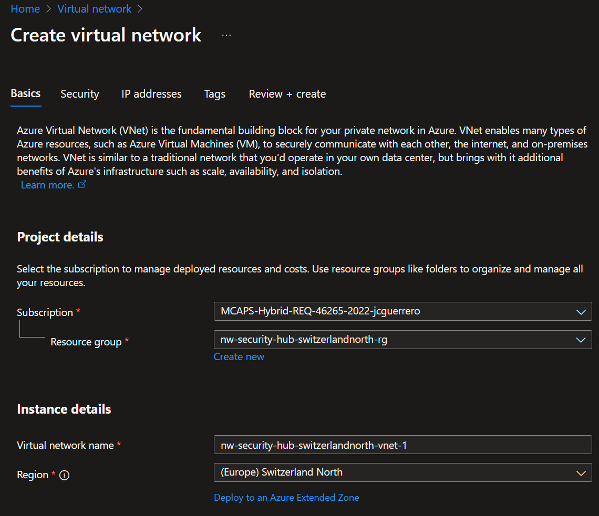

# Step 1: Virtual Networks

Before creating resources, see [Naming conventions](./tutorial.md#naming-conventions).

## Hub Resources

When doing a multi-region Hub-Spoke network architecture, you want your hub resources to be deployed in a region that is central to your spoke regions. In this case, we will deploy the hub resources in Switzerland North, but only because there is a joke to be made about "Switzerland's neutral role".

### Resoruce group

#### Create

1. Create a `nw-security-hub-switzerlandnorth-1-rg` resource group in Switzerland North.

2. Add tags as needed

And the end result should look like this:

### Virtual Network

#### Create

1. Look for a "Virtual network" in the Azure Portal's market place

Make sure you selected the right one, by `Microsoft | Azure Service`

1. Create a `nw-security-hub-switzerlandnorth-1-vnet` virtual network in Switzerland North.

##### Bastion

1. Enable **Bastion**. Add a `nw-security-hub-switzerlandnorth-1-vnet-bas` name.
1. For the **Public address**
  - You can just let the default preselected '(New)'. It will create a new public IP address.
  - But if you are particular about naming, you can
    1. Create a new one, naming it `nw-security-hub-switzerlandnorth-1-vnet-bas-pip`
