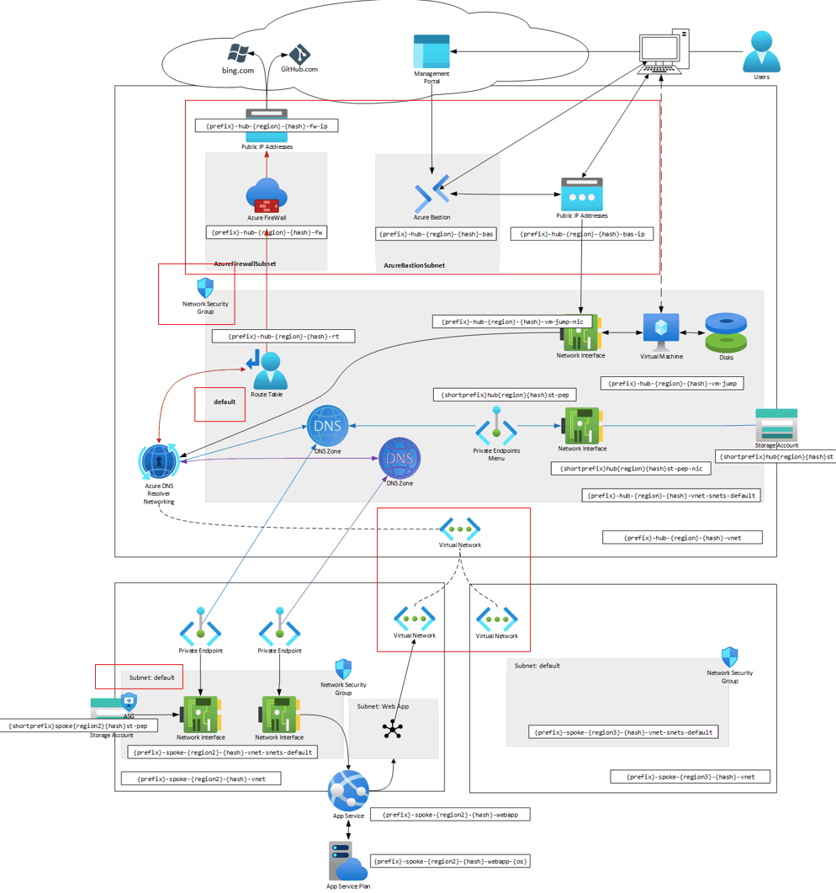

# Module 1: Virtual Networks

## Before you begin

Before creating resources, see [Naming conventions](../README.md#naming-conventions).

## Table of Contents

1. [Create Hub VNet & resources](./hub.md)
1. [Create Spoke VNet & resources](./spoke.md)
   1. VPN peerings

## Status Check

### Diagram

You can visualize the progress of your network

1. Go to any VNet
1. Go to Monitoring > Diagram
1. Expand the components

You should see something like this.-

## Finished

[Go back to parent](../README.md)
