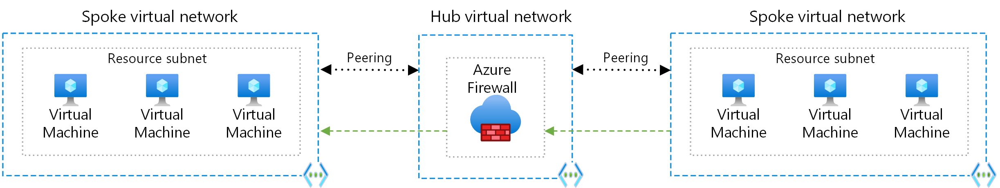
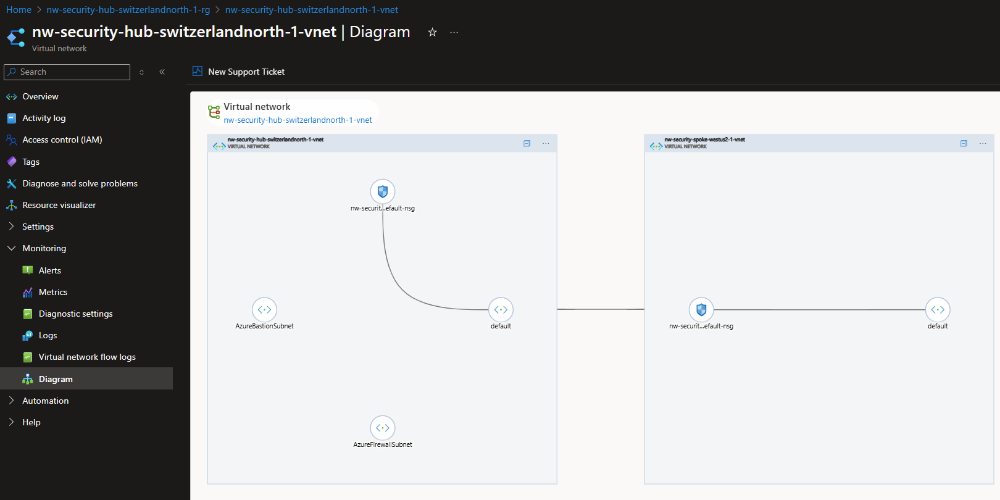

# Module 1: Virtual Networks

## Table of Contents

1. [Hub & Spoke architecture](#hub--spoke-architecture)
1. [Networks](#networks)
1. [Topics](#topics)
1. [Status Check](#status-check)

## Topics

1. [Create Hub VNet & resources](./hub.md)
1. [Create Spoke VNet & resources](./spoke.md)
   1. VPN peerings

## Hub & Spoke architecture

Look at the URL(s) we've included on [Hub-and-Spoke Architectures](../../../README.md#hub-spoke).

This module is part of a series of modules that will help you create a Hub & Spoke network architecture.

The idea is that we can centralize some services to:

- Reduce maintenance loads
- Reduce **operational costs** (services like **Azure Firewall** and **Azure Bastion** can be expensive!)

At a high level, it looks like this.-

> _"How is this applicable to ISE?"_ you might ask.

Well, you can have multiple environments (Dev, Test, Prod) in the same subscription, and still keep them isolated.

The above example exceeds the scope of this tutorial, but it's good to know that you can expand on this.

## Networks

- `10.x.x.x`: Our virtual networks
  - `1.x.x`: Hub
    - `0.0-63`: Azure Bastion
    - `1.0-63`: Azure Firewall
    - `4-7.x`: `default` subnet
  - `2.x.x`: US Spoke
    - `0.x/22`: `default` subnet
  - `3.x.x`: TBD

## Status Check

### Diagram

You can visualize the progress of your network

1. Go to any VNet
1. Go to Monitoring > Diagram
1. Expand the components

You should see something like this.-

## Next Steps

[Go back to parent](../README.md)
