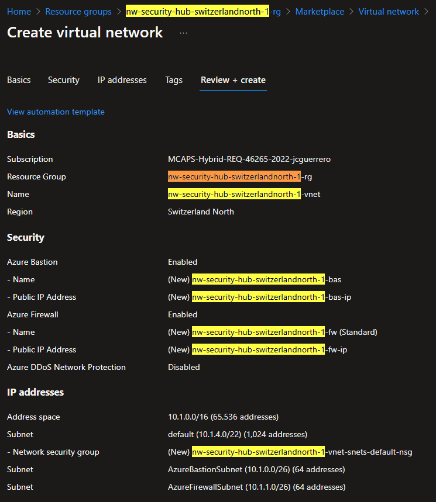

# Hub VNet

## Description

When doing a multi-region Hub-Spoke network architecture, you want your hub resources to be deployed in a region that is central to your spoke regions. In this case, we will deploy the hub resources in Switzerland North, but only because there is a joke to be made about "Switzerland's neutral role".

## Resources

In this chapter we'll be creating the following resources

- [R]esource [G]roup: `{my-prefix}-hub-{region}-{id}-rg`
  - [V]irtual [Net]work: `{my-prefix}-hub-{region}-{id}-vnet`: `10.1.x.x`
    - [Bas]tion: `{my-prefix}-hub-{region}-{id}-bas`
      - [P]ublic [IP]: `{my-prefix}-hub-{region}-{id}-bas-pip`
    - [F]ire[w]all: `{my-prefix}-hub-{region}-{id}-fw`
      - [P]ublic [IP]: `{my-prefix}-hub-{region}-{id}-fw-pip`
    - Subnets
      - `AzureBastionSubnet`: `10.1.0.x/26`
      - `AzureFirewallSubnet`: `10.1.1.x/26`
      - `default`: `10.1.4.x/22`
        - NSG: `{my-prefix}-hub-{region}-{id}-vnet-snet-default-nsg`

Where:

- `{some-short-prefix}`: Your username (i.e. `johndoe`)
- `{region}`: The region of your Hub VNet (i.e. `switzerlandnorth`)
- `{id}`: The unique identifier of the spoke VNet (i.e. `1`)

### Resoruce group

#### Create

##### Basic

Create a `{my-prefix}-hub-{region}-{id}-rg` resource group in Switzerland North.

##### Tags

Add tags as needed

And the end result should look like this:

### [V]irtual [Net]work

#### Market place

Look for a "Virtual network" in the Azure Portal's market place

Make sure you selected the right one, by `Microsoft | Azure Service`

#### Create

##### Basics

Create a `{my-prefix}-hub-{region}-{id}-vnet` virtual network in Switzerland North.

##### Security

Toggle ON: **Bastion** & **Firewall**. We'll talk more about these below.

###### Bastion

> [!CAUTION]
> Be mindful that this is an **expensive resource**, which is **charged by the hour**.

1. Toggle ON the _"Enable Azure Bastion"_. Add a `{my-prefix}-hub-{region}-{id}-bas` name.
1. For the **Public address**

- You can just let the default pre-selected '(New)'. It will create a new public IP address. It will add a `-bastion` suffix tho, so it will be `{my-prefix}-hub-{region}-{id}-bastion`, which is confusing.
- So, if your OCD is anything like mine, and you are particular about naming, you can
  1. Click on `Create a public IP address`
  1. Create a new one, naming it `{my-prefix}-hub-{region}-{id}-bas-pip` (see how the suffix just keep adding up?)
  1. Go back to the previous screen and select the newly created public IP address.

###### Firewall

> [!CAUTION]
> Be mindful that this is an **expensive resource**, which is **charged by the hour**.

Before we begin, be mindful that this is an expensive resource, which is charged by the hour.

1. Toggle ON the _"Enable Azure Firewall"_. Add a `{my-prefix}-hub-{region}-{id}-fw` name.
1. **Tier**: You'll need at least **Standard** for this exercise.
1. **Policy**: _"None (Use classic firewall rules)"_
1. **Azure Firewall Public IP Address**: Same as above,

- You can just let the default pre-selected '(New)'. It will create a new public IP address. It will add a `-firewall` suffix tho, so it will be `{my-prefix}-hub-{region}-{id}-firewall`, which is confusing.
- But if you want to name it, you can create a new one, naming it `{my-prefix}-hub-{region}-{id}-fw-pip` and select it.

##### IP Address

When you first open the "IP addresses" tab, you'll see following.

And eventho we'll be working on `10.x.x.x`, we'll make some changes.
Remember that all VNets will communicate, so planning ahead to not have IP collision is important.

Furthermore, we'll skip network optimization for now, and just create distinct subnets that are easy to read.

Both **Azure Bastion** and **Azure Firewall** need to have their own **delegated subnets**. The names are reserved standard and cannot be changed:

- `AzureBastionSubnet`
- `AzureFirewallSubnet`

> Quiz: _"How many IP addresses does Bastion need'?"_

We'll also need a `default` subnet (for the lack of a better name) to host any other resource we want (NIC interfaces, VMs, etc).

Now, you might be considering a setup like this

But the only problem is

- What happens when you need MORE than 255 IP addresses?
- You cannot extend your subnet past `10.1.1.x` into `10.1.2.x`, because it would collide with `AzureBastionSubnet`

Because of this, we'll push the smaller/well known subnets to the beginning of our IP address planning, and let the `default` subnet take some of the larger range.
We'll reserve all the `10.1.4.x` addresses for this subnet, w/ `1024` IP addresses.

So, we'll end up with 3 subnets:

| Subnet                | IP family | CIDR Block    | Size    | Notes    |
| --------------------- | --------- | ------------- | ------- | -------- |
| `AzureBastionSubnet`  | `0.x`     | `10.1.0.0/26` | `64`    | Needs 50 |
| `AzureFirewallSubnet` | `1.x`     | `10.1.1.0/26` | `64`    |          |
| `default`             | `4-7.x`   | `10.1.4.0/22` | `1,024` |          |

After our changes, it should look something like this.-

##### Review

Give 1 good look before creating all the resources.

If everything looks good, hit that `[ Create ]` button.

### [N]etwork [S]ecurity [G]roup

1. Create a Network security group
1. Attach it to the `default` subnet.

We'll configure it later down the road

## Status Check

### Snapshot

Your resources should look like this.-

### Resource visualizer

You can see the relationship between the Firewall `fw` and the Public IP `fw-pip` in the resource visualizer.

## Costs

Both **Azure Bastion** & **Azure Firewall** are expensive resources, which are charged by the hour.

So keep an eye on them.

## Next Steps

[Go back to module](./README.md)
