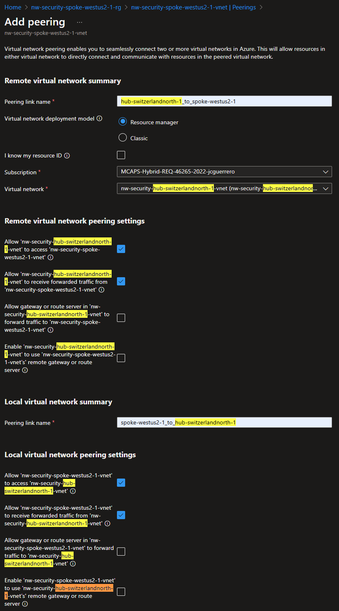
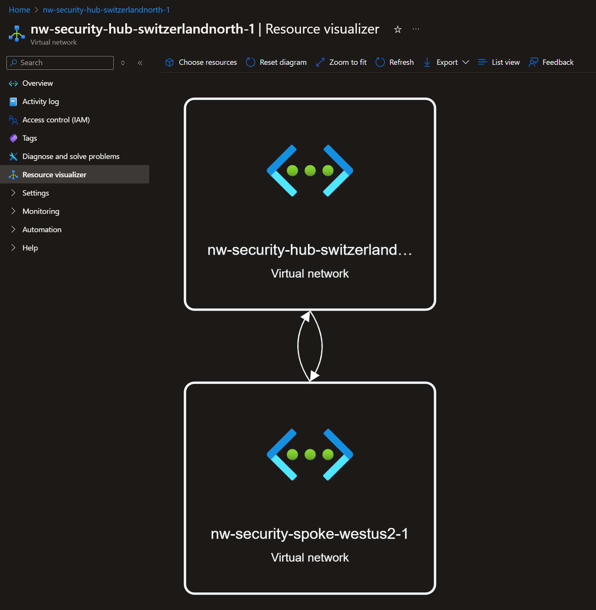

# VNets peerings

Now we have 2 VNets with address spaces

- `10.1.x.x`: Hub
- `10.2.x.x`: Spoke

We need to connect them so the traffic can flow between them.

> [!TIP]
> When you create a virtual network peering between two virtual networks, the system adds a route for each address range within the address space of each virtual network involved in the peering.

## Add Peering

1. Navigate to any `vnet`
1. Go to **Settings** > **Peerings**
1. Click on [ **+ Add** ]

Note that you can allow traffic:

- [x] Hub > Spoke
- [x] Spoke > Hub

For this excercise will check some of the boxes.

### Remote virtual network summary

- Peering link name: `{that-vnet}_to_{this-vnet}`
- Virtual network deployment model: `Resource Manager` (leave it as is)
- Subscription: `{Your subscription}`
- Virtual network: `{that-vnet}`

### Local virtual network summary

- Peering link name: `{this-vnet}_to_{that-vnet}`

### Remote|Local virtual network peering settings

| Permission                                                                     | Remote | Local |
| ------------------------------------------------------------------------------ | ------ | ----- |
| Allow {that vnet} to access {this vnet}                                        | `x`    | `x`   |
| Allow {that vnet} to receive forwarded traffic from {this vnet}                | `x`    | `x`   |
| Allow gateway or route server in {that vnet} to forward traffic to {this vnet} |        |       |
| Enable {that vnet} tp use {this vnet}'s remote gateway or route server         |        |       |

We can later come back and remove permissions to reinforce security.

## Resource Visualizer

Under the "Resource visualizer" you should see something like this:

Note that the 2 arrows represent the peering between the 2 VNets.

- [x] Hub > Spoke
- [x] Spoke > Hub

## Next Steps

[Go back to module](./README.md)
