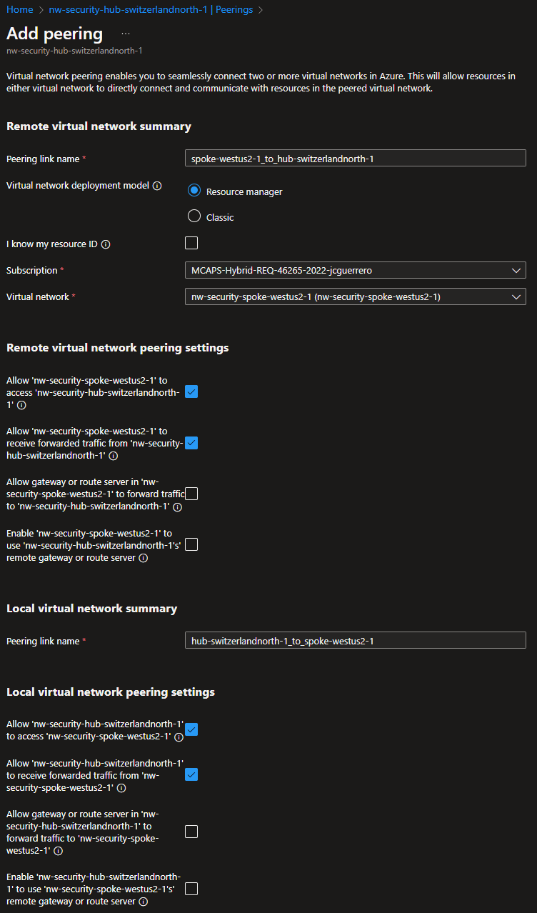
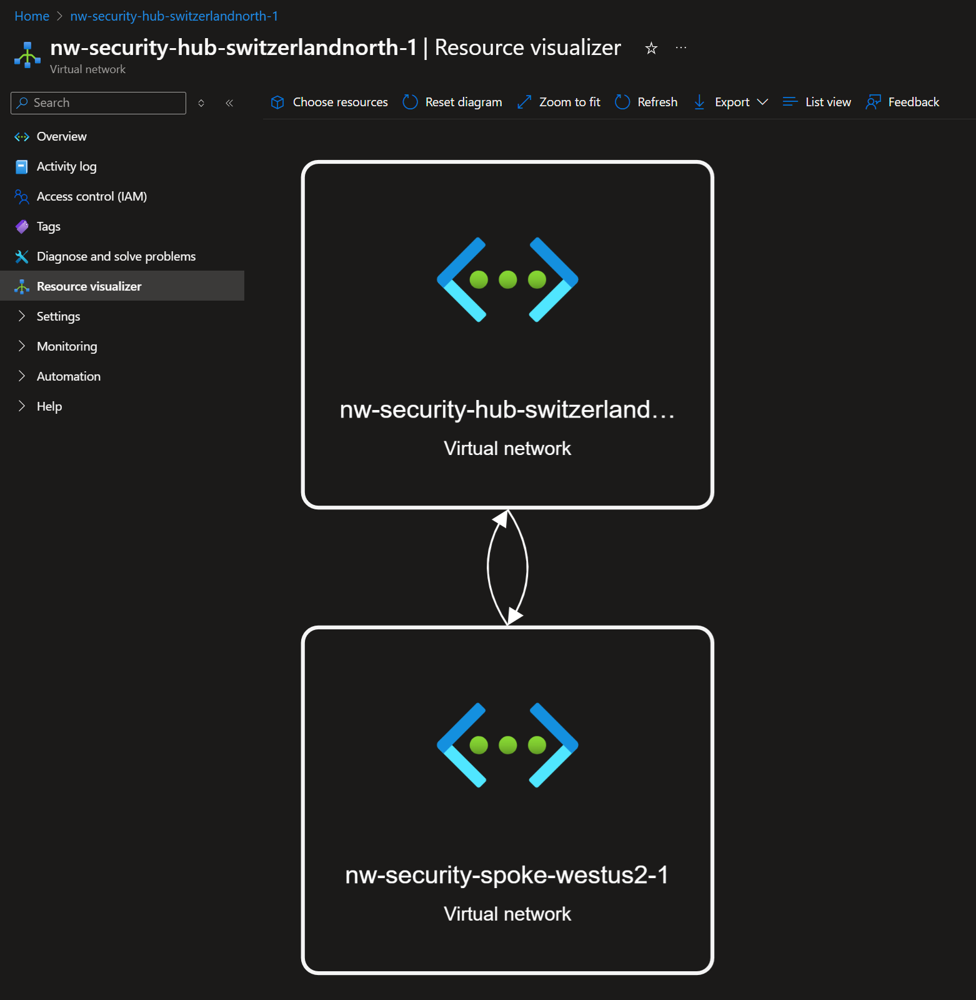

# Spoke VNet

## Description

A "Spoke" VNet is merely a VNet that is connected to a "Hub" VNet to reuse centralized resources, like **Bastion**, **Firewall** or even a shared **Storage Account**.
For this excercise we will only create 1 spoke subnet in the region of your choice. We chose to go with `westus2` for the US.

## Resources

- [R]esource [G]roup: `{my-prefix}-spoke-{region}-{id}-rg`
  - [V]irtual [Net]work: `{my-prefix}-spoke-{region}-{id}-vnet`: `10.2.x.x`
    - Subnets
      - `default`: `10.2.0-3.x/22`
        - [N]etwork [S]ecurity [G]roup: `{my-prefix}-spoke-{region}-{id}-vnet-snet-default-nsg`

Where:

- `{some-short-prefix}`: Your username (i.e. `johndoe`)
- `{region}`: The region of your spoke VNet (i.e. `westus2`)
- `{id}`: The unique identifier of the spoke VNet (i.e. `1`)

### Resource Group

#### Create

Just like we did on the `hub`, we will create a Resource group for the `spoke` VNet.

1. Create a `{my-prefix}-spoke-{region}-{id}-rg` resource group in West US 2.

### [V]irtual [Net]work

Just like in the [Hub](./hub.md), we'll create a VNet. But this time, it **WILL NOT** have a **Bastion** or **Firewall**.

#### Create

Name it `{my-prefix}-spoke-{region}-{id}-vnet` in West US 2.

##### Security

Make sure **Bastion** & **Firewall** remained **Toggled OFF**.

###### IP addresses

| Subnet    | IP family | CIDR Block    | Size    | Notes |
| --------- | --------- | ------------- | ------- | ----- |
| `default` | `0-3.x`   | `10.2.0.0/22` | `1,024` |       |

##### Review + Create

Review your settings and create the VNet.

### [N]etwork [S]ecurity [G]roup

1. Create a Network security group
1. Attach it to the `default` subnet.

#### Create

##### Basics

##### Review

We'll configure it later down the road

#### Associate

Go to the `default` subnet and associate the NSG.

#### Overview

### VNet Peering(s)

Now we have 2 VNets with address spaces `10.1.x.x` & `10.2.x.x`. We need to connect them so the traffic can flow between them.

#### Add Peering

Go to Peerings > Add

Note that you can allow traffic:

- [x] Hub > Spoke
- [x] Spoke > Hub

For this excercise will check some of the boxes.

##### Remote virtual network summary

- Peering link name: `hub-switzerlandnorth-{id}_to_spoke-westus2-{id}`
- Virtual network deployment model: `Resource Manager` (leave it as is)
- Subscription: `{Your subscription}`
- Virtual network: `{my-prefix}-hub-switzerlandnorth-{id}-vnet`

##### Local virtual network summary

- Peering link name: `spoke-westus2-{id}_to_hub-switzerlandnorth-{id}`

##### Remote|Local virtual network peering settings

| Permission                                                                     | Remote | Local |
| ------------------------------------------------------------------------------ | ------ | ----- |
| Allow {that vnet} to access {this vnet}                                        | `x`    | `x`   |
| Allow {that vnet} to receive forwarded traffic from {this vnet}                | `x`    | `x`   |
| Allow gateway or route server in {that vnet} to forward traffic to {this vnet} |        |       |
| Enable {that vnet} tp use {this vnet}'s remote gateway or route server         |        |       |

We can later come back and remove permissions to reinforce security.

## Resource Visualizer

Under the "Resource visualizer" you should see something like this:

Note that the 2 arrows represent the peering between the 2 VNets.

- [x] Hub > Spoke
- [x] Spoke > Hub

## Next Steps

[Go back to module](./README.md)
