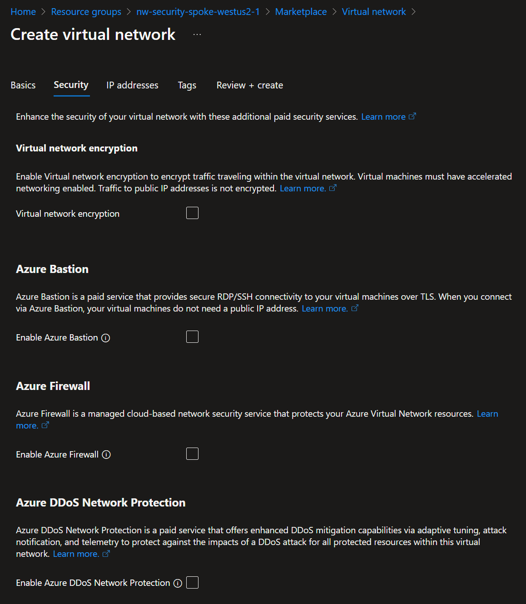
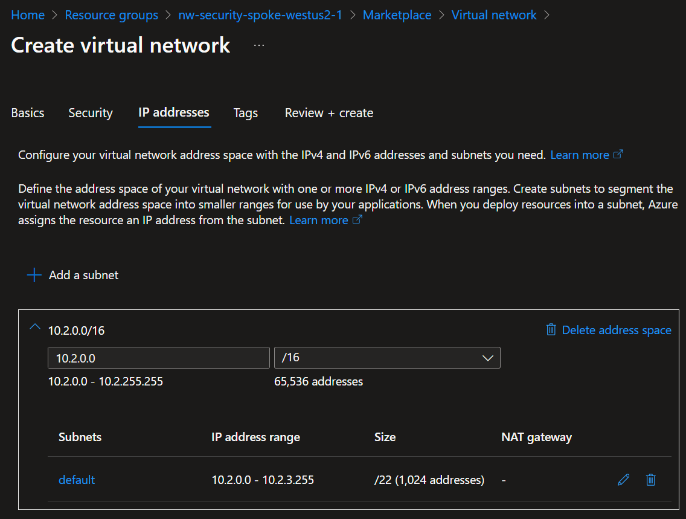

# Spoke VNet

## Description

A "Spoke" VNet is merely a VNet that is connected to a "Hub" VNet to reuse centralized resources, like **Bastion**, **Firewall** or even a shared **Storage Account**.
For this excercise we will only create 1 spoke subnet in the region of your choice. We chose with `westus2` for the US.

## Resources

- Resource Group: `{my-prefix}-spoke-westus2-{id}-rg`
  - VNet: `{my-prefix}-spoke-westus2-{id}-vnet`: `10.2.x.x`
    - Subnets
      - `default`: `10.2.0.x/22`
        - NSG: `{my-prefix}-spoke-westus2-{id}-vnet-snet-default-nsg`

### Resource Group

#### Create

1. Create a `{my-prefix}-spoke-westus2-{id}-rg` resource group in West US 2.
   

### [V]irtual [Net]work

Just like in the [Hub](./hub.md), we'll create a VNet. But this time, it **WILL NOT** have a **Bastion** or **Firewall**.

#### Create

Name it `{my-prefix}-spoke-westus2-{id}-vnet` in West US 2.

##### Security

Make sure **Bastion** & **Firewall** remained **Toggled OFF**.

###### IP addresses

| Subnet    | IP family | CIDR Block    | Size    | Notes |
| --------- | --------- | ------------- | ------- | ----- |
| `default` | `0-3.x`   | `10.2.0.0/22` | `1,024` |       |

