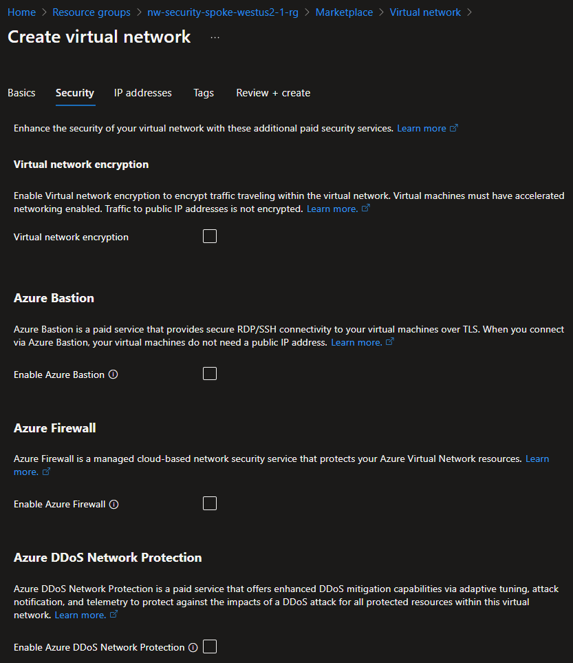
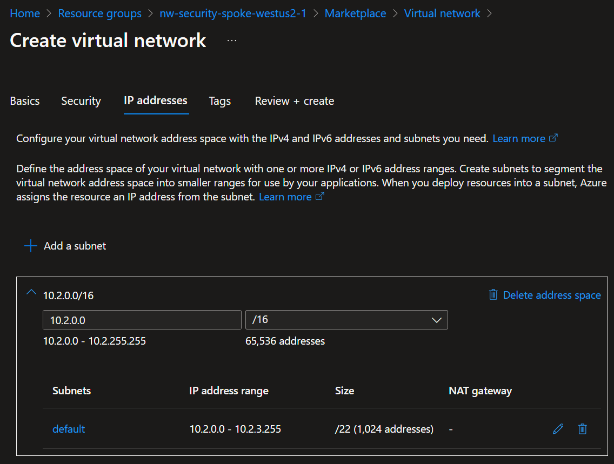
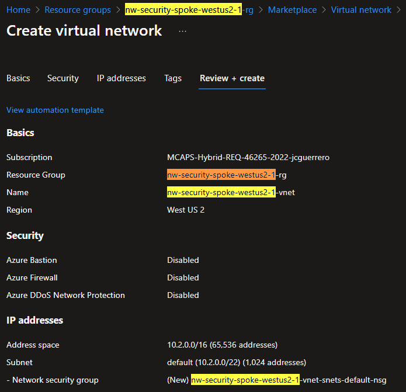
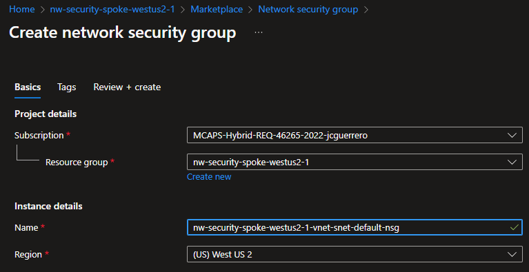
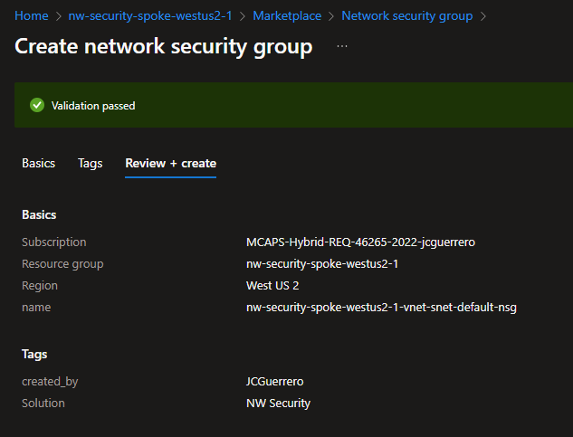
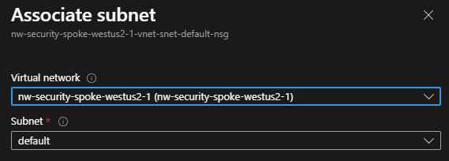
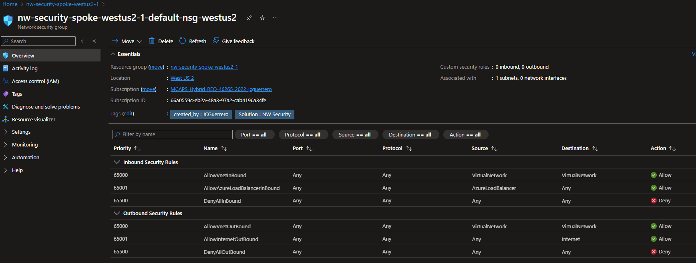

# Spoke VNet

## Description

A "Spoke" VNet is merely a VNet that is connected to a "Hub" VNet to reuse centralized resources, like **Bastion**, **Firewall** or even a shared **Storage Account**.
For this excercise we will only create 1 spoke subnet in the region of your choice. We chose to go with `westus2` for the US.

## Resources

- [R]esource [G]roup: `{prefix}-spoke-{region}-{id}-rg`
  - [V]irtual [Net]work: `{prefix}-spoke-{region}-{id}-vnet`: `10.2.x.x`
    - Subnets
      - `default`: `10.2.0-3.x/22`
        - [N]etwork [S]ecurity [G]roup: `{prefix}-spoke-{region}-{id}-vnet-snet-default-nsg`

Where:

- `{some-short-prefix}`: Your username (i.e. `johndoe`)
- `{region}`: The region of your spoke VNet (i.e. `westus2`)
- `{id}`: The unique identifier of the spoke VNet (i.e. `1`)

### Resource Group

#### Create

Just like we did on the `hub`, we will create a Resource group for the `spoke` VNet.

1. Create a `{prefix}-spoke-{region}-{id}-rg` resource group in West US 2.

### [V]irtual [Net]work

Just like in the [Hub](./hub.md), we'll create a VNet. But this time, it **WILL NOT** have a **Bastion** or **Firewall**.

#### Create

Name it `{prefix}-spoke-{region}-{id}-vnet` in West US 2.

##### Security

Make sure **Bastion** & **Firewall** remained **Toggled OFF**.

###### IP addresses

| Subnet    | IP family | CIDR Block    | Size    | Notes |
| --------- | --------- | ------------- | ------- | ----- |
| `default` | `0-3.x`   | `10.2.0.0/22` | `1,024` |       |

##### Review + Create

Review your settings and create the VNet.

### [N]etwork [S]ecurity [G]roup

1. Create a Network security group
1. **Associate** it to the `default` subnet.

#### Create

##### Basics

- Name: `{prefix}-spoke-{region}-{id}-vnet-snet-default-nsg`
- Region: `{region}`

##### Review & Create

#### Settings

##### Subnets

###### Associate

1. Go to your newly created NSG
1. **Settings** > **Subnets**
1. Click on [ **+ Associate** ]
1. Associate it to the `default` subnet

#### Overview

## Status Check

### Exported

#### CSV

| NAME                                                  | TYPE                   | LOCATION  |
| ----------------------------------------------------- | ---------------------- | --------- |
| `{prefix}-spoke-{region}-{id}-vnet`                   | Virtual network        | West US 2 |
| `{prefix}-spoke-{region}-{id}-vnet-snets-default-nsg` | Network security group | West US 2 |

#### Template

[JSON Template](../../../azure/templates/modules/01/spoke)

## Next Steps

[Create VNets peering](./peering.md)
