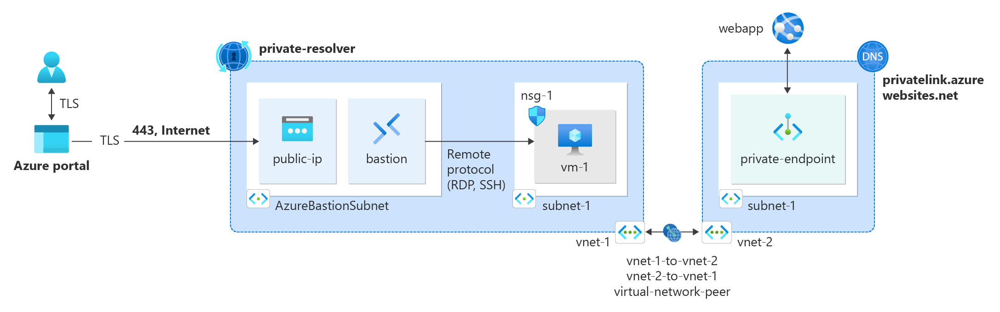
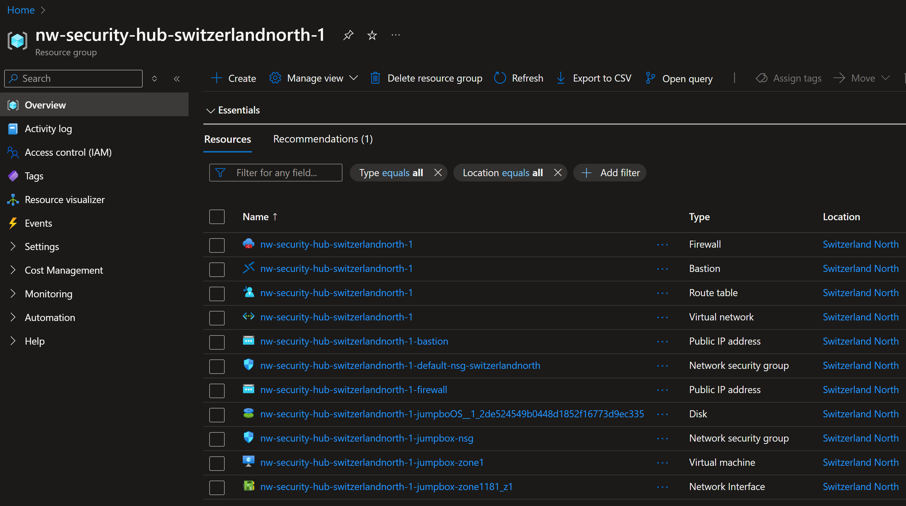

# Module 2: Jump Box

Now that we have a Hub VNet enabled w/ **Bastion**, we can create a Virtual machine that will serve as a jump box.

## Architecture

This diagram is an oversimpification of what we've built so far. But it give an idea of what we're trying to achieve.-

So if an external user like yourself, want to access a private resource from one of the private spoke-VNets (like a webapp, or a storage account), we need to use the Bastion service to proxy into the Jump box, and then access the private resource.

## Table of Contents

1. Inside the Hub
   1. [Create a Jumpbox Virtual Machine](./hub/vm.md)
   1. [Create a Route Table](./hub/rt.md)
   1. [Add Rules to Azure Firewall](./hub/fw.md)

## Status Check

### Snapshot

Your resources should look like something this.-

## Next Steps

[Go back to parent](../README.md)
