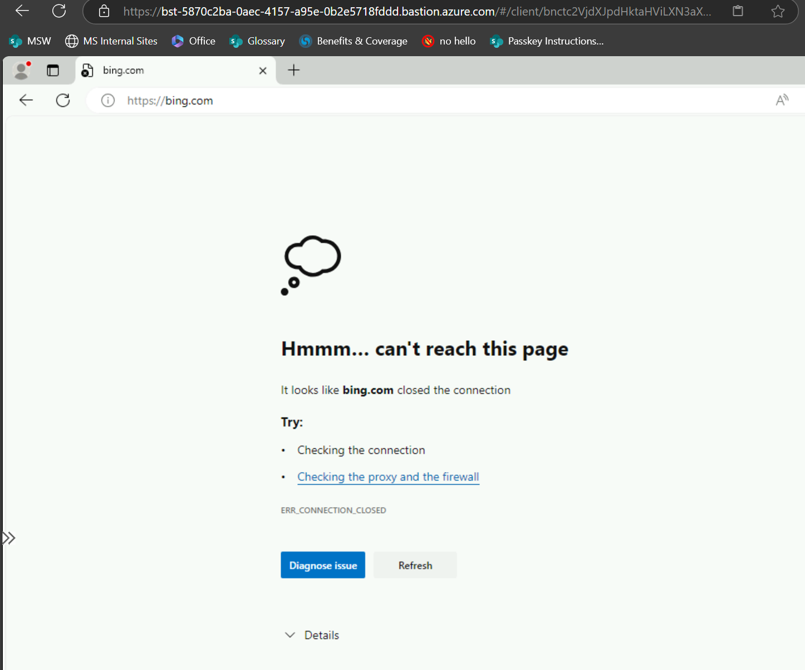
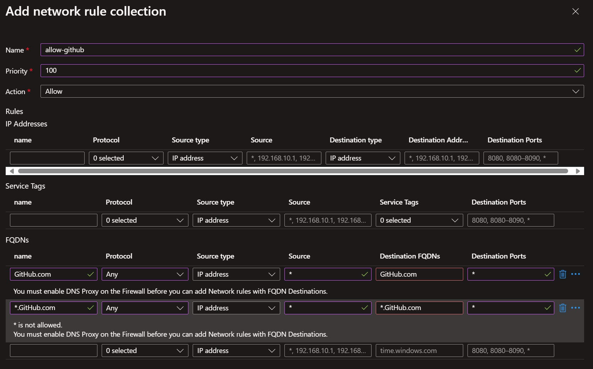

# Azure Firewall Rules

Now that all traffic is going through the **Azure Firewall**, we can start adding rules to allow or deny traffic.

## Step 1: Disallow all

Add a rule to disallow all traffic.

- Name: `disallow-all`
- Priority: `100,000`
- Action: _"Deny"_
- Rules
  - IP Addresses:

| name  | Protocol | Source Type | Source | Destination Type | Destination Addresses | Destination Ports |
| ----- | -------- | ----------- | ------ | ---------------- | --------------------- | ----------------- |
| `WWW` | Any      | Any         | `*`    | Any              | `*`                   | `*`               |

Now go to the Jump box, and test that in fact you cannot access anything in the WWW, like `bing.com`

## Step 2: Allow some FDQNs

Try to add an allow rule.

- Name: `allow-github`
- Priority: `100`
- Action: _"Allow"_
- Rules
  - FQDNS:

| name         | Protocol | Source Type | Source | Destination FQDNs | Destination Ports |
| ------------ | -------- | ----------- | ------ | ----------------- | ----------------- |
| `GitHub.com` | Any      | Any         | `*`    | `GitHub.com`      | `*`               |

If you get a "You must enable DNS Proxy" error, go to the **Azure Firewall**, go to the next section

## Step 3: Enable DNS Proxy

Uhm... it seems we missed something

Oh, so we need to enable the DNS Proxy first.
