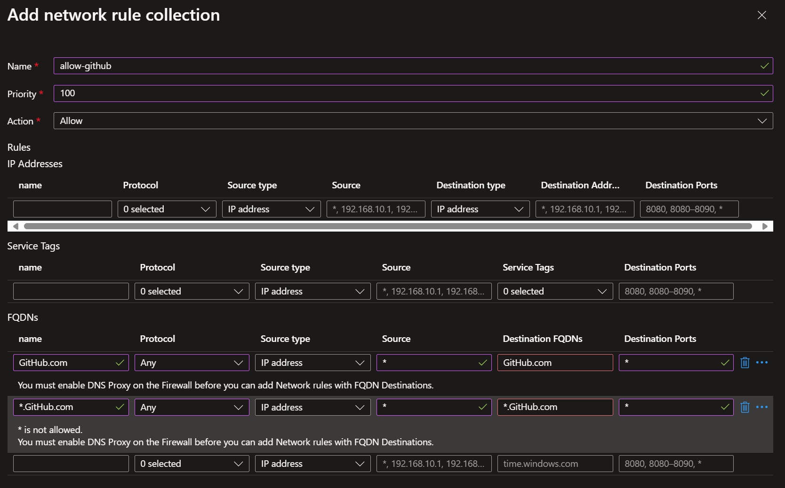
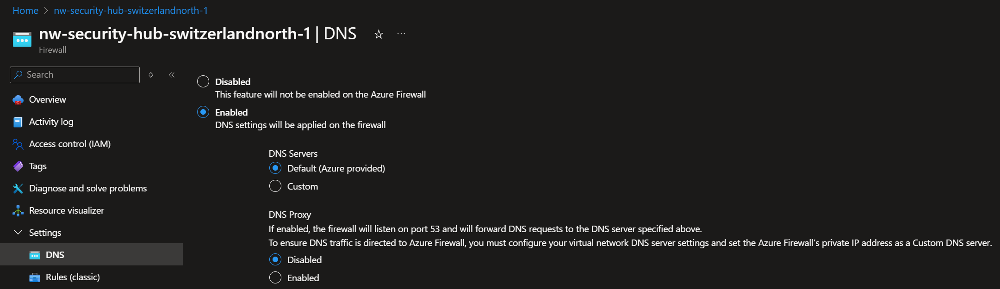
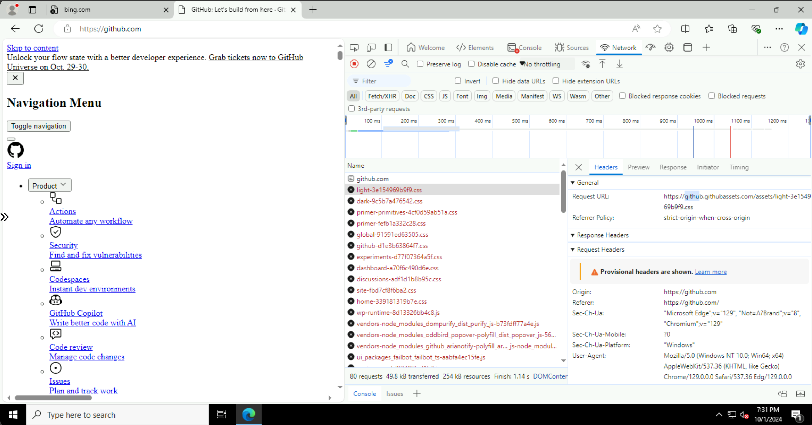
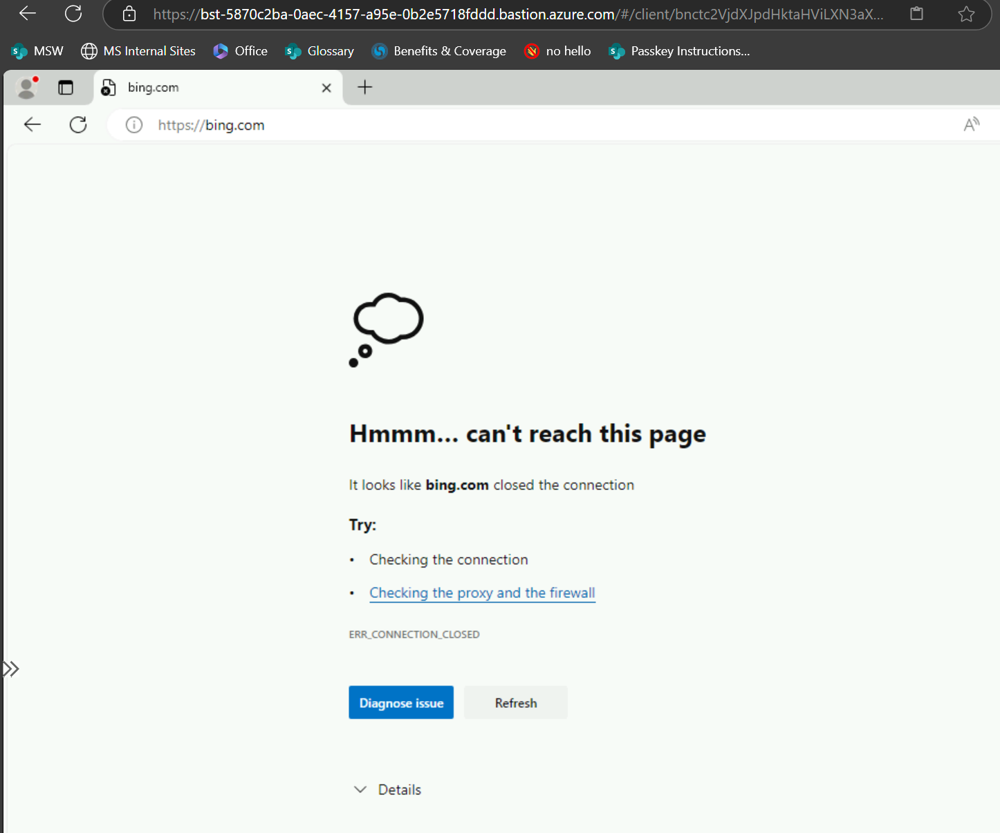
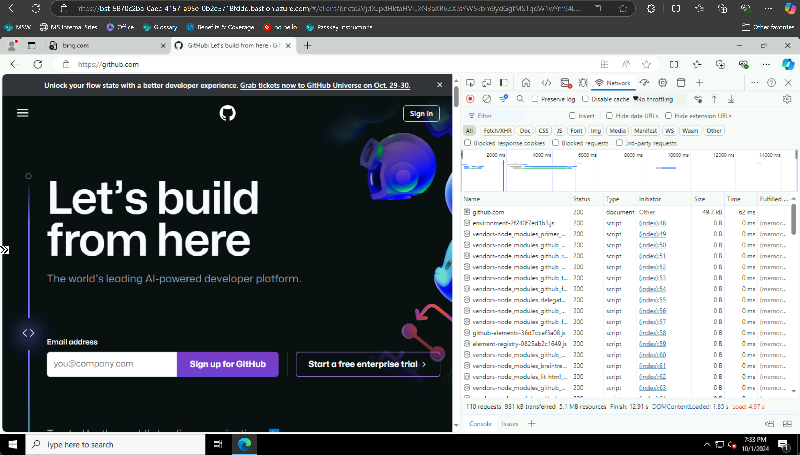
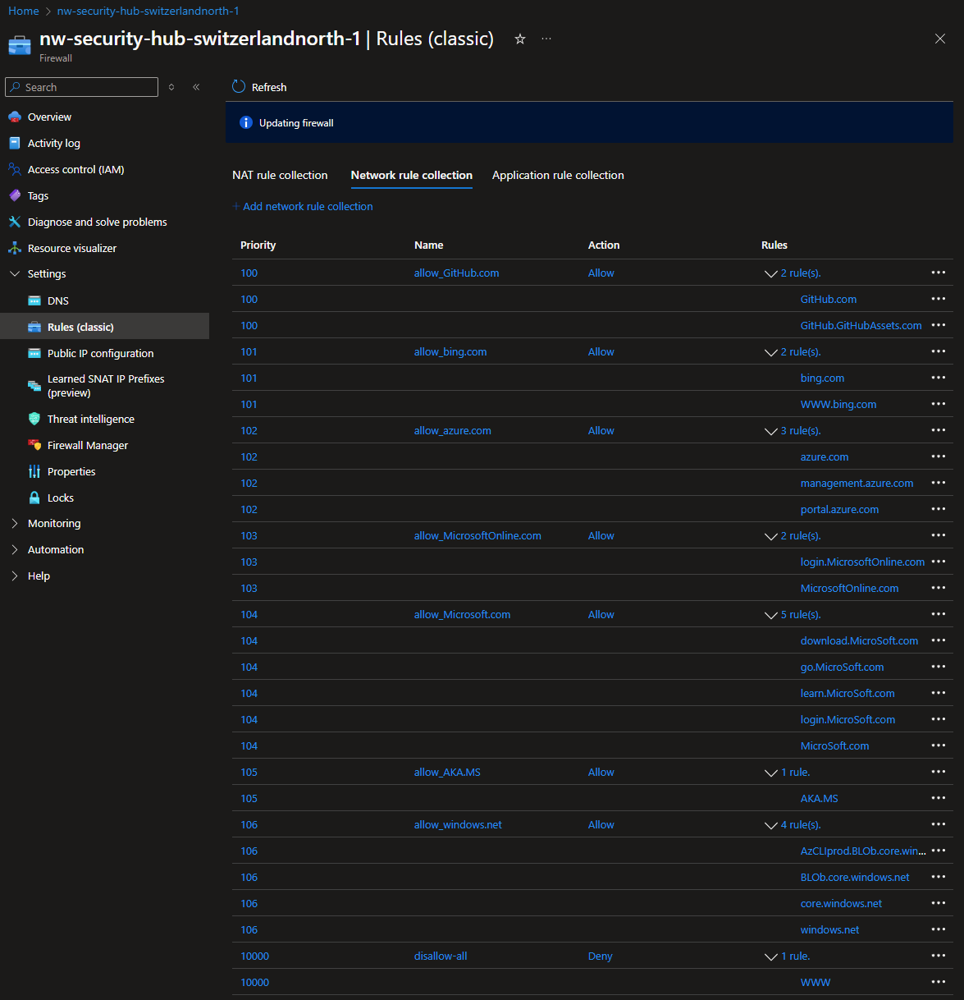

# Configuring Azure Firewall

Now that all traffic is going through the **Azure Firewall**, we can start adding rules to allow or deny traffic.

> [!TIP]
> Everytime you add a rule, the firewall takes like 1+ full minute(s) to apply the rule.

We're going to add **Network Rules Collection**

1. Go to **Settings** > **Rules (Classic)**
1. Go to second tab **Network Rules Collection**
1. Click on **+ Add network rule collection**

## Before you begin

The FireWall disallows all traffic by default.

It's configuration, is equivalent to this

- Name: `disallow-all`
- Priority: `N`
- Action: _"Deny"_
- Rules
  - IP Addresses:

| name  | Protocol | Source Type | Source | Destination Type | Destination Addresses | Destination Ports |
| ----- | -------- | ----------- | ------ | ---------------- | --------------------- | ----------------- |
| `Any` | Any      | Any         | `*`    | Any              | `*`                   | `*`               |

## Pre-requisites: DNS Proxy

### Step 1: Try to add any FDQN rule

Try to add an allow rule.

- Name: `allow-github`
- Priority: `100`
- Action: _"Allow"_
- Rules
  - FQDNS:

| name           | Protocol | Source Type | Source | Destination FQDNs | Destination Ports |
| -------------- | -------- | ----------- | ------ | ----------------- | ----------------- |
| `GitHub.com`   | Any      | Any         | `*`    | `Github.com`      | `*`               |
| `*.GitHub.com` | Any      | Any         | `*`    | `*.GitHub.com`    | `*`               |

> [!TIP]
> Domain are case-insensitive

You should get a couple of errors

<!-- prettier-ignore-start -->
> [!CAUTION]
> `*` is not allowed

> [!CAUTION]
> You must enable DNS Proxy
<!-- prettier-ignore-end -->

Uhm, it seems we missed something...

Proceed to next section

### Step 2: Enable DNS Proxy

Oh, so we need to enable the **DNS Proxy** first!

1. Navigate do DNS

- [x] Mark "DNS Settings" as **"Enabled"**
- [x] Mark "DNS Proxy" as **"Enabled"**

Now try to go back to the rules and add the rule again.

> [!NOTE]
> DNS Proxy works on port `53`.

You should take this into account, when securing Network Security Groups

### Step 3: Add the FDQN rule

Now try again to add the `allow` rule mentioned above.

- Name: `allow-github`
- Priority: `100`
- Action: _"Allow"_
- Rules
  - FQDNS:

| name         | Protocol | Source Type | Source | Destination FQDNs | Destination Ports |
| ------------ | -------- | ----------- | ------ | ----------------- | ----------------- |
| `GitHub.com` | Any      | Any         | `*`    | `GitHub.com`      | `*`               |

### Step 4: Check access

1. Open Edge browser
1. Navigate to [https://GitHub.com](https://GitHub.com)
1. You should see the following

Yai! \o/
err... success?

Great... Seems that we're able to load **some** `GitHub.com` resources.

Keep reading. This will make sense later on.

## Scenarios

There are 2 scenarios we can consider:

1. **Allow all, except...**: (5 minutes-ish) If you don't have much time to spend, this is the quickest way to get started to understand some concepts.
1. **Zero Trust.- Disallow ALL, except...**: (30 minutes-ish) If you want to learn more and are willing to put in the time, head to the second scenario

Either way, we recommend that you fully read both before you proceed, so you have a better understanding of trade-offs.

_"In politics, there are no solutions, only trade-offs."_

### Scenario 1: Allow All, except...

In the most basic scenario, we can

1. We'll add an `allow` **all traffic** rule at the bottom.
1. And then manage a disallow list were we add things we DON'T want.

Do you know how time consuming it could be to basically keep an inventory of all the WWW?

Who wants that kind of headache? Any who...

#### Step 1: Check access

1. Open Edge browser
1. Navigate to [https://google.com](https://google.com)
1. See that the site should be blocked

#### Step 2: Allow (any) & all

- Name: `allow-any`
- Priority: `10000`
- Action: _"Allow"_
- Rules
  - IP Addresses:

| name  | Protocol | Source Type | Source | Destination Type | Destination Addresses | Destination Ports |
| ----- | -------- | ----------- | ------ | ---------------- | --------------------- | ----------------- |
| `Any` | Any      | Any         | `*`    | Any              | `*`                   | `*`               |

<!-- prettier-ignore-start -->

> [!WARN]
> Even if asked specifically, the firewall won't allow ALL traffic through. like ICMP (ping)

<!-- prettier-ignore-END -->

#### Step 3: Check access (again)

1. Open Edge browser
1. Navigate to [https://google.com](https://google.com)
1. See that the site should now be allowed

But, we want to make sure that it was the firewall that does the blocking, and not some miss-vm-configuration.

#### Step 4: Disallow google.com

- Name: `disallow-google`
- Priority: `1000`: NOTE this value is lower than the `allow-any` rule. So it takes higher precedence.
- Action: _"Deny"_
- Rules
  - FQDNS:

| name         | Protocol | Source Type | Source | Destination FQDNs | Destination Ports |
| ------------ | -------- | ----------- | ------ | ----------------- | ----------------- |
| `google.com` | Any      | Any         | `*`    | `google.com`      | `*`               |

Now go to the Jump box.

You might still be able to access `google.com` because of the DNS cache.
How so?

1. `google.com` redirects to `www.google.com`
1. But we're only blocking contents of `google.com`

Oh jeez!

#### Step 5: Disallow www.google.com

Well, let's add a rule for `*.google.com` then.

| name           | Protocol | Source Type | Source | Destination FQDNs | Destination Ports |
| -------------- | -------- | ----------- | ------ | ----------------- | ----------------- |
| `*.google.com` | Any      | Any         | `*`    | `*.google.com`    | `*`               |

_"What do you mean I cannot add `*.foo.bar` domains?"_

Alright, let's try `www.google.com` then.

| name             | Protocol | Source Type | Source | Destination FQDNs | Destination Ports |
| ---------------- | -------- | ----------- | ------ | ----------------- | ----------------- |
| `www.google.com` | Any      | Any         | `*`    | `www.google.com`  | `*`               |

So your rule should look like this:

- Name: `disallow-google`
- Priority: `1000`
- Action: _"Deny"_
- Rules
  - FQDNS:

| name             | Protocol | Source Type | Source | Destination FQDNs | Destination Ports |
| ---------------- | -------- | ----------- | ------ | ----------------- | ----------------- |
| `google.com`     | Any      | Any         | `*`    | `google.com`      | `*`               |
| `www.google.com` | Any      | Any         | `*`    | `www.google.com`  | `*`               |

_"Are there any domains I have not accounted for?"_

Well, Yeah! like THE REST OF THE INTERNET! (Why are we screaming?!)

### Scenario 2: Zero Trust.- Disallow ALL, except...

#### Pre-requisites

If you did Scenario 1, please go ahead and remove `allow-any` rule.

#### Step 1: Check Access

Go the Jump box, and test that in fact you cannot access anything in the WWW, like `bing.com`

1. Open Edge browser
1. Navigate to [https://bing.com](https://bing.com)
1. See that the site should be blocked

#### Step 2: Add MORE FQDNs

##### GitHub.com

Navigate to [GitHub.com](https://GitHub.com) (see pre-requisites at the top)

Seems that we're able to load **some** `GitHub.com` resources.

If we inspect with Developer tools with <kbd>F11</kbd>, we can see OTHER domains, like `GitHub.GithubAssets.com`.

So keep rinse & repeat until:

- `a)` You're proven youself a point and your learning ego is satisfied and ready to move on.
- or `b)` Your OCD is happy to see the page fully rendered!

`GitHub.com`

##### bing.com

Following the same methodology, your goal is to render the page fully.

`bing.com`

#### Rules

These are all the rules we ended up adding:

**Zero Trust** can sure be exhausting!

But hey, you're worth it ;D

## Next Steps

[Go back to parent](../README.md)
