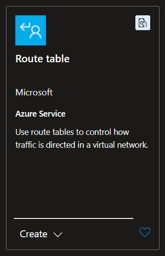
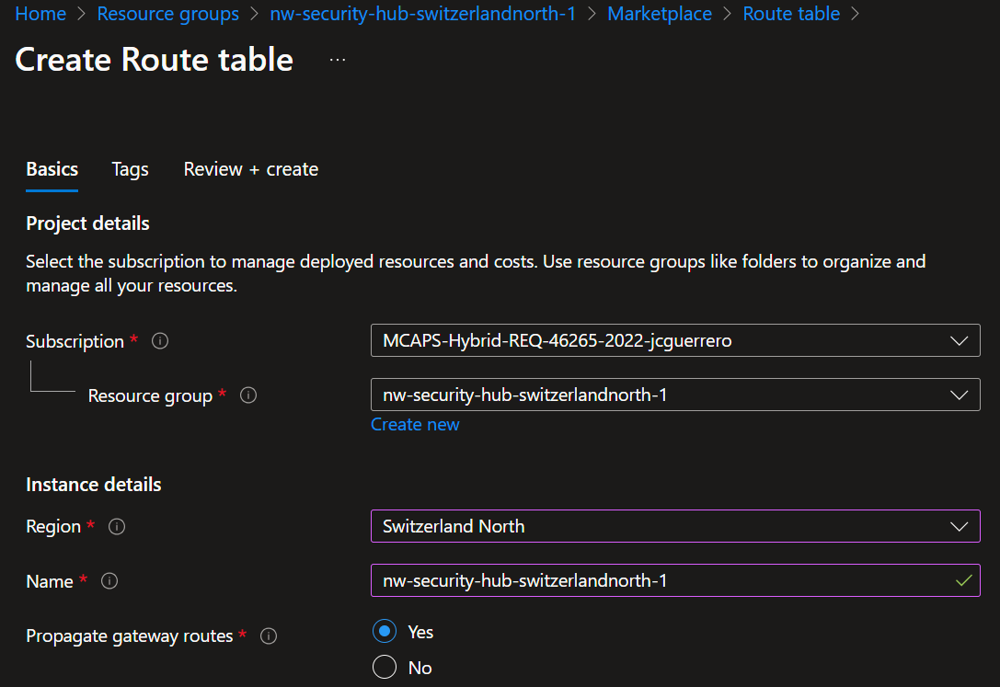
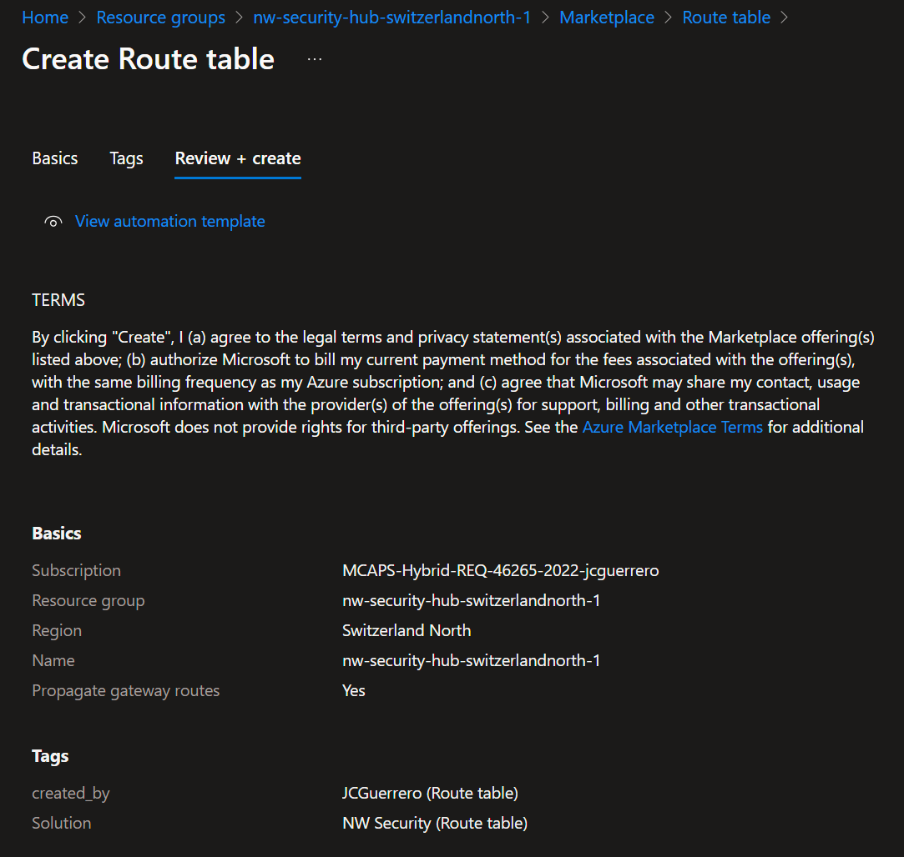
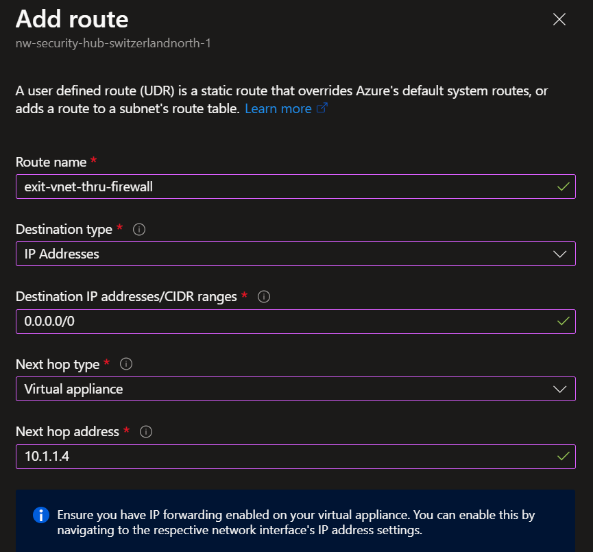
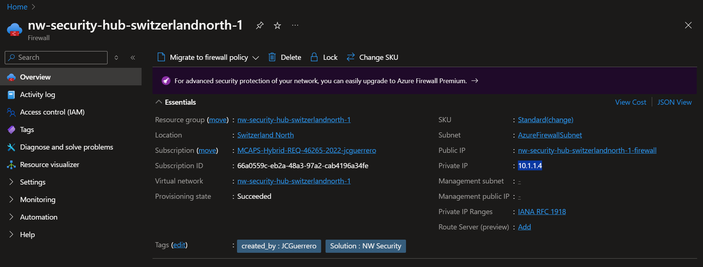

# Route Table

## Resources

### Route Table

#### Market place

Look for a "Route table" in the Azure Portal's market place

#### Create

- **Name**: `{my-prefix}-hub-switzerlandnorth-{id}-rt`
- **Propagate gateway routes**: _"Yes"_

#### Review + Create

Take a good look at the TERMS

### Routes

#### Drive traffic through the Firewall

> Quiz: _"What is the IP address for 'Every possible IP ot there'?"_

Go to Settings > Routes > Add

- **Route name**: `exit-vnet-thru-fw`
- **Destination type**: _"IP Addresses"_
- **Destination IP addresses/CIDR ranges**: ???
- **Next hop type**: _"Virtual appliance"_ (as in the **Azure Firewall**)
- **Next hop address**: In a new tab, go to the **Azure Firewall** and copy the **Private IP** address
 
