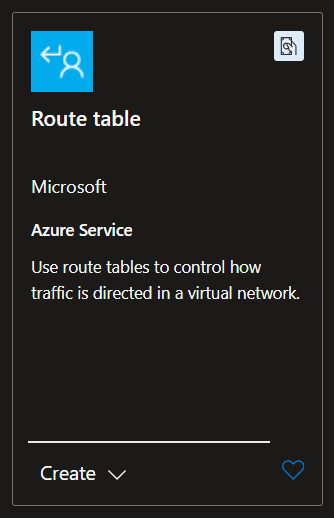
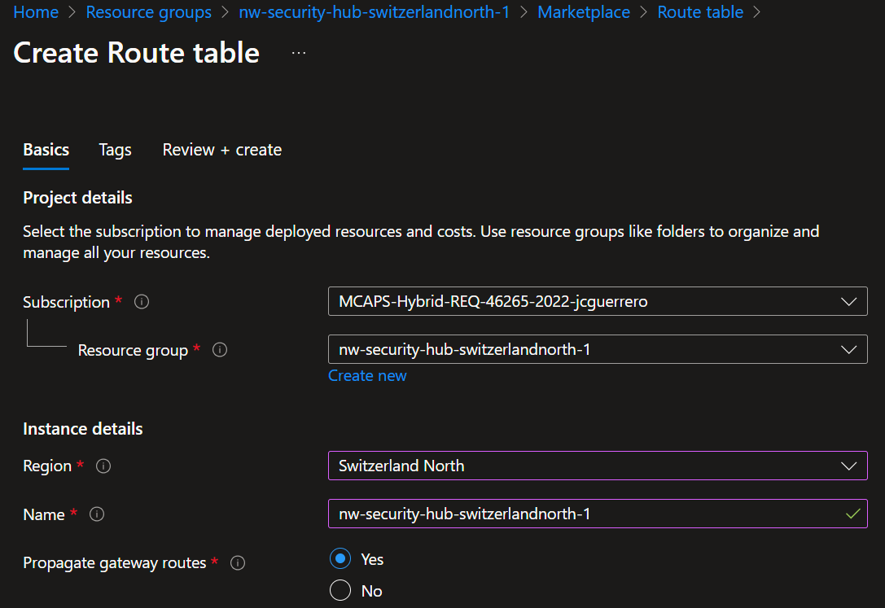
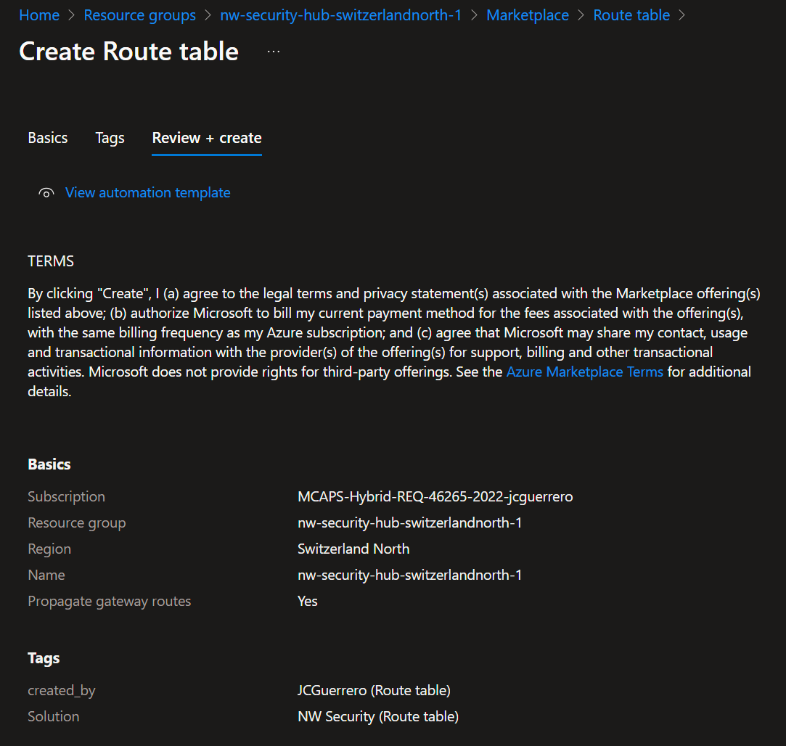
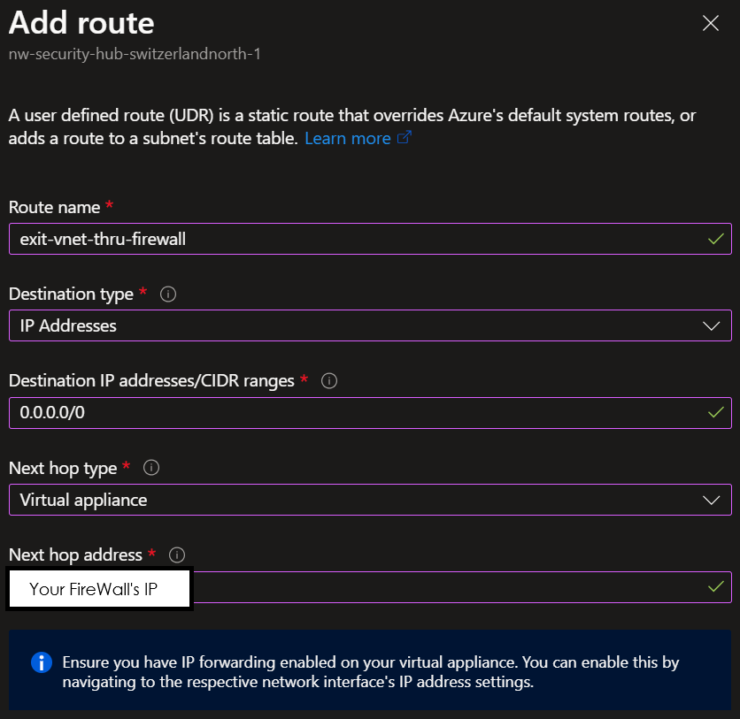
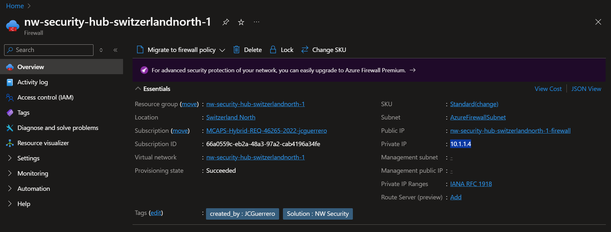

# Creating a Route Table

## Resources

### Route Table

- [R]esource [G]roup: `{my-prefix}-hub-{region}-{id}-rg` (already exists)
  - [R]oute [T]able: `{my-prefix}-hub-{region}-{id}-rt`

Where:

- `{some-short-prefix}`: Your username (i.e. `johndoe`)
- `{region}`: The region of your Hub VNet (i.e. `switzerlandnorth`)
- `{id}`: The unique identifier of the spoke VNet (i.e. `1`)

#### Market place

Look for a "Route table" in the Azure Portal's market place

#### Create

- **Name**: `{my-prefix}-hub-{region}-{id}-rt`
- **Propagate gateway routes**: _"Yes"_

#### Review + Create

Take a good look at the TERMS

### Routes

We'll add the following routes.
The order matters, we want the more specific routes at the top, and the more general ones at the bottom.

| Source  | IP range   | CIDR          | Next Hop Type     | Details               |
| ------- | ---------- | ------------- | ----------------- | --------------------- |
| Default | `10.1.x.x` | `10.1.0.0/16` | Virtual network   | `hub`                 |
| Default | `10.2.x.x` | `10.2.0.0/16` | Virtual network   | peering > `spoke`     |
| Default | `10.x.x.x` | `10.0.0.0/8`  | None              | Avoids security risks |
| Default | `x.x.x.x`  | `0.0.0.0/0`   | Virtual Appliance | `fw` > `WWW`          |

> [!TIP]
> Quiz: _"What is the IP address for 'Every possible IP ot there'?"_

#### Drive traffic through the Firewall

Go to Settings > Routes > Add

- **Route name**: `exit-vnet-thru-fw`
- **Destination type**: _"IP Addresses"_
- **Destination IP addresses/CIDR ranges**: ???
- **Next hop type**: _"Virtual appliance"_ (as in the **Azure Firewall**)
- **Next hop address**: In a new tab, go to the **Azure Firewall** and copy the **Private IP** address
  

## Next Steps

[Go back to parent](../README.md)
