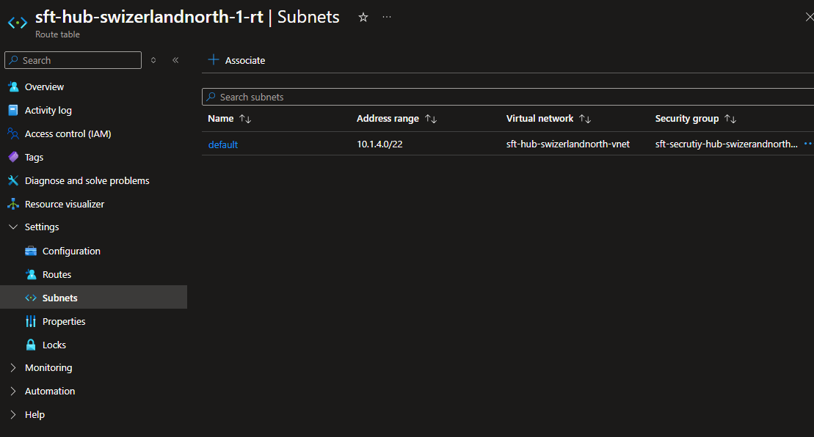

# Creating a Route Table

## Goal

1. Drive all outbound traffic
   1. Going to the internet: through the **Azure Firewall**
   1. Going to other VNets

## Before you begin

### Routing

#### Virtual network traffic routing

From [Virtual network traffic routing](https://learn.microsoft.com/en-us/azure/virtual-network/virtual-networks-udr-overview)

Azure automatically creates system routes and assigns the routes to each subnet in a virtual network.

- You can't _create_ **system routes**
- You can't _remove_ **system routes**

But you *can overrid*e some **system routes** with [custom routes](https://learn.microsoft.com/en-us/azure/virtual-network/virtual-networks-udr-overview#custom-routes).

Azure creates _default_ **system routes** for each **subnet** and adds more [optional default route](https://learn.microsoft.com/en-us/azure/virtual-network/virtual-networks-udr-overview#optional-default-routes)s to **specific subnets**,
[or every subnet, when you use specific Azure capabilities].

#### Default routes

From [Virtual network traffic routing](https://learn.microsoft.com/en-us/azure/virtual-network/virtual-networks-udr-overview) > [Default](https://learn.microsoft.com/en-us/azure/virtual-network/virtual-networks-udr-overview#default)

Each route contains

1. An address prefix
1. And next hop type.

When traffic leaving a **subnet**, is sent to an **IP address** _within_ the **address prefix** of a **route**,
the route that contains the prefix is the route that Azure uses.

...

| Source  | Address prefixes              | Next hop type   |
| ------- | ----------------------------- | --------------- |
| Default | Unique to the virtual network | Virtual network |
| Default | `x.x.x.x`                     | Internet        |
| Default | `10.x.x.x`                    | None            |
| Default | `172.16.0.0/12`               | None            |
| Default | `192.168.x.x`                 | None            |
| Default | `100.64.0.0/10`               | None            |

## Resources

- [R]esource [G]roup: `{my-prefix}-hub-{region}-{id}-rg` (already exists)
  - [R]oute [T]able: `{my-prefix}-hub-{region}-{id}-rt`

Where:

- `{some-short-prefix}`: Your username (i.e. `johndoe`)
- `{region}`: The region of your Hub VNet (i.e. `switzerlandnorth`)
- `{id}`: The unique identifier of the spoke VNet (i.e. `1`)

### Route Table

#### Market place

Look for a "Route table" in the Azure Portal's market place

#### Create

- **Name**: `{my-prefix}-hub-{region}-{id}-rt`
- **Propagate gateway routes**: _"Yes"_

#### Review + Create

Take a good look at the TERMS

#### Settings

##### Subnets

###### Associate

Just like with NSGs, we will associate **Route Table** with `default` subnet.-

1. On the route table > **Settings** > **Subnets** >
1. Clikc on [ **+ Associate** ]

Use the hub network and `default` subnet

### Routes

> [!TIP]
> By default, Azure routes traffic between subnets.

We'll add the following route.

| Destinaton Type | IP range  | CIDR ranges | Next hop Type     | Details      |
| --------------- | --------- | ----------- | ----------------- | ------------ |
| IP Addresses    | `x.x.x.x` | `0.0.0.0/0` | Virtual Appliance | `fw` > `WWW` |

#### Drive traffic through the Firewall

First, we need to get the **Private IP** address of the **Azure Firewall**.

1. Go to Firewall > **Overview**
1. Copy the **Private IP** address (in notepad or something)

We will now redirect Any traffic other than `10.x.x.x` to the WWW through the **Azure Firewall**.

> [!TIP]
> QUIZ: _"What is the IP address for 'Every possible IP ot there'?"_

1. Back in the new route table go to **Settings** > **Routes**
1. Click on [ **+ Add** ]

- **Route name**: `exit-vnet-thru-fw`
- **Destination type**: _"IP Addresses"_
- **Destination IP addresses/CIDR ranges**: `0.0.0.0/0`
- **Next hop type**: _"Virtual appliance"_ (as in the **Azure Firewall**)
- **Next hop address**: Use the **Private IP** address of the **Azure Firewall**

## Next Steps

[Configure FireWall](./fw.md)
