# Jump box

## Resources

- Resource group: `{my-prefix}-spoke-westus2-{id}-rg` (already exists)
  - Virtual Machine: `{my-prefix}-spoke-westus2-{id}-vm-jump`
    - Disks: `{my-prefix}-spoke-westus2-{id}-vm-jump-hdd`
    - NIC: `{my-prefix}-spoke-westus2-{id}-vm-jump-nic`
    - NSG: `{my-prefix}-spoke-westus2-{id}-vm-jump-nsg` (Optional, can use the Hub's NSG)

### [V]irtual [M]achine

Look for the `Virtual machine` service Azure Portal's Market place.

#### Create

##### Basics

###### Project details

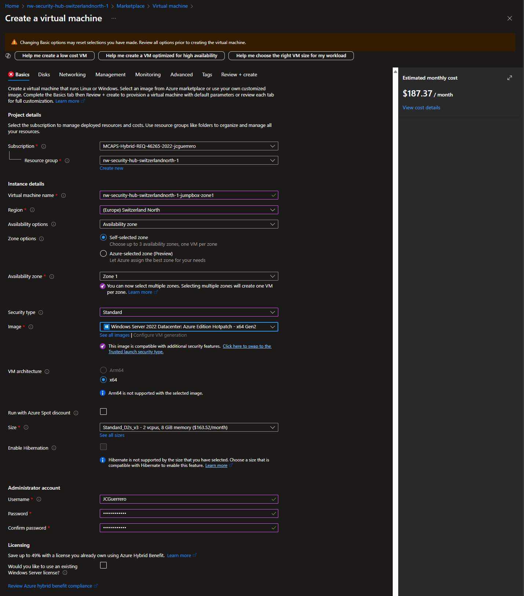

- **Security Type**: _"Standard"_
- **VM Architecture**: x64
- **Size**: _"Standard"_
- **Image**: _"Windows Server 2022 Datacenter: Azure Edition"_ (or w/e Windows Server is available at the time)

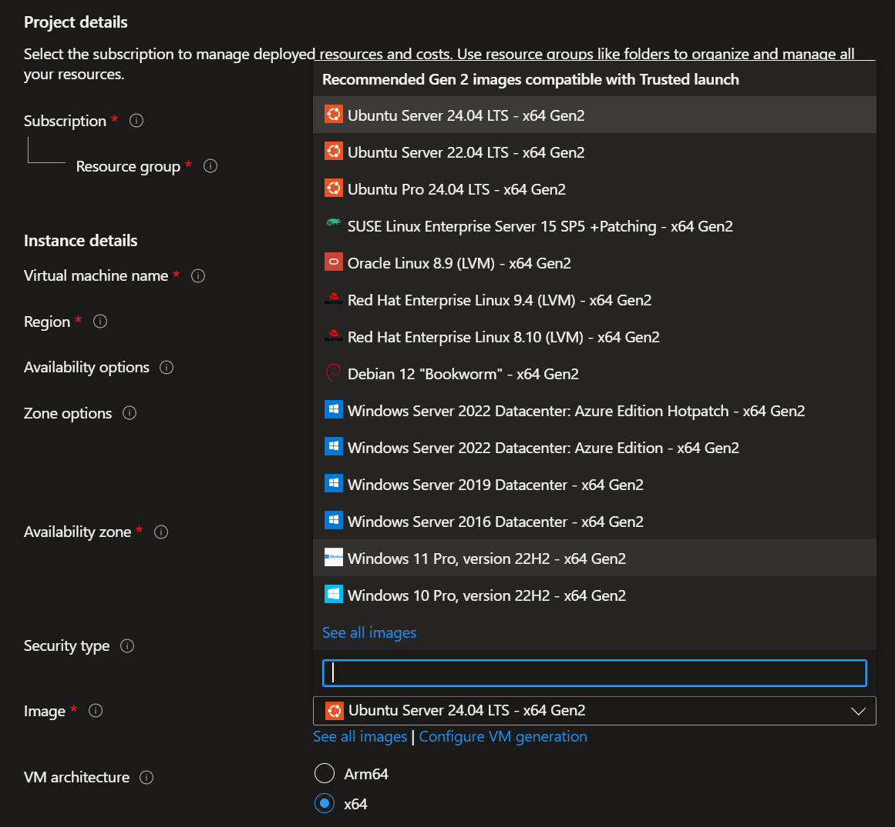

###### Administrator account

Create a username and password you'll remember. If you forget it, you might need to completely recreate the VM.

##### Disks

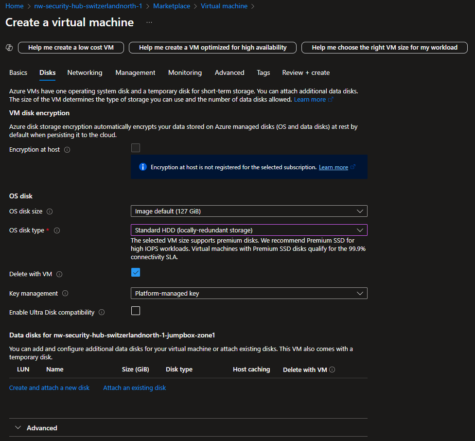

- [x] **Delete with VM**: Checked
- **Key management**: _"Platform-managed key"_

##### Networking

###### Network interface

We'll just go ahead and put it in our `default` subnet (1 IP address down, 1,023 left).

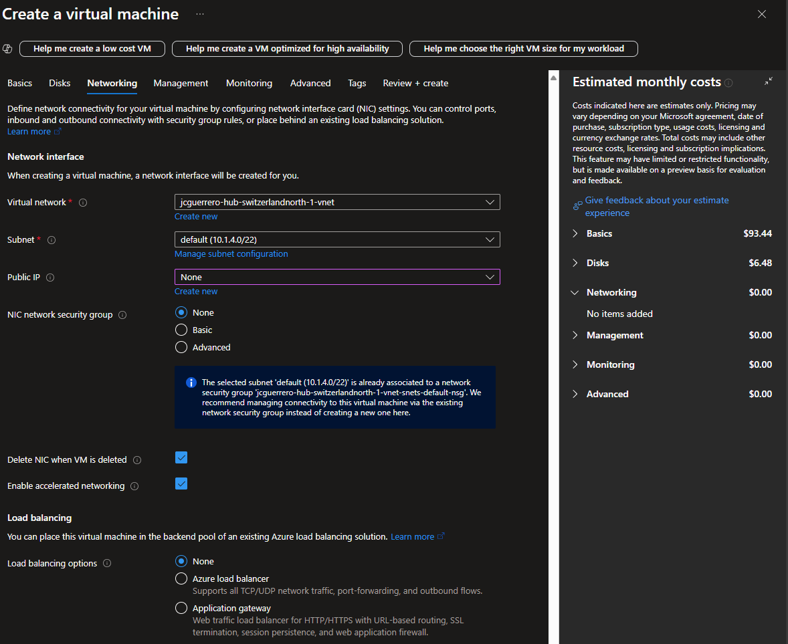

- **Public IP**: _"None"_ .- **VERY IMPORTANT**. We'll access via Bastion's Public IP address
- **NIC network security group**: _"Advanced"_
- **Configure network security group**: You can use the NSG we created for all the Hub's `default` `subnet`, or create a new one specific for this VM if you need more level of control.
- [x] **Delete NIC when VM is deleted**: Checked
- **Subnet**: `default`. Note that the other 2 **delegated subnets**, are listed, but not available for selection.

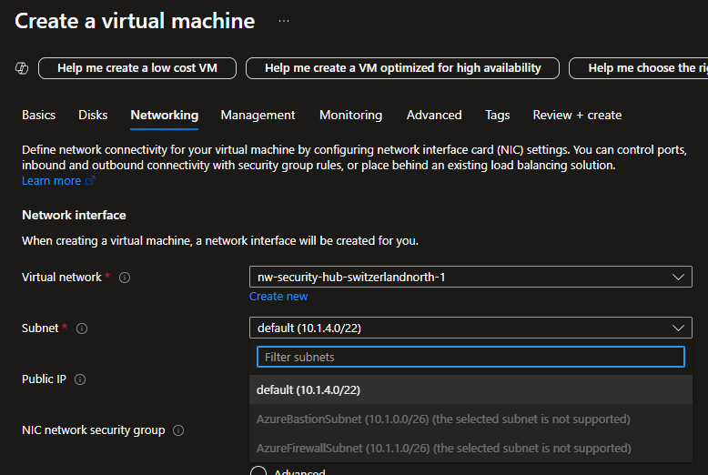

###### Load balancing

- **Load balancing options**: _"None"_

##### Review + Create

Take a good look at the TERMS

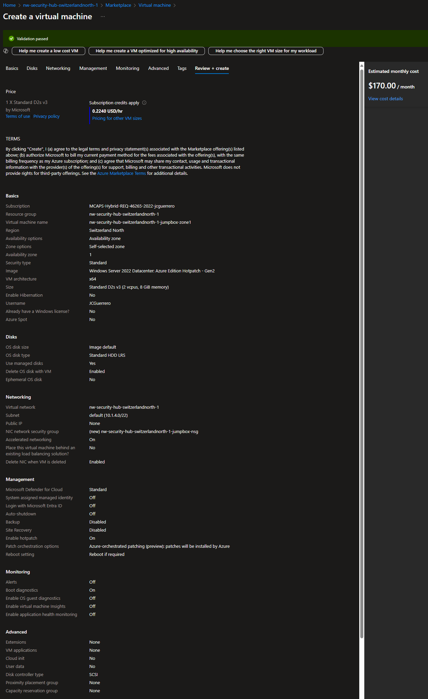

#### Checkpoint

Note that some names will be auto-generated with randomized characters.
If you want to avoid this, you would need to create those resources manually and then attaching them.

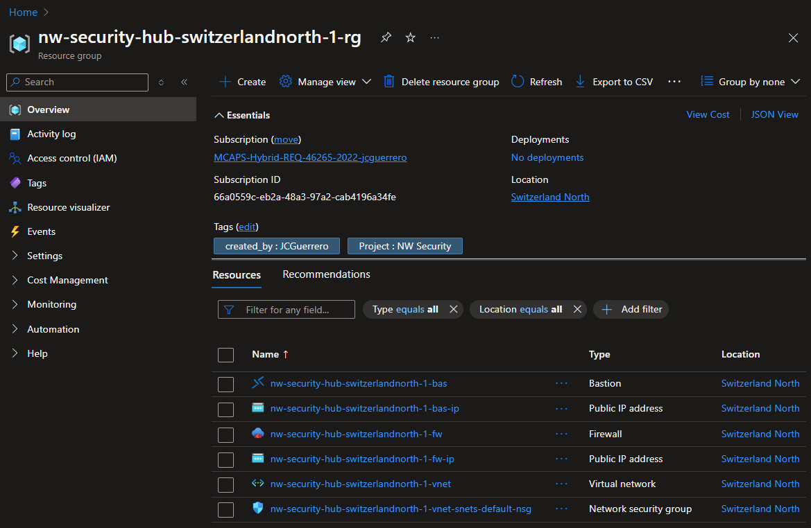

#### Overview

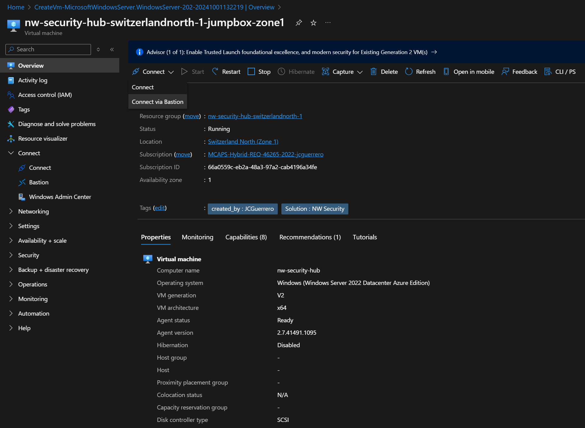

#### Connect

1. Select Connect > Bastion

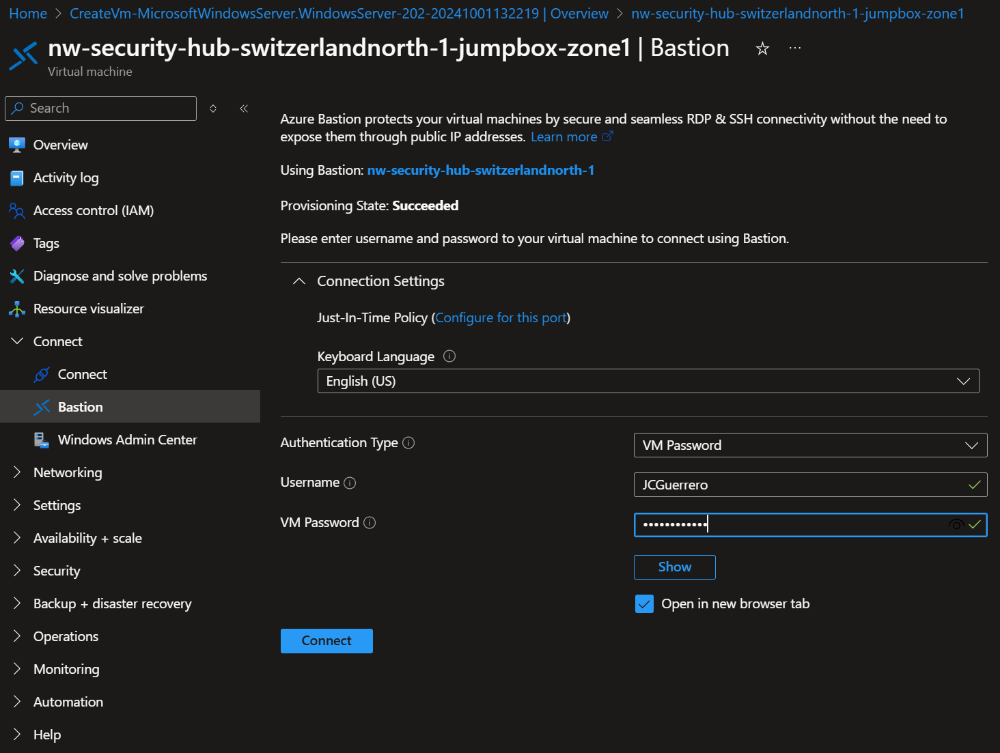

2. Using the password from above, connect to the VM.
3. Enable Pop-ups from azure portal

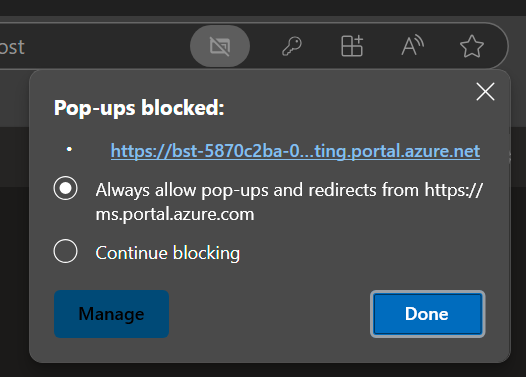

Finally, Windows Server should come up

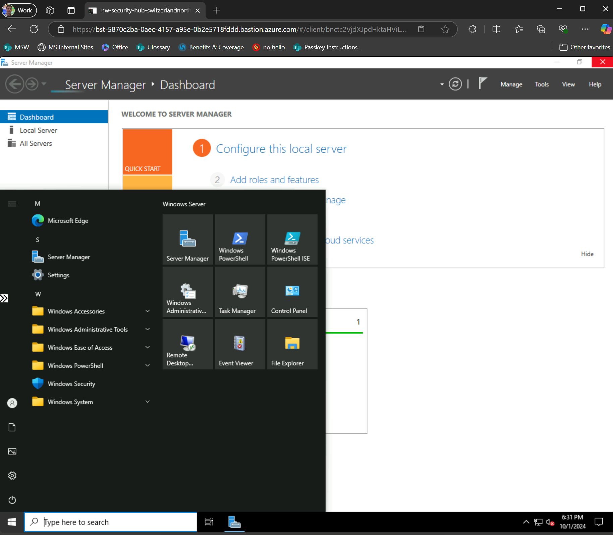

## Finished

[Go back to parent](../README.md)
