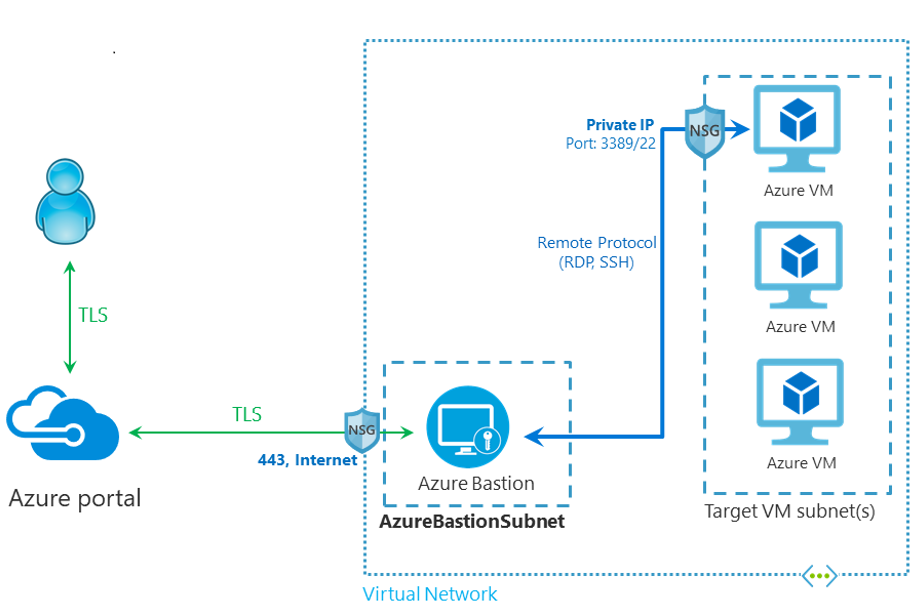
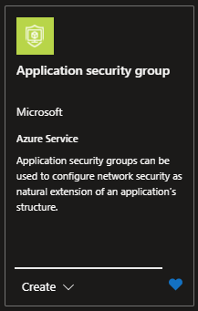

# Jump box

## Architecture

Previously we created a **Bastion** service in the Hub-VNet. Now we can create a Virtual Machine that will serve as a jump box.

Why does Bastion need a delegated subnet? That is how it controls the traffic coming from the public IP address to the VM(s) in the `default` subnet.

This enables more than 1 person connecting at the same time; assuming your VM supports it, like a properly configured **Windows Server**.

## Resources

- [R]esource [G]roup: `{my-prefix}-spoke-{region}-{id}-rg` (already exists)
  - [V]irtual [N]etwork: `{my-prefix}-hub-{region}-{id}-vnet` (already exists)
    - [S]ubnet: `default` (already exists)
      - [N]etwork [S]ecurity [G]roup: `{my-prefix}-hub-{region}-{id}-nsg` (already exists)
  - [V]irtual [M]achine: `{my-prefix}-spoke-{region}-{id}-vm-jump`
    - [H]ard [D]isk [D]rive: `{my-prefix}-spoke-{region}-{id}-vm-jump-hdd`
    - [N]etwork [I]nterfa[c]e: `{my-prefix}-spoke-{region}-{id}-vm-jump-nic`
    - [A]pplication [S]ecurity [G]roup: `{my-prefix}-spoke-{region}-{id}-vm-jump-asg`

Where:

- `{some-short-prefix}`: Your username (i.e. `johndoe`)
- `{region}`: The region of your Hub VNet (i.e. `switzerlandnorth`)
- `{id}`: The unique identifier of the spoke VNet (i.e. `1`)

### [V]irtual [M]achine

Look for the `Virtual machine` service Azure Portal's Market place.

#### Create

##### Basics

###### Project details

- **Security Type**: _"Standard"_
- **VM Architecture**: x64
- **Size**: _"Standard"_
- **Image**: _"Windows Server 2022 Datacenter: Azure Edition"_ (or w/e Windows Server is available at the time)

###### Administrator account

Create a `username` and `password` you'll remember. If you forget it, you might need to completely recreate the VM.

##### Disks

- [x] **Delete with VM**: Checked
- **Key management**: _"Platform-managed key"_

##### Networking

###### Network interface

We'll just go ahead and put it in our `default` subnet (1 IP address down, 1,023 left).

- **Public IP**: _"None"_ .- **VERY IMPORTANT**. We'll access via Bastion's Public IP address
- **NIC network security group**: _"Advanced"_
- **Configure network security group**: You can use the NSG we created for all the Hub's `default` `subnet`, or create a new one specific for this VM if you need more level of control.
- [x] **Delete NIC when VM is deleted**: Checked
- **Subnet**: `default`. Note that the other 2 **delegated subnets**, are listed, but not available for selection.

###### Load balancing

- **Load balancing options**: _"None"_

##### Review + Create

Take a good look at the TERMS

### Application Security Group

We could have assigned a **static IP** that we know, and then use that in the `nsg` to control traffic. But managing that can very quickly become a nightmare.

So creating an `asg` is a good idea, so we can keep a human readable name for the `nsg` rules.

#### Market Place

Search for "Application Security Group" in the Azure Portal's Market Place.

#### Create

- **Name**: `{my-prefix}-hub-{region}-{id}-vm-jump-asg`

Then link the NIC to the ASG.

## Status Check

Note that some names will be auto-generated with randomized characters.
If you want to avoid this, you would need to create those resources manually and then attaching them.

### Overview

### Connect

1. Select Connect > Bastion

2. Using the password from above, connect to the VM.
3. Enable Pop-ups from azure portal

Finally, Windows Server should come up

## Next Steps

[Go back to parent](../README.md)
