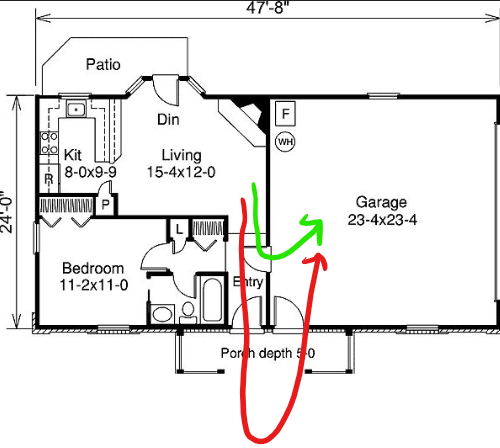
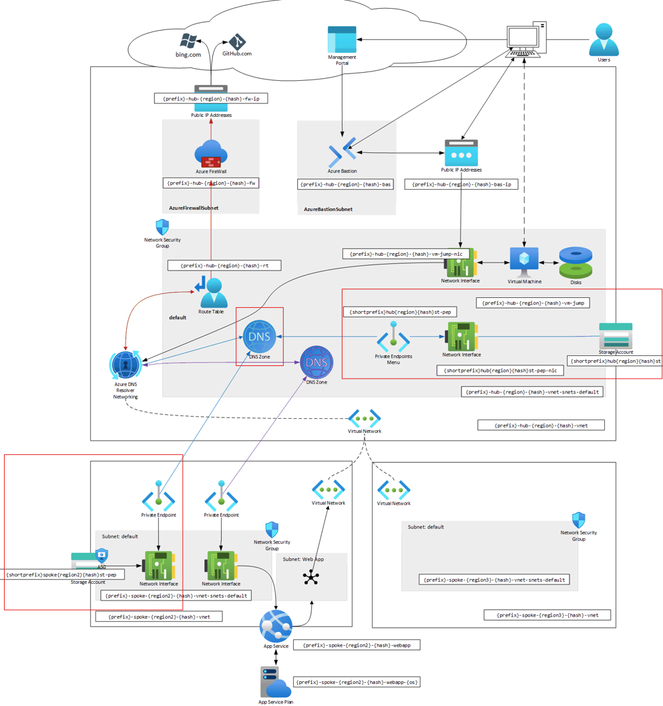

# Module 3: Secure Storage Accounts

## Table of Contents

- [Motivation](#motivation)
- [Excercises](#excercises)
- [Next Steps](#next-steps)

## Motivation

**By default**, _Azure Storage Accounts_ can expose **public URLs** (with **public IP addresses**)

It doesn't matter how **private** our VNets are, if we constantly redirect traffic via **public networks**.

Imagine that everytime you want to go to your garage, you're going outside your house to get through the exterior door. It doesn't make sense, right?

VNets are no different. And we'll achieve this via **Private Endpoints**.

## Excercises

### Pre-requisites

If you haven't already, please go through the following:

1. [Download and install Storage Explorer](./storage_explorer.md)
   1. Your laptop (Optional)
   1. In the JumpBox VM

> [!TIP]
> REMINDER: Is the Jumpbox VM running?

Sometimes the VM shuts down.

### Steps

> [!IMPORTANT]
> All Storage containers will get registered under `{name}.blob.core.windows.net`

1. [Hub resources](hub/README.md)
   1. Create Private DNS Zone
   1. Create Storage Account
1. [Spoke resources](spoke/README.md)
   1. Create Storage Account
1. [Network Security Groups](nsg.md)

## Next Steps

[Go to module 04](../04/README.md)
