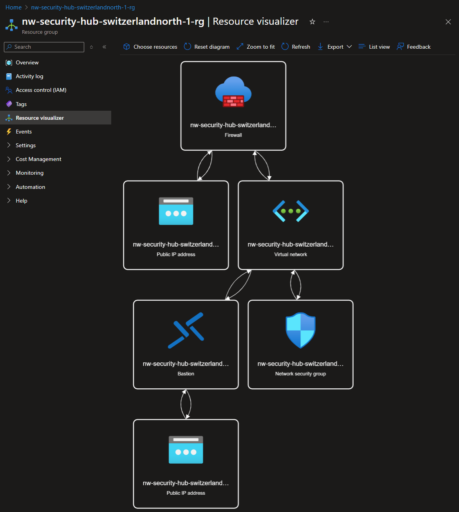

# Module 3: Secure Storage Accounts

## Table of Contents

1. Hub
1. [Download and install Storage Explorer](../storage_explorer.md) inside the VM
1. [Create Private DNS Zone](./dnsz.md)
1. [Create Storage Account](./st.md)

## Status Check

## Next Steps

[Go back to parent](../README.md)
