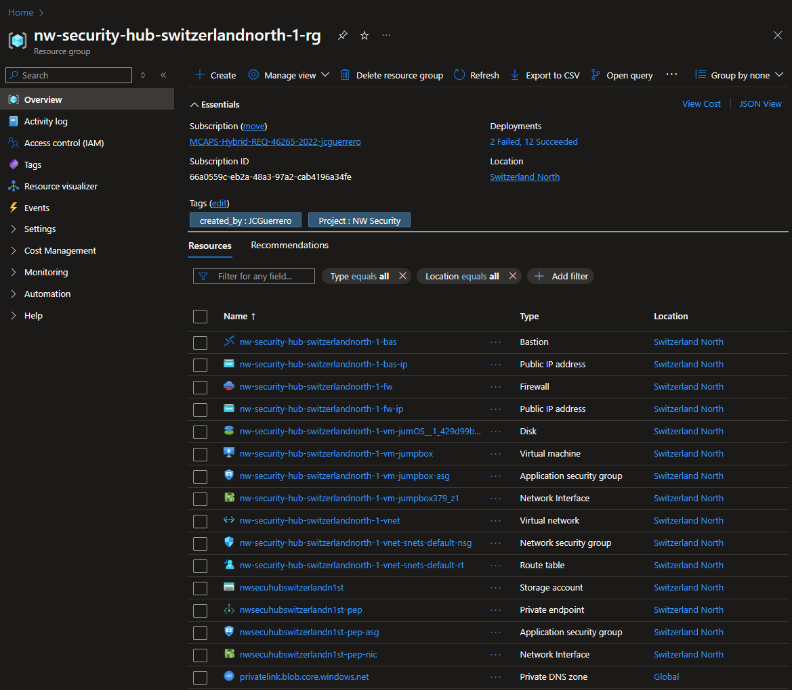

# Module 3: Secure Storage Accounts, Hub resources

## Steps

1. Hub
   1. VM
      1. [Download and install Storage Explorer](../storage_explorer.md)
   1. [Create Private DNS Zone](./pdnsz.md)
   1. [Create Storage Account](./st.md)

## Status Check

### Exported

#### CSV

Your resources should look like something this.-

| NAME                                                  | TYPE                       | LOCATION          |
| ----------------------------------------------------- | -------------------------- | ----------------- |
| `{prefix}-hub-{location}-{id}-bas`                    | Bastion                    | Switzerland North |
| `{prefix}-hub-{location}-{id}-bas-ip`                 | Public IP address          | Switzerland North |
| `{prefix}-hub-{location}-{id}-fw`                     | Firewall                   | Switzerland North |
| `{prefix}-hub-{location}-{id}-fw-ip`                  | Public IP address          | Switzerland North |
| `{prefix}-hub-{location}-{id}-vm-jumOS\_{hash}`       | Disk                       | Switzerland North |
| `{prefix}-hub-{location}-{id}-vm-jumpbox`             | Virtual machine            | Switzerland North |
| `{prefix}-hub-{location}-{id}-vm-jumpbox-asg`         | Application security group | Switzerland North |
| `{prefix}-hub-{location}-{id}-vm-jumpbox{hash}`       | Network Interface          | Switzerland North |
| `{prefix}-hub-{location}-{id}-vnet`                   | Virtual network            | Switzerland North |
| `{prefix}-hub-{location}-{id}-vnet-snets-default-nsg` | Network security group     | Switzerland North |
| `{prefix}-hub-{location}-{id}-vnet-snets-default-rt`  | Route table                | Switzerland North |
| `{short_prefix}{short_location}{short_id}st`          | Storage account            | Switzerland North |
| `{short_prefix}{short_location}{short_id}st-pep`      | Private endpoint           | Switzerland North |
| `{short_prefix}{short_location}{short_id}st-pep-asg`  | Application security group | Switzerland North |
| `{short_prefix}{short_location}{short_id}st-pep-nic`  | Network Interface          | Switzerland North |
| `privatelink.blob.core.windows.net`                   | Private DNS zone           | **Global**        |

#### Template

[JSON Template](../../../../azure/templates/modules/03/hub)

### Resource Visualizer

### Network Diagram

## Next Steps

[Create Spoke Storage Account resources](../spoke/st.md)
