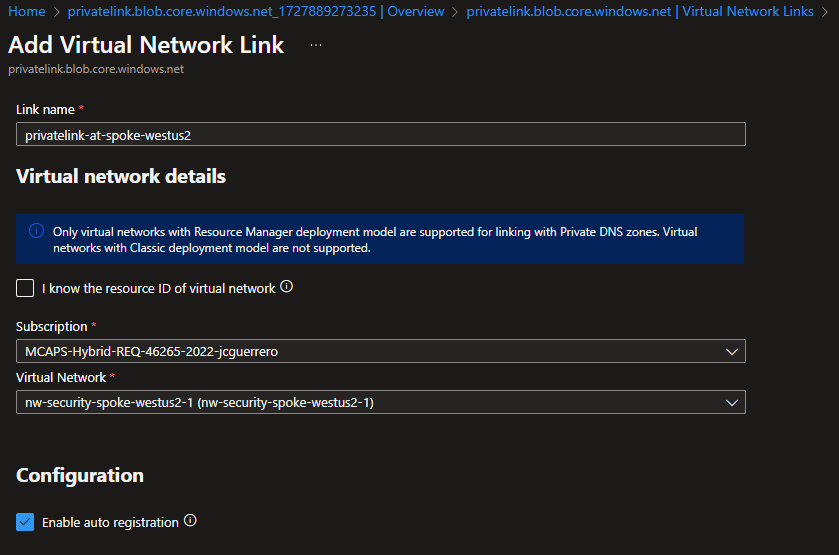

# Creating and Configuring a Private DNS Zone for Azure Storage Accounts

## Resources

- Private DNS Zone: `privatelink.blob.core.windows.net`
  - Links to VNets
    - `privatelink-at-hub`
    - `privatelink-at-spoke-westus2`

### Private DNS Zone

#### Market place

Look for a "Private DNS Zone" in the Azure Portal's market place

#### Create

##### Basics

- **Name**: `privatelink.blob.core.windows.net`

##### Review + Create

#### Create VNet Links

1. Go to "DNS Management" > "Virtual Network Links".
1. Click on "Add" and select the VNet to link.

##### VNet: Hub

- **Link name**: Give a meaningful name to the link, like `privatelink-at-hub`
- **Virtual Network**: Select the **Hub** VNet
- [x] **Enable auto registration**: Click on this checkbox.

##### VNet: Spoke

- **Link name**: Give a meaningful name to the link, like `privatelink-at-hub`
- **Virtual Network**: Select the **Hub** VNet
- [x] **Enable auto registration**: Click on this checkbox.

##### Status Check

Go to "DNS Management" > "Virtual Network Links".

## Next Steps

[Go back to parent](../README.md)
