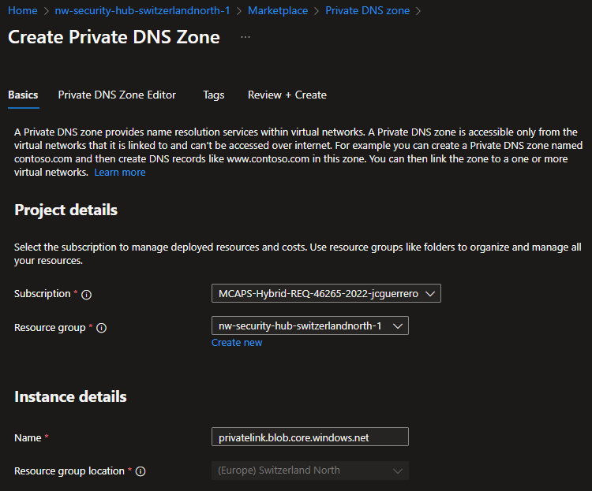
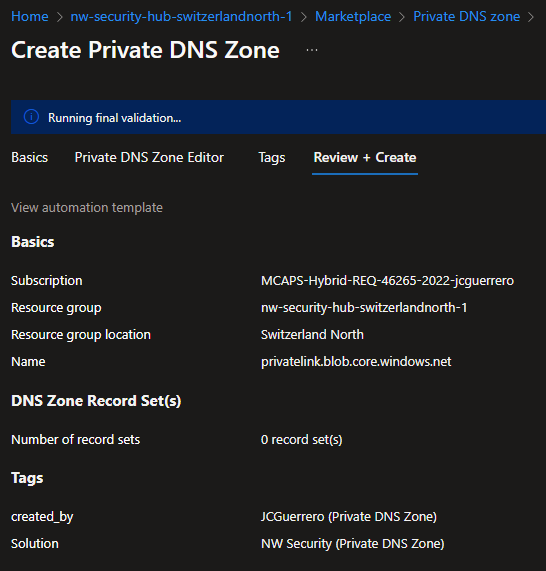
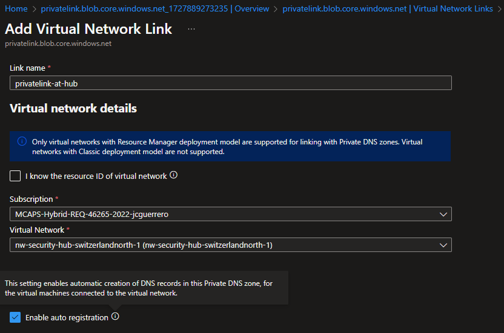

# Creating and Configuring a Private DNS Zone for Azure Storage Accounts

## Description

**By default**, _Azure Storage Accounts_ expose **public URLs** (with **public IP addresses**)

It doesn't matter how **private** our VNets are, if we constantly redirect traffic via public networks.

## Resources

- Private DNS Zone: `privatelink.blob.core.windows.net`
  - `privatelink-at-hub` VNet link
  - `privatelink-at-spoke-westus2` VNet link

### Private DNS Zone

#### Market place

Look for a "Private DNS Zone" in the Azure Portal's market place

#### Create

##### Basics

- **Name**: `privatelink.blob.core.windows.net`

##### Review + Create

#### Create VNet Links

1. Go to "DNS Management" > "Virtual Network Links".
1. Click on "Add" and select the VNet to link.

##### Link to Hub VNet

- **Link name**: Give a meaningful name to the link, like `privatelink-at-hub`
- **Virtual Network**: Select the **Hub** VNet -[x] **Enable auto registration**: Click on this checkbox.

> NOTE: You will only be able to select 1 VNet to enable auto registration.

> > FIXME KEEP GOING
