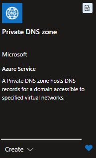
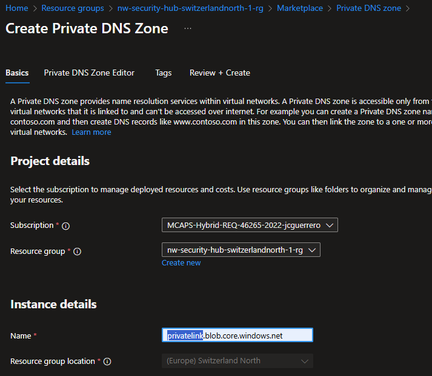
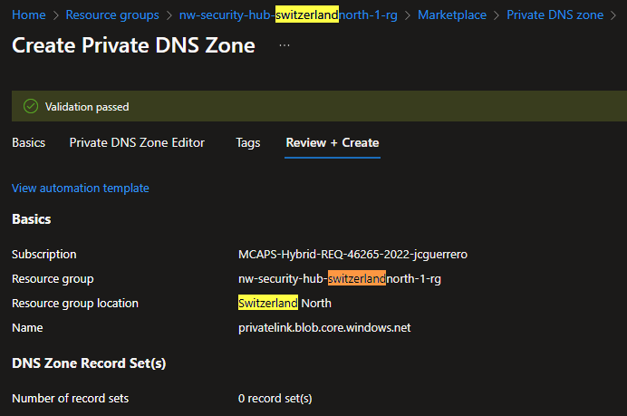
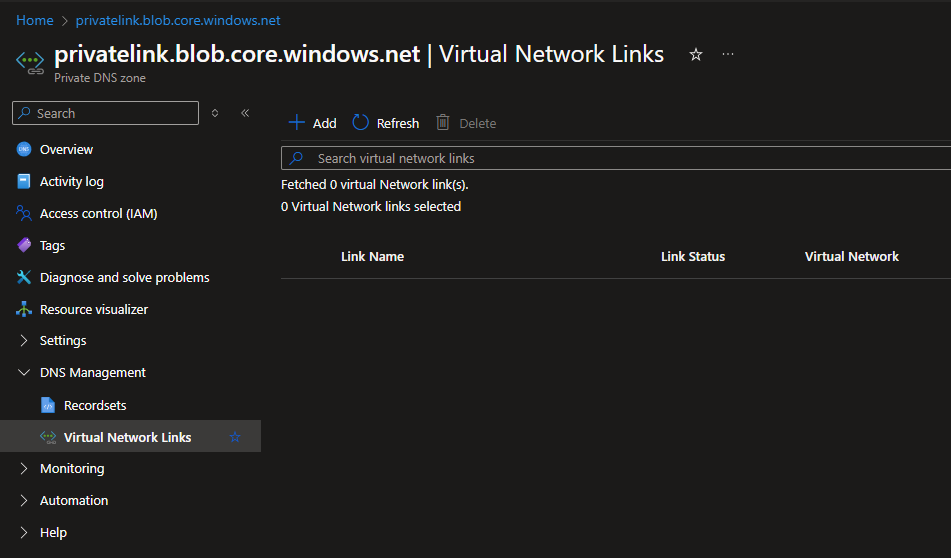
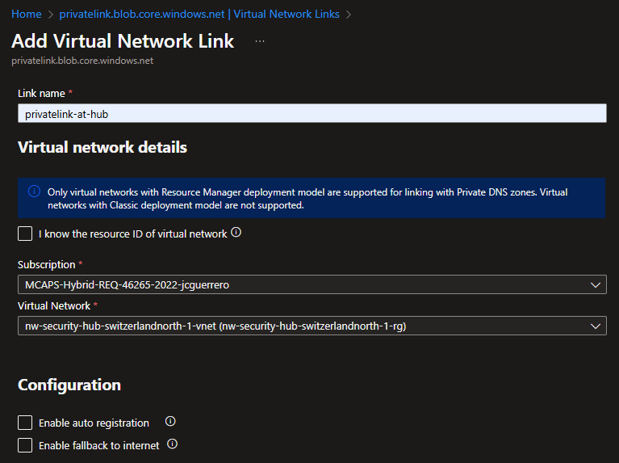
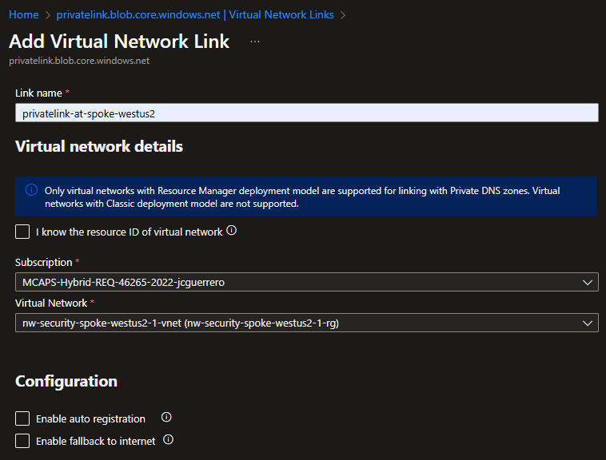
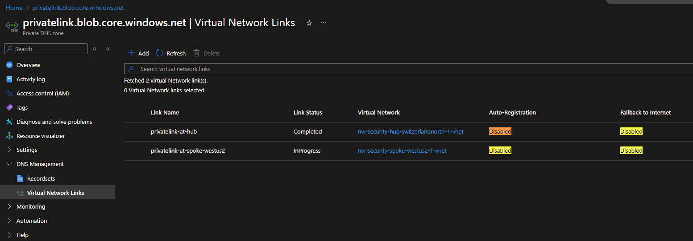

# Private DNS Zone for Azure Storage Accounts

Here is how to Create and Configure a **Private DNS Zone** for Azure **Storage Accounts**.

## Resources

- [R]esource [G]roup: `{prefix}-hub-{region}-{id}-rg` (already exists)
  - [V]irtual [N]etwork: `{prefix}-hub-{region}-{id}-vnet` (already exists)
    - [S]ubnet: `default` (already exists)
  - (🌟 **new**) [P]rivate [DNS] [Z]one: `privatelink.blob.core.windows.net`
    - (🌟 **new**) Links to VNets
      - (🌟 **new**) `privatelink-at-hub`
      - (🌟 **new**) `privatelink-at-spoke-westus2`

### Private DNS Zone

> [!NOTE]
> Unlike other resources, **Private DNS Zone** is "**Global**".

#### Market place

Look for a "Private DNS Zone" in the Azure Portal's market place

#### Create

##### Basics

> [!IMPORTANT]
> All Storage containers will get registered under `{name}.blob.core.windows.net`

But when we create a **Private DNS Zone**, storage accounts also get registered under the `privatelink` you create. as an alias: `{name}.{dns_zone_name}.blob.core.windows.net`

- **Name**: `privatelink.blob.core.windows.net`

##### Review + Create

#### DNS Management

##### Virtual Network Links

We'll create Virtual Network Links for `hub` and `spoke` VNets.

1. Go to "DNS Management" > "Virtual Network Links".
1. Click on **[ + Add ]** and select the VNet to link.

###### VNet: Hub

**Virtual network details**

- **Link name**: Give a meaningful name to the link, like `privatelink-at-hub`
- **Virtual Network**: Select the **Hub** VNet

**Configuration**

- [ ] **Enable auto registration**: Leave this unchecked.
- [ ] **Enable fallback to the internet**: Leave this unchecked.

<!-- prettier-ignore-start -->
> [!TIP]
> **Auto-registration** Is only used when you have VM scalesets or other services that need to register themselves.
<!-- prettier-ignore-end -->

###### VNet: Spoke

**Virtual network details**

- **Link name**: Give a meaningful name to the link, like `privatelink-at-spoke`
- **Virtual Network**: Select the **Spoke** VNet

**Configuration**

- [ ] **Enable auto registration**: Leave this unchecked.
- [ ] **Enable fallback to the internet**: Leave this unchecked.

## Status Check

### Virtual Network Links

1. Go to "DNS Management" > "Virtual Network Links".

## Next Steps

[Create Storage Account resources](./st.md)
