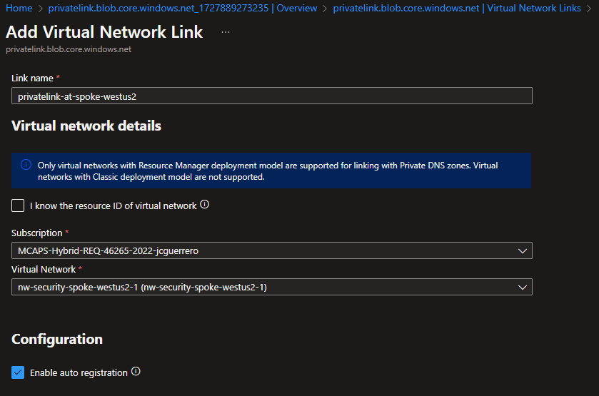
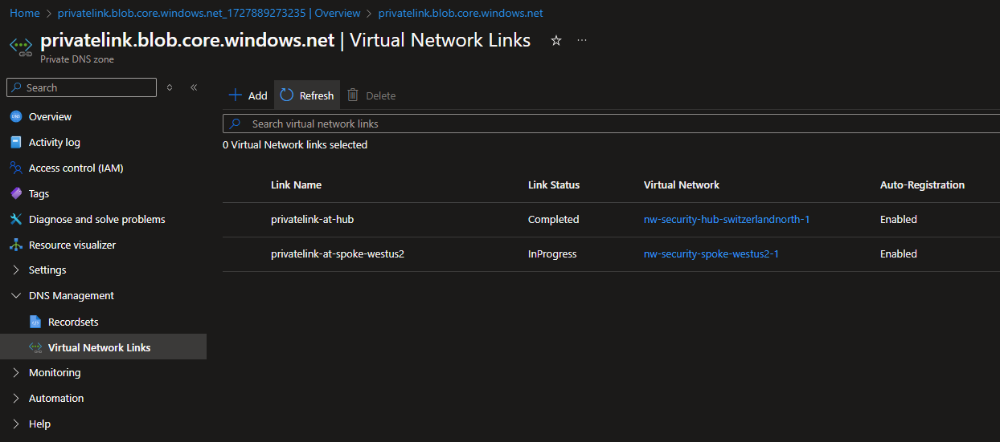

# Creating and Configuring a Private DNS Zone for Azure Storage Accounts

## Resources

- [R]esource [G]roup: `{my-prefix}-hub-{region}-{id}-rg` (already exists)
  - [V]irtual [N]etwork: `{my-prefix}-hub-{region}-{id}-vnet` (already exists)
    - [S]ubnet: `default` (already exists)
      - [N]etwork [S]ecurity [G]roup: `{my-prefix}-hub-{region}-{id}-nsg` (already exists)
  - [P]rivate [DNS] [Z]one: `privatelink.blob.core.windows.net`
    - Links to VNets
      - `privatelink-at-hub`
      - `privatelink-at-spoke-westus2`

### Private DNS Zone

#### Market place

Look for a "Private DNS Zone" in the Azure Portal's market place

#### Create

##### Basics

- **Name**: `privatelink.blob.core.windows.net`

> [!IMPORTANT]
> All Storage containers will get registered under `{name}.blob.core.windows.net`

##### Review + Create

#### Create VNet Links

1. Go to "DNS Management" > "Virtual Network Links".
1. Click on "Add" and select the VNet to link.

##### VNet: Hub

- **Link name**: Give a meaningful name to the link, like `privatelink-at-hub`
- **Virtual Network**: Select the **Hub** VNet
- [x] **Enable auto registration**: Click on this checkbox.

##### VNet: Spoke

- **Link name**: Give a meaningful name to the link, like `privatelink-at-hub`
- **Virtual Network**: Select the **Hub** VNet
- [x] **Enable auto registration**: Click on this checkbox.

##### Status Check

Go to "DNS Management" > "Virtual Network Links".

### Network Security Group

Private Endpoints will need to be able to register with the Private DNS Zone. So you need to take in account

- Spoke
  - **Outbound**: Allow DNS traffic to `10.1.x.x`
    - Storage Account's Private Endpoints registering from `hub` VNet (`10.1.x.x`), as well as other spoke VNets (like `10.2.x.x`).
- Hub
  - **Inbound**: Allow traffic DNS traffic (via port `53`) from `10.x.x.x`

> [!NOTE]
> In this tutorial we won't go to such extense

Mainly because we're (I'm) NOT 100% sure that working on port `53` would suffice :p

> [!IMPORTANT]
> You should take this into account in a **Zero Trust** Production Environment.

## Next Steps

[Go back to parent](./README.md)
