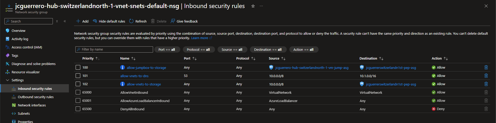
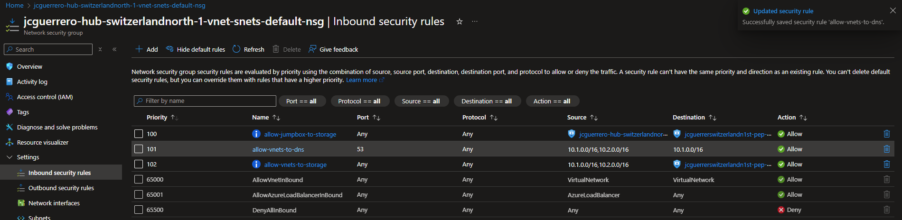

# Shared Storage Account

## Description

Sometimes you need to share files between different VNets around the world. In this case, you can use a shared storage account to store the files and share them with different VNets.

## Goal

1. A Shared storage account in the `hub` `vnet`, also accessible from the `spoke` `vnet`.
1. The Storage account should only be accessible from the jumpbox in the `hub` `vnet`.

## Naming

Bear in mind that _Storage account_ names are very limited (3-24 chars, no `-` or `_`) & unique across ALL Azure. So unlike other modules, we'll need to simplify the naming for the storage account, and the subsequent resources.

## Resources

- [R]esource [G]roup: `{prefix}-hub-{short_region}-{short_id}-rg` (already exists)
  - [V]irtual [N]etwork: `{prefix}-hub-{short_region}-{short_id}-vnet` (already exists)
    - [S]ubnet: `default` (already exists)
      - [N]etwork [S]ecurity [G]roup: `{prefix}-hub-{short_region}-{short_id}-nsg` (already exists)
  - (🌟 **new**) [St]orage Account: `{short_prefix}hub{short_region}{short_id}st`. i.e. `jchubswitzerlandnorth1st`.
    - (🌟 **new**) [P]rivate [E]nd[p]oint: `{short_prefix}hub{short_region}{short_id}st-pep`
      - (🌟 **new**) [N]etwork [I]nterfa[c]e: `{short_prefix}hub{short_region}{short_id}st-pep-nic`
      - (🌟 **new**) [A]pplication [S]ecurity [G]roup: `{short_prefix}hub{short_region}{short_id}st-pep-asg`

Where:

- `{short_prefix}`: Your username (i.e. `johndoe`)
- `{short_region}`: The region of your spoke VNet (i.e. `westus2`)
- `{short_id}`: The unique identifier of the spoke VNet (i.e. `1`)

### Storage Account

#### Market Place

Search for "Storage Account" in the Azure Portal's Market Place.


#### Create

##### Basics


**Storage account name**: `{short_prefix}hub{short_region}{short_id}st`

**Primary Service**: Choose "**Azure Files**".

<!-- prettier-ignore-start -->
> [!NOTE]
> **Gen2** is also available.
<!-- prettier-ignore-end -->


**Redundancy**: Choose "Geo-redundant storage (GRS)", since this will be shared between US and EU.


##### Advanced


- **Permitted scope of copy operations**: Choose _"Same Microsoft Entra tenant"_.

> [!TIP]
> You can also choose _"From storage accounts that have a private endpoint to the same virtual network"_.


##### Networking

> [!IMPORTANT]
> The Storage Account gets shipped with its own Firewall


###### Public access

We will start by "poking a hole" and adding our Public IP address to test connectivity, and then proceed to lock it down to the VNet.

- **Public Network access**
  - [x] Enable: Choose

##### Virtual networks

<!-- prettier-ignore-start -->
> [!CRITICAL]
> **Virtual networks**: This is ONLY for **Service Endpoints**, the old way, which will redirect traffic to the Public IP address of the Storage Account. **NOT** for **Private Endpoints**.
<!-- prettier-ignore-end -->

##### IP Addresses

> [!WARNING]
> The following is just to test connectivity. We will be removing this soon enough.

- **Allow select public internet IP addresses to access your resource**
  - Add your \_current) **Public IP address**

##### Private Endpoints

> [!WARNING]
> As of **2024-11-26**, Creating a **Private Endpoint** against an existing **Private DNS Zone** via the Storage Account wizard will fail.

**Leave empty**. We need the storage account to be created first.

##### IP Addresses

##### Data protection

We can remove all the "soft delete" protections, as it will only increase our costs.

You should enable this only when the data requires that level of durability.


##### Encryption

> [!WARNING]
> There are options that you **cannot change after** creating the resource

**You won't be changing ANYTHING here**, but we include it to make you aware that , like.-

- [C]ustomer [M]anaged [K]eys
  - Tables
  - Queues


##### Review + create

Make sure that all the naming is solid, and that it is in the expected location region.


### Private Endpoint

In this step, we will end up with the following names:

- `{storage_account_name}` (already exists)
  - (🌟 **new**) `{storage_account_name}-pep`
    - (🌟 **new**) `{storage_account_name}-pep-nic`
    - (🌟 **new**) `{storage_account_name}-pep-asg`

#### Market Place

Search for "Private Endpoint" in the Azure Portal's Market Place.


#### Create

##### Basics

- **Name**: `{storage_account_name}-pep`
- **Network Interface Name**: `{storage_account_name}-pep-nic`


##### Resource

- **Resource type**: Choose `Microsoft.Storage/storageAccounts`
- **Resource**: Choose the **storage account** you created in the previous step.
- **Target sub-resource**: Choose _"blob"_.


##### Virtual Network

- **Subnet**: Choose the `default` subnet.
- **Private IP Configuration**: Choose _"Dynamically allocate an IP address"_.
- **Application Security Groups**: You can go ahead and create one. We will use this to control which resources/IP addresses can access this storage account.


##### DNS

Point to the **Private DNS Zone** created in the previous step.


##### Review + create


#### Resources


#### Settings

Now that the **Private Endpoint** is created, it should have self-registered against the **Private DNS Zone**.

##### DNS configuration


## Reconfigure Storage Account

##### Configuration


#### Reconfigure

Having installed the "Storage Explorer" in both your Jumpbox and your local laptop, you should now be able to connect to this storage account from any of the 2 places:

##### Step 1: Upload data

From Either **Your Laptop** or the **Jumpbox**

1. Open Storage Explorer
1. Create a container
1. Upload a file from your laptop


##### Step 2: Remove Public IP

1. Go to "Security + networking" > "Networking" > "Firewalls and virtual networks" > "Firewall"
1. Remove the Public IP address you added in the previous step.

**Before**:


**After**:


Ideally, we would just change _"Plublic network access"_ to **"Disabled"**. But let's take it 1 step at the time.

###### Step 3: Download data

From your laptop, try to download the file you uploaded in step 1.

You should now see an error like this.-


But it should still work from your Jumpbox `=]`

### Network Security Group

#### Inbound

> [!IMPORTANT]
> Keep reading all the following scenarios.

You will be only doing **ONE** of the following scenarios.
Depending on how venturous you are feeling.

##### Scenario 1: Minimum security

You could add an **inbound** rule to allow traffic from our entire `10.x.x.x`

- **Name**: `allow-private-to-storage`
- **Source**:
  - `10.0.0.0/8`: This includes
    - `hub`'s vnet `10.1.x.x`
    - `spoke`'s vnet `10.2.x.x`
- **Destination**: `{short_prefix}hub{short_region}{short_id}st-pep-asg`



> [!IMPORTANT]
> What happens if a bad actor gets access from a `10.3.4.5` ?

##### Scenario 2: More explicit minimum security

You could add an **inbound** rule to allow traffic from our entire `10.x.x.x`

- **Name**: `allow-private-to-storage`
- **Source**:
  - `10.1.0.0/16`
  - `10.2.0.0/16`
- **Destination**: `{short_prefix}hub{short_region}{short_id}st-pep-asg`

> [!IMPORTANT]
> What happens if a bad actor creates a VM inside `hub`, from a `10.1.4.5` ?



##### Scenario 3: More security

1. Remember the ASG we created for the jumpboxes (currently only 1)? We'll use that instead of the entire `10.1.x.x`.
1. Also, why allow the entirety of `10.2.x.x`, when we know the `default` subnet is only 1K IPs? `10.2.0-3.0/22`

- **Name**: `allow-private-to-storage`
- **Source**:
  - ~~`10.1.0.0/16`~~ `{prefix}-hub-{short_region}-{short_id}-vm-jump-asg`
  - ~~`10.2.0.0/16`~~ `10.2.0.0/22`
- **Destination**: `{short_prefix}hub{short_region}{short_id}st-pep-asg`

> [!WARNING]
> What happens if a bad actor creates a VM with an IP `10.2.3.4`?

##### Scenario 4: Zero Trust

This is **NOT** _"trust only **buddies**"_, this is **ZERO TRUST**!

- _"But in the future, were planning to have a web application in the `spoke` `vnet` that we want to add access to this storage account"_
- Well, then you would add the excemption THEN to allow it. [YAGNI](https://en.wikipedia.org/wiki/You_aren%27t_gonna_need_it#:~:text=%22You%20aren't%20gonna%20need,add%20functionality%20until%20deemed%20necessary.)

So we end-up with something like this

- **Name**: `allow-jumpbox-to-storage`
- **Source**:
  - `{prefix}-hub-{short_region}-{short_id}-vm-jump-asg`
- **Destination**: `{short_prefix}hub{short_region}{short_id}st-pep-asg`

> [!NOTE] > `10.2.x.x`: Will remain TBD

## Status Check

### Private Endpoint

If you navigate "Resource visualizer", it should show the "[P]rivate [E]nd[p]oint" connected to the "Storage Account". and to the "[N]etwork [I]nterfa[c]e".


### Private DNS Zone

1. Go to {Your private DNS Zone} > "DNS Management" > "Recordsets"
1. You should see the "A" record pointing to the Private IP address of the "Private Endpoint".


### Jumpbox (VM)

#### Terminal

Open a PowerShell terminal and run the following command:

```
$> nslookup {your storage}.blob.core.windows.net
```

You should see the name getting resolved

#### Storage Explorer

If you installed the "Storage Explorer" in the Jumpbox, you should be able to access the storage account from there.


You should be able to create a text file, and upload it

## Next Steps

[Go back to parent](./README.md)
