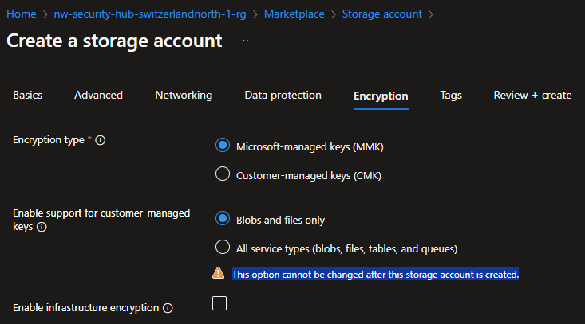
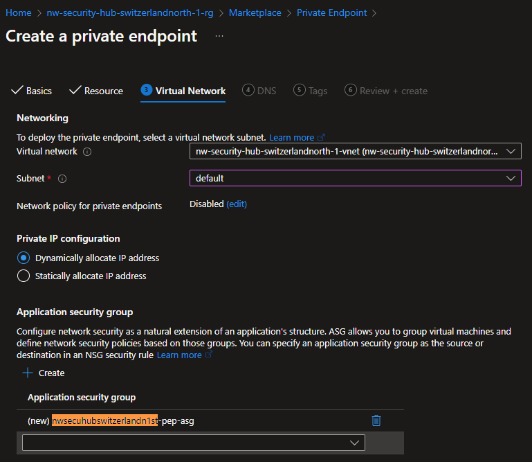

# Shared Storage Account

## Description

Sometimes you need to share files between different VNets around the world. In this case, you can use a shared storage account to store the files and share them with different VNets.

## Goal

1. A Shared storage account in the `hub` `vnet`, also accessible from the `spoke` `vnet`.
1. The Storage account should only be accessible from the jumpbox in the `hub` `vnet`.

## Naming

Bear in mind that _Storage account_ names are very limited (3-24 chars, no `-` or `_`) & unique across ALL Azure. So unlike other modules, we'll need to simplify the naming for the storage account, and the subsequent resources.

## Resources

- [R]esource [G]roup: `{prefix}-hub-{short_region}-{short_id}-rg` (already exists)
  - [V]irtual [N]etwork: `{prefix}-hub-{short_region}-{short_id}-vnet` (already exists)
    - [S]ubnet: `default` (already exists)
      - [N]etwork [S]ecurity [G]roup: `{prefix}-hub-{short_region}-{short_id}-nsg` (already exists)
  - (🌟 **new**) [St]orage Account: `{short_prefix}hub{short_region}{short_id}st`. i.e. `nwsecuhubswitzerlandn1st`.
    - (🌟 **new**) [P]rivate [E]nd[p]oint: `{short_prefix}hub{short_region}{short_id}st-pep`
      - (🌟 **new**) [N]etwork [I]nterfa[c]e: `{short_prefix}hub{short_region}{short_id}st-pep-nic`
      - (🌟 **new**) [A]pplication [S]ecurity [G]roup: `{short_prefix}hub{short_region}{short_id}st-pep-asg`

Where:

- `{short_prefix}`: Your username (i.e. `johnd`)
- `{short_region}`: The region of your spoke VNet (i.e. `switzerlandn`)
- `{short_id}`: The unique identifier of the spoke VNet (i.e. `1`)

### Storage Account

#### Market Place

Search for "Storage Account" in the Azure Portal's Market Place.


#### Create

##### Basics


**Storage account name**: `{short_prefix}hub{short_region}{short_id}st`

**Primary Service**: Choose "**Azure Files**".

<!-- prettier-ignore-start -->
> [!NOTE]
> **Gen2** is also available.
<!-- prettier-ignore-end -->


**Redundancy**: Choose "Geo-redundant storage (GRS)", since this will be shared between US and EU.


##### Advanced


- [x] **Enable storage account key access**: Checked/Selected.
- **Permitted scope of copy operations**: Choose _"Same Microsoft Entra tenant"_.

##### Networking

> [!IMPORTANT]
> The Storage Account gets shipped with its own Firewall


###### Public access

We will start by "poking a hole" and adding our **Public IP address** to test connectivity, and then proceed to lock it down to the **VNet**.

- **Public Network access**
  - [x] Enable: Choose

##### Virtual networks

<!-- prettier-ignore-start -->
> [!CAUTION]
> **Virtual networks**: This is ONLY for **Service Endpoints** (the old way), which will redirect traffic to the Public IP address of the Storage Account. **NOT** for **Private Endpoints**.
<!-- prettier-ignore-end -->

##### IP Addresses

> [!WARNING]
> The following is just to test connectivity. We will be removing this soon enough.

- **Allow select public internet IP addresses to access your resource**
  - Add your (current) **Public IP address**

##### Private Endpoints

> [!WARNING]
> As of **2024-11-26**, Creating a **Private Endpoint** against an existing **Private DNS Zone** via the Storage Account wizard will fail.

**Leave empty**. We need the storage account to be created first.

##### Data protection

We can remove all the "soft delete" protections, as it will only increase our costs.

You should enable this only when the data requires that level of durability.


##### Encryption

> [!WARNING]
> There are options that you **cannot change after** creating the resource

**You won't be changing ANYTHING here**, but we include it to make you aware that , like.-

- [C]ustomer [M]anaged [K]eys
  - Tables
  - Queues



##### Review + create

Make sure that all the naming is solid, and that it is in the expected location region.


#### Settings

##### Configuration

Ensure that _"allow storage account **key access**"_ is **Enabled**


### Private Endpoint

In this step, we will end up with the following names:

- `{storage_account_name}` (JUST created)
  - (🌟 **new**) `{storage_account_name}-pep`
    - (🌟 **new**) `{storage_account_name}-pep-nic`
    - (🌟 **new**) `{storage_account_name}-pep-asg`

#### Market Place

Search for "Private Endpoint" in the Azure Portal's Market Place.


#### Create

##### Basics

- **Name**: `{storage_account_name}-pep`
- **Network Interface Name**: `{storage_account_name}-pep-nic`


##### Resource

- **Resource type**: Choose `Microsoft.Storage/storageAccounts`
- **Resource**: Choose the **storage account** you created in the previous step.
- **Target sub-resource**: Choose _"blob"_.


##### Virtual Network

- **Subnet**: Choose the `default` subnet.
- **Private IP Configuration**: Choose _"Dynamically allocate an IP address"_.
- **Application Security Groups**: Create one: `{storage_account_name}-pep-asg`

> [!NOTE]
> We will use the ASG to control which resources/IP addresses can access this **storage account**.



##### DNS

Point to the **Private DNS Zone** created in the previous step.


##### Review + create


#### Resources

If you navigate "Resource visualizer", it should show the "[P]rivate [E]nd[p]oint" connected to the "Storage Account". and to the "[N]etwork [I]nterfa[c]e".


#### Settings

Now that the **Private Endpoint** is created, it should have self-registered against the **Private DNS Zone**.

##### DNS configuration


### Storage Account Container

#### Create

You can use any of the following methods to create a container:

- Azure Portal
  - `{storage_account}` > _"Data storage"_ > _"Containers"_
  - Click on **[ + Container ]**
- Storage Explorer
  - From your laptop
  - From the Jumpbox

#### Status Check


## Reconfigure Storage Account

### Step 1: Upload data

Having installed the "Storage Explorer" in both your **Jumpbox** and your local **laptop**, you should now be able to connect to this storage account from any of the 2 places:

From either **Your Laptop** or the **Jumpbox**

1. Upload a file from your laptop


### Step 2: Disable access from Public IP

> [!WARNING]
> After Ignite Microsoft '24, this section changed

1. Go to `{storage_account}`
1. Go to _"Security + networking"_ > _"Networking"_ > _"Public access"_
1. Click on **[ Manage ]** under _"Public network access"_
1. Change _"Public network access"_ to **"Disable"**

**Disable**:


**After**:

Notice how it says _"Public network access **Disabled**"_


1. Go to "Security + networking" > "Networking" > "Public access"
1. Now, if you check **[ View ]** under "Resource settings: ..."
1. Everything should be grayed out


> [!TIP]
> Remove the IP Address **BEFORE** Disabling the Public Access

### Step 3: Publicly INACCESSIBLE

From your laptop, try to download the file you uploaded in step 1.

You should now see an error like this.-


But it should still work from your Jumpbox 🥷

## Status Check

### Private DNS Zone

1. Go to {Your private DNS Zone} > "DNS Management" > "Recordsets"
1. You should see the "A" record pointing to the Private IP address of the "Private Endpoint".

### Jumpbox (VM)

#### Terminal

Open a PowerShell terminal and run the following command:

```
$> nslookup {your storage}.blob.core.windows.net
```

You should see the name getting resolved

#### Storage Explorer

If you installed the "Storage Explorer" in the Jumpbox, you should be able to access the storage account from there.


You should be able to create a text file, and upload it

## Next Steps

[Go back to parent](./README.md)
