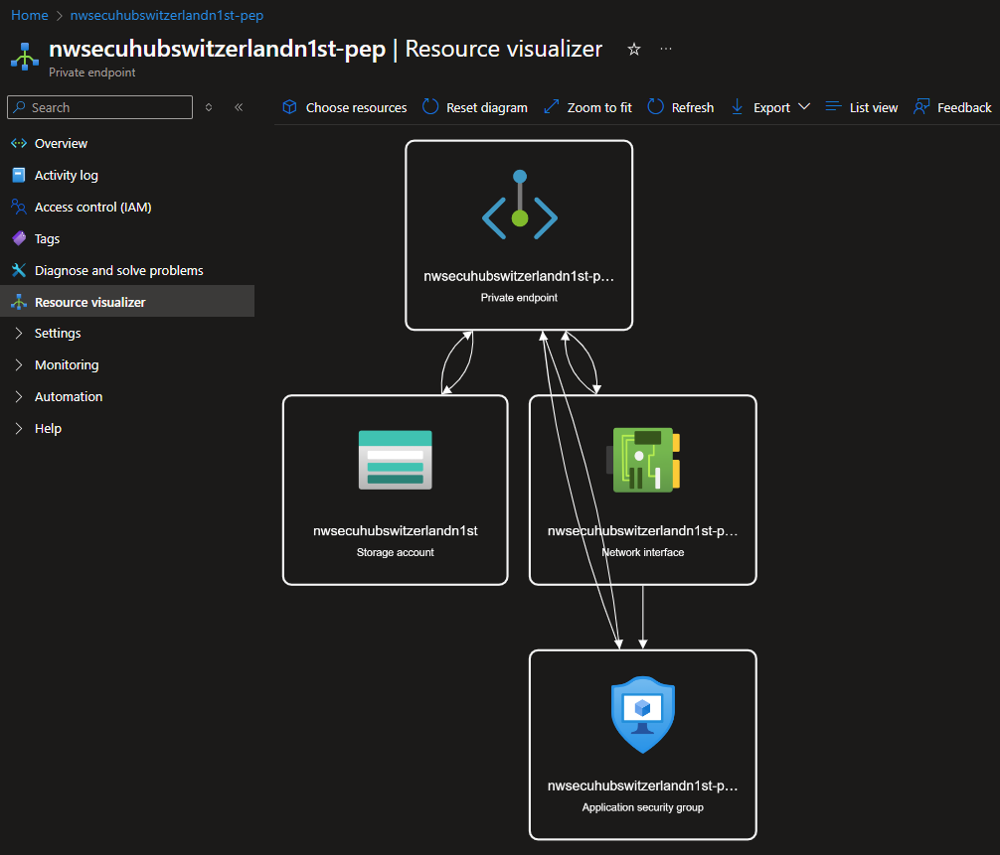

# Shared Storage Account

## Description

Sometimes you need to share files between different VNets around the world. In this case, you can use a shared storage account to store the files and share them with different VNets.

## Naming

Bear in mind that _Storage account_ names are very limited (3-24 chars, no `-` or `_`) & unique across ALL Azure. So unlike other modules, we'll need to simplify the naming for the storage account, and the subsequent resources.

## Resources

- Storage Account: `{some-short-prefix}hub{region}{id}st`. i.e. `jchubswitzerlandnorth1st`.
  - Private Endpoint: `{some-short-prefix}hub{region}{id}st-pep`
    - Network Interface: `{some-short-prefix}hub{region}{id}st-pep-nic`

> NOTE: You can create "Private Endpoint" and "Network interface" in the same step as the "Storage Account" creation, but you won't have much control over naming. So We would recommend you start by creating the "Private endpoint".

### Private Endpoint

Creating the "Private Endpoint" and "Network Interface" before-hand will ensure that we end up with the following names:

- `{name}st`
  - `{name}st-pep`
    - `{name}st-pep-nic`

You can also skip this step and either:

1. Go straight to the "Storage Account > Create" and create them from there.
1. Or add them after the fact, which requires more work.

#### Create

##### Basics

- **Name**: `hub{region}st-pep`
- **Network Interface Name**: `hub{region}st-pep-nic`

##### Resource

- **Target sub-resource**: Choose _"blob"_.

##### Virtual Network

- **Subnet**: Choose the `default` subnet.
- **Private IP Configuration**: Choose _"Dynamically allocate an IP address"_.
- **Application Security Groups**: You can go ahead and create one. We will use this to control which resources/IP addresses can access this storage account.

###### DNS

Point to the Private DNS Zone created in the previous step.

#### Settings

DNS configuration:

IP configurations:

### Storage Account

#### Create

##### Basics

**Storage account name**: `{short-prefix}hub{region}{id}st`

**Primary Service**: Choose "Azure Files".

But be aware that Gen2 is also available.

**Redundancy**: Choose "Geo-redundant storage (GRS)", since this will be shared between US and EU.

##### Networking

> **NOTE**: The Storage Account gets shipped with its own Firewall

**Network access**: Choose _"Enable public access from selected virtual networks and IP Addresses"_.

We will start by "poking a hole" and adding our Public IP address to test connectivity, and then proceed to lock it down to the VNet.

**Subnets**: Choose all the subnets available.

- `default`: We want any service from the VNet to be able to access the storage account. We can add more security with ([A]pplication) [S]ecurity [G]roups.
- `AzureBastionSubnet`: We want to be able to access & test the storage account from the Jump box accessible from Bastion.
- ~~`AzureFirewallSubnet`~~: N/A

**IP Addresses**: **TEMPORARY!** Add your current Public IP address. We will be removing this later on.

**Private Endpoints**: If you have created the "Private Endpoint" before-hand, you can just link it here. If not, this is the step where you could create it:

.

> NOTE: This view does NOT allow you to control the name of the "[N]etwork [I]nterfa[c]e". If you want to control the name, you should create the "[P]rivate [E]nd[p]oint" in the step above.

##### Data protection

##### Encryption

##### Review

#### Private Endpoint: Did you forget?

Listen, I get it. We all do mistakes. If you forgot to create the "Private Endpoint" before-hand, or during creation process; you can still do it now.

#### Reconfigure

Having installed the "Storage Explorer" in both your Jumpbox and your local laptop, you should now be able to connect to this storage account from any of the 2 places:

##### Step 1: Upload data

From Either **Your Laptop** or the **Jumpbox**

1. Open Storage Explorer
1. Create a container
1. Upload a file from your laptop

##### Step 2: Remove Public IP

1. Go to "Security + networking" > "Networking" > "Firewalls and virtual networks" > "Firewall"
1. Remove the Public IP address you added in the previous step.

**Before**:

**After**:

Ideally, we would just change _"Plublic network access"_ to **"Disabled"**. But let's take it 1 step at the time.

###### Step 3: Download data

From your laptop, try to download the file you uploaded in step 1.

You should now see an error like this.-

But it should still work from your Jumpbox `=]`

## Status Check

### Private Endpoint

If you navigate "Resource visualizer", it should show the "[P]rivate [E]nd[p]oint" connected to the "Storage Account". and to the "[N]etwork [I]nterfa[c]e".

### Private DNS Zone

1. Go to {Your private DNS Zone} > "DNS Management" > "Recordsets"
1. You should see the "A" record pointing to the Private IP address of the "Private Endpoint".

