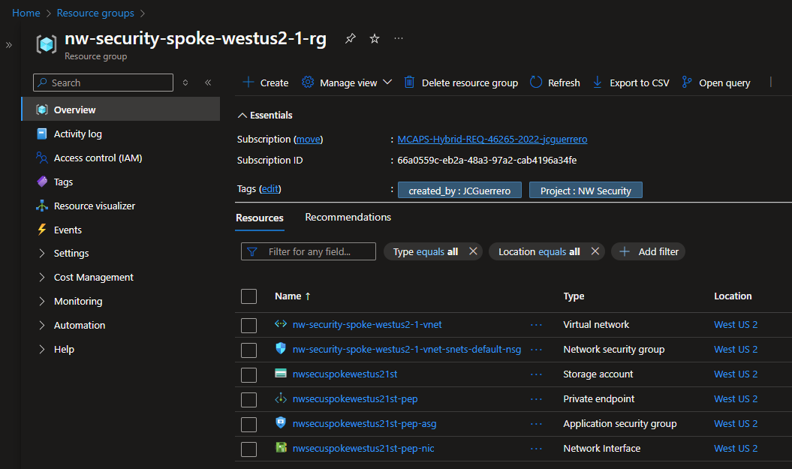
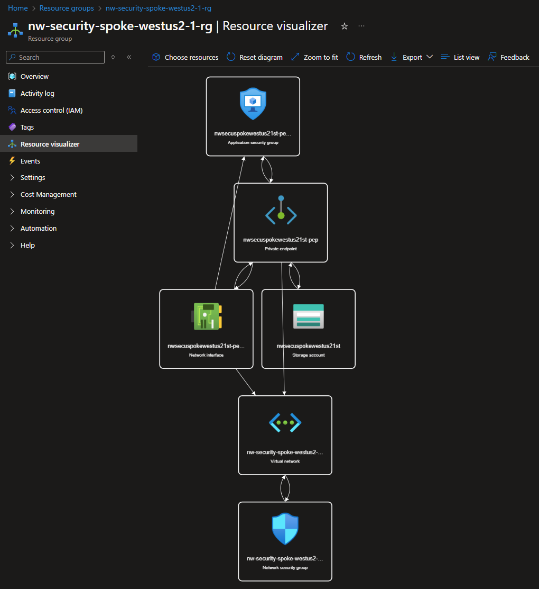
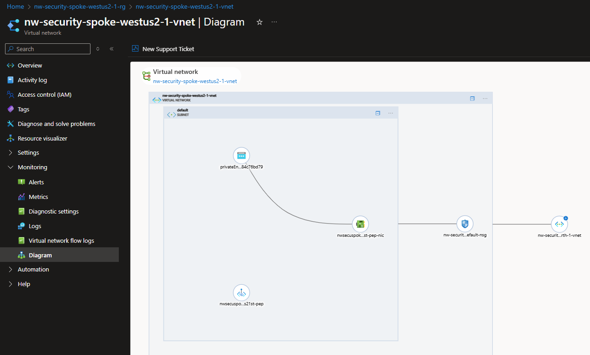

# Module 3: Secure Storage Accounts, Spoke resources

## Steps

1. Spoke
   1. [Create Storage Account](spoke/st.md)

## Status Check

### Exported

#### CSV

| NAME                                                    | TYPE                       | LOCATION  |
| ------------------------------------------------------- | -------------------------- | --------- |
| `{prefix}-spoke-{region}-{id}-vnet`                     | Virtual network            | West US 2 |
| `{prefix}-spoke-{region}-{id}-vnet-snets-default-nsg`   | Network security group     | West US 2 |
| `{short_prefix}spoke{short_region}{short_id}st`         | Storage account            | West US 2 |
| `{short_prefix}spoke{short_region}{short_id}st-pep`     | Private endpoint           | West US 2 |
| `{short_prefix}spoke{short_region}{short_id}st-pep-asg` | Application security group | West US 2 |
| `{short_prefix}spoke{short_region}{short_id}st-pep-nic` | Network Interface          | West US 2 |

#### Template

[JSON Template](../../../../azure/templates/spoke/03)

### Resource Visualizer

### Network Diagram

## Next Steps

[Configure NSG rules](../nsg.md)
