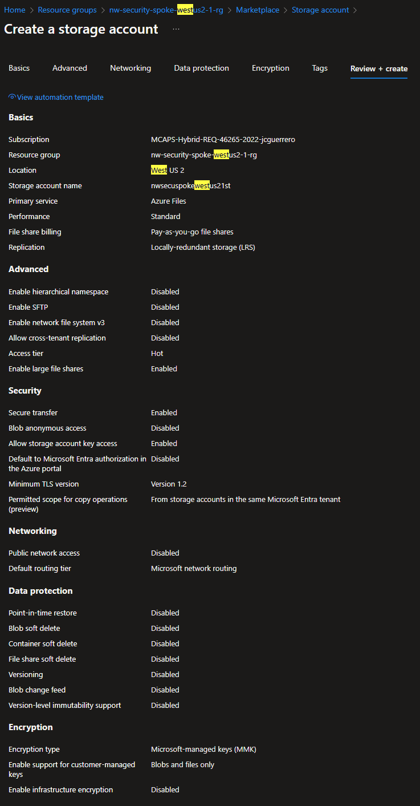

# Regional Storage Account

## Description

The information of each short_region is stored in a locally-accessible storage account.

## Goal

1. A Regional storage account in the `spoke` `vnet`, also accessible the **jumpbox** in the `hub` `vnet`.

## Resources

- [R]esource [G]roup: `{prefix}-spoke-{short_region}-{short_id}-rg` (already exists)
  - [V]irtual [N]etwork: `{prefix}-spoke-{short_region}-{short_id}-vnet` (already exists)
    - [S]ubnet: `default` (already exists)
      - [N]etwork [S]ecurity [G]roup: `{prefix}-spoke-{short_region}-{short_id}-nsg` (already exists)
  - (🌟 **new**) [St]orage Account: `{short_prefix}spoke{short_region}{short_id}st`.
    - (🌟 **new**) [P]rivate [E]nd[p]oint: `{short_prefix}spoke{short_region}{short_id}st-pep`
      - (🌟 **new**) [N]etwork [I]nterfa[c]e: `{short_prefix}spoke{short_region}{short_id}st-pep-nic`
      - (🌟 **new**) [A]pplication [S]ecurity [G]roup: `{short_prefix}spoke{short_region}{short_id}st-pep-asg`

Where:

- `{short_prefix}`: Your username (i.e. `johnd`)
- `{short_region}`: The short_region of your spoke VNet (i.e. `wus2`)
- `{short_id}`: The unique identifier of the spoke VNet (i.e. `1`)

### Storage Account

#### Create

##### Basics

Since you just created one **Storage account** at `hub`, we will skim over some details in this part.

- **Storage account name**: `{short_prefix}spoke{short_region}{short_id}st`
- **Redundancy**: Choose "Geo-redundant storage (GRS)", since this will be shared between US and EU.


##### Advanced


##### Networking

> [!IMPORTANT]
> The Storage Account gets shipped with its own Firewall

We've already proven how to close the security. No need to "start Public" and then "Disable" it.

- **Public network access**: Set to "Disable"


> [!WARNING]
> This view does **NOT** allow you to control the name of the "[N]etwork [I]nterfa[c]e". If you want to control the name, you should create the "[P]rivate [E]nd[p]oint" in the step above.

##### Data protection


##### Review



### Storage Account Container

#### Create

Like we did in **Hub**, create a BLOb container.

#### Storage Browser

> [!WARNING]
> You won't be able to access this container from the portal, as we've disallowed **Public Access**.


### Private Endpoint

- `{storage_account_name}`
  - `{storage_account_name}-pep`
    - `{storage_account_name}-pep-nic`
    - `{storage_account_name}-pep-asg`

#### Create

##### Basics

- **Name**: `{storage_account_name}-pep`
- **Network Interface Name**: `{storage_account_name}-pep-nic`


##### Resource

- **Resource type**: Choose `Microsoft.Storage/storageAccounts`
- **Resource**: Choose the **storage account** you created in the previous step.
- **Target sub-resource**: Choose _"blob"_.


##### Virtual Network

- **Subnet**: Choose the `default` subnet.
- **Private IP Configuration**: Choose _"Dynamically allocate an IP address"_.
- **Application Security Groups**: Create one: `{storage_account_name}-pep-asg`


##### DNS

Point to the **Private DNS Zone** created in the previous step.


##### Review + create


#### Resource Visualizer

You can see the resources you've just created


#### Settings

##### DNS Configuration

It should be registered to the same Private DNS Zone, like we did w/ the one at hub.


### [N]etwork [S]ecurity [G]roup

#### Inbound Rules

Unfortunately, we can't use **Application Security Group** from other VNets to control access. We'll have to settle for IP addresses.

- **Name**: `allow-hub-jumpbox-to-storage`
- **Source**:
  - ~~Application Security Group: `{jumpbox_name}-asg`~~ (if only it were that simple...)
  - **IP Addresses**: ~~`10.1.x.x`~~ `10.1.4.0/22` (`hub`'s `default` `subnet`)
- **Destination**:
  - **Application Security Group**: `{storage_account_name}-pep-asg`

## Status Check

### Resource Group


### From Jumpbox (VM)

#### Terminal

Open a PowerShell terminal run the following command:

```
$> nslookup {your storage}.blob.core.windows.net
```

You should see the name getting resolved


### Storage explorer

If you installed the "Storage Explorer" in the Jumpbox, you should be able to access the storage account from there.


You should be able to work with either Storage Account.


## Next Steps

[Go back to parent](./README.md)
