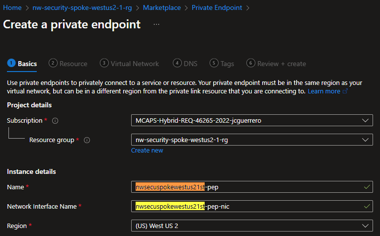
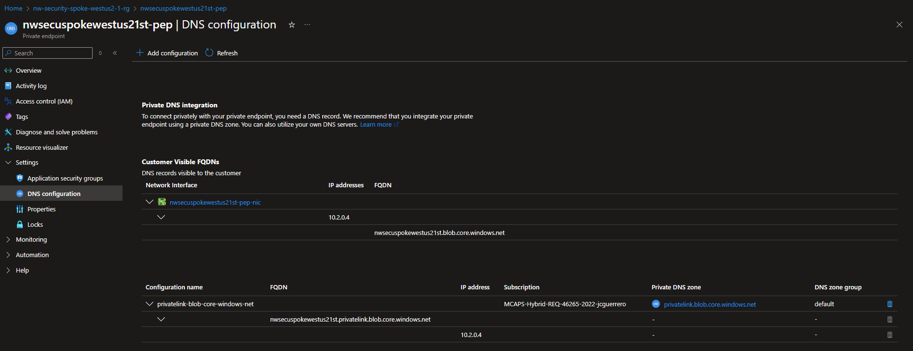
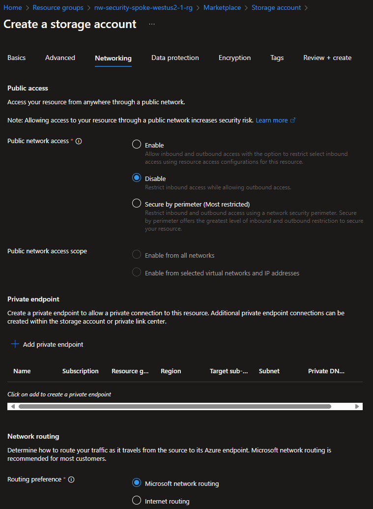

# Regional Storage Account

## Description

The information of each region is stored in a locally-accessible storage account.

## Resources

- [R]esource [G]roup: `{my-prefix}-spoke-{region}-{id}-rg` (already exists)
  - [St]orage Account: `{some-short-prefix}spoke{region}{id}st`. i.e. `jcspokewestus21st`.
    - [P]rivate [E]nd[p]oint: `{some-short-prefix}spoke{region}{id}st-pep`
      - [N]etwork [I]nterfa[c]e: `{some-short-prefix}spoke{region}{id}st-pep-nic`
    - [A]pplication [S]ecurity [G]roup: `{some-short-prefix}spoke{region}{id}st-asg`

Where:

- `{some-short-prefix}`: Your username (i.e. `johndoe`)
- `{region}`: The region of your spoke VNet (i.e. `westus2`)
- `{id}`: The unique identifier of the spoke VNet (i.e. `1`)

### Private Endpoint

Creating the "Private Endpoint" and "Network Interface" before-hand will ensure that we end up with the following names:

- `{name}st`
  - `{name}st-pep`
    - `{name}st-pep-nic`

You can also skip this step and either:

1. Go straight to the "Storage Account > Create" and create them from there.
1. Or add them after the fact, which requires more work.

#### Create

##### Basics

- **Name**: `spoke{region}st-pep`
- **Network Interface Name**: `spoke{region}st-pep-nic`

##### Resource

- **Target sub-resource**: Choose _"blob"_.

##### Virtual Network

- **Subnet**: Choose the `default` subnet.
- **Private IP Configuration**: Choose _"Dynamically allocate an IP address"_.
- **Application Security Groups**: You can go ahead and create one. We will use this to control which resources/IP addresses can access this storage account.

###### DNS

Point to the Private DNS Zone previously created.

### Resource Visualizer

You can see the resources you've just created

### Settings

#### DNS Configuration

It should be registered to the same Private DNS Zone, like we did w/ the one at hub.

### Storage Account

#### Create

##### Basics

Since you just created one Storage account at hub, we will skim over some details in this part.

##### Networking

> [!IMPORTANT]
> The Storage Account gets shipped with its own Firewall

**Network access**: The regional is meant to be private to only the app from that region. We'll still be able to access it from **Hub** via the **Private Endpoint**. Configured below.

**Private Endpoints**: If you have created the "Private Endpoint" before-hand, you can just link it here. If not, this is the step where you could create it:

.

> [!WARNING]
> This view does **NOT** allow you to control the name of the "[N]etwork [I]nterfa[c]e". If you want to control the name, you should create the "[P]rivate [E]nd[p]oint" in the step above.

##### Review

## Status Check

### Resource Group

## Next Steps

[Go back to parent](../README.md)
