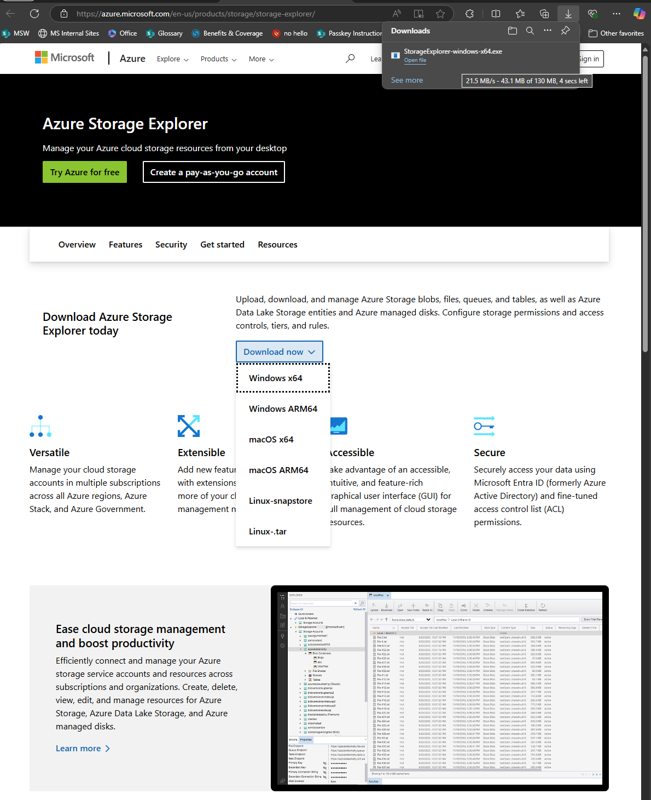

# Storage Explorer

## Download & Install

We'll be using the Storage Explorer to trouble-shoot the Storage Accounts.

### How

[Go to `azure.microsoft.com/{lang}/products/storage/storage-explorer/`](https://azure.microsoft.com/en-us/products/storage/storage-explorer/?msockid=2f1cf2046f1769f8340ae3c86e1668c1#Download-4)

### Where

#### Your Laptop (Optional)

The excercise guides you to opening up the Storage Account to your Public IP (insecure), But then has you to close it.

This helps troubleshooting the storage account when you cannot connect from the jumpbox.

#### Jumpbox

You will need to install it in the Jumpbox, so you can manage your spoke-VNet's Storage account.

### Troubleshoot

Having trouble accessing the URL above? Remember our FireWall FDQNs rules? Time to add some more :/

> [!NOTE]
> We're explicitly NOT including the URLs in this tutorial

1. DNS naming changes overtime. And keeping that list up to date here would be futile.
1. We want you to go over the excercise of hitting <kbd>F11</kbd> in the browser and see the URLs being blocked.

