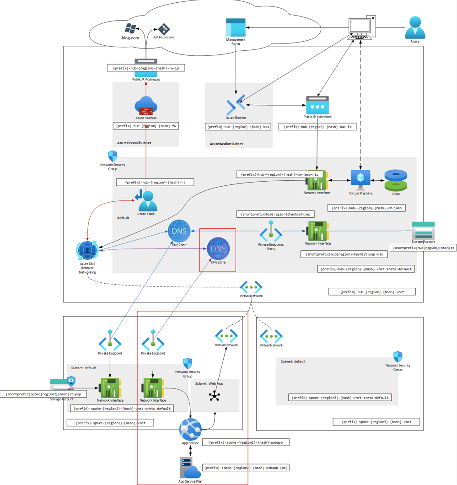

# Module 4: Web applications

> [!IMPORTANT]
> All webapps will get registered under `{name}.azurewebsites.net`

## Table of Contents

1. Hub resources
   1. [[P]rivate [DNS] [Z]one](./hub/pdnsz.md)
1. [Spoke resources](./spoke/README.md)
   1. VNet (already existing)
      1. Delegated subnet
      1. [N]etwork [S]ecurity [G]roup
   1. [WebApp] resources
      1. Service
      1. [P]rivate [E]nd[p]oint
         1. [N]etwork [I]nterfa[c]e
         1. [A]pplication [S]ecurity [G]roup

## Next Steps

[Go back to parent](../README.md)
