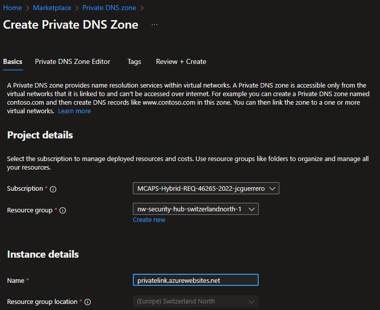
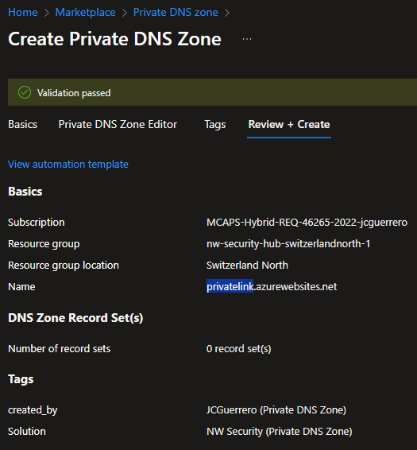
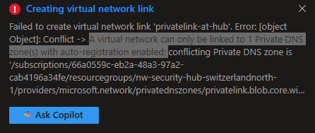
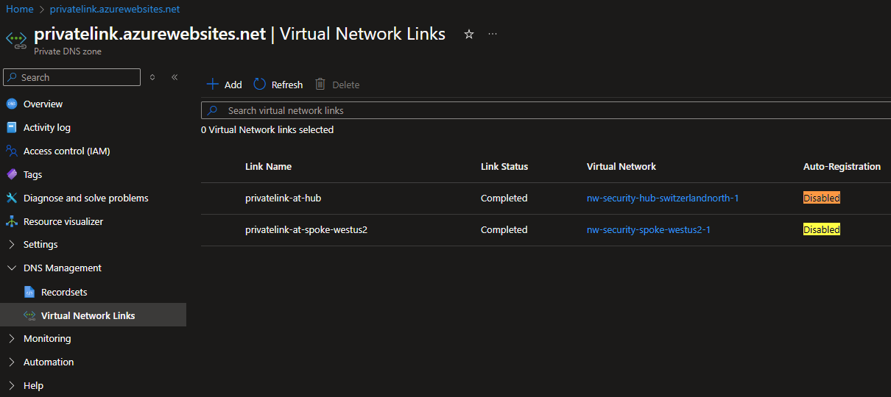
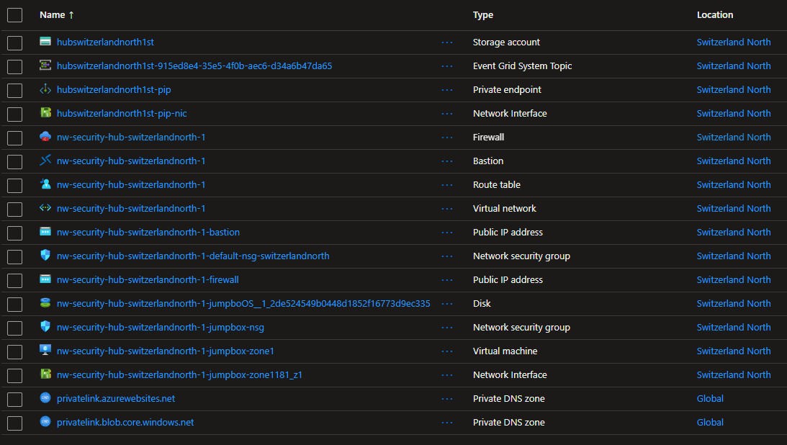

# Creating and configuring a Private DNS Zone for WebApps

## Summary

Just like we created a Private DNS Zone for the storage account, we need to create one for the webapps. This will allow the webapps to communicate with the storage account using the private endpoint.

## Resources

- [R]esource [G]roup: `{my-prefix}-hub-{region}-{id}-rg` (already exists)
  - [V]irtual [N]etwork: `{my-prefix}-hub-{region}-{id}-vnet` (already exists)
    - [S]ubnet: `default` (already exists)
      - [N]etwork [S]ecurity [G]roup: `{my-prefix}-hub-{region}-{id}-nsg` (already exists)
  - [P]rivate [DNS] [Z]one: `privatelink.azurewebsites.net`
    - Links to VNets
      - `privatelink-at-hub`
      - `privatelink-at-spoke-westus2`

Where:

- `{some-short-prefix}`: Your username (i.e. `johndoe`)
- `{region}`: The region of your spoke VNet (i.e. `switzerlandnorth`)
- `{id}`: The unique identifier of the spoke VNet (i.e. `1`)

### Private DNS Zone

> [!IMPORTANT]
> All webapps will be registered under `{name}.azurewebsites.net`

#### Market place

Look for a "Private DNS Zone" in the Azure Portal's market place

#### Create

##### Basics

- **Name**: `privatelink.blob.core.windows.net`

##### Review + Create

#### Create VNet Links

1. Go to "DNS Management" > "Virtual Network Links".
1. Click on "Add" and select the VNet to link.

##### VNet: Hub

- **Link name**: Give a meaningful name to the link, like `privatelink-at-hub`
- **Virtual Network**: Select the **Hub** VNet
- [ ] **Enable auto registration**: Leave this unchecked.

> [!IMPORTANT]
> You won't be able to register another Private DNS zone under the same VNet if you "enable auto-registration".

##### VNet: Spoke

- **Link name**: Give a meaningful name to the link, like `privatelink-at-spoke`
- **Virtual Network**: Select the **Spoke** VNet
- [ ] **Enable auto registration**: Leave this unchecked.

> [!IMPORTANT]
> You won't be able to register another Private DNS zone under the same VNet if you "enable auto-registration".

### Network Security Group

Since you already configured a DNS Zone for storage accounts, it should benefit from the same configuration. So no further action is needed at this point.

## Status Check

### Private DNS Zone

Go to "DNS Management" > "Virtual Network Links".

### Resources

## Next Steps

[Go back to parent](../README.md)
