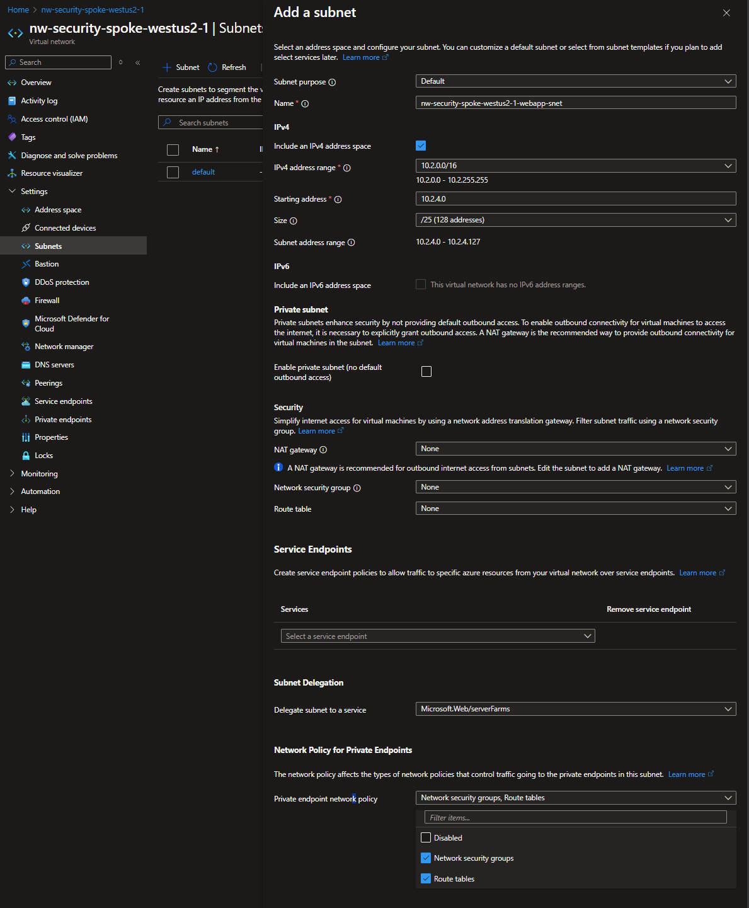

# Create a Delegated subnet and configure Security Groups

## Resources

- [R]esource [G]roup (already exists): `{my-prefix}-spoke-{region}-{id}-rg`
  - [V]irtual [Net]work (already exists): `{my-prefix}-spoke-{region}-{id}-vnet`: `10.2.x.x`
    - Subnets
      - `default` (already exists): `10.2.0.x/22`
        - [N]etwork [S]ecurity [G]roup (already exists): `{my-prefix}-spoke-{region}-{id}-vnet-snet-default-nsg`
      - `webapp`: `10.2.4.x/25`
        - [N]etwork [S]ecurity [G]roup: `{my-prefix}-spoke-{region}-{id}-vnet-snet-webapp-nsg`

Where:

- `{some-short-prefix}`: Your username (i.e. `johndoe`)
- `{region}`: The region of your Hub VNet (i.e. `wesutus2`)
- `{id}`: The unique identifier of the spoke VNet (i.e. `1`)

### Network Security Group

#### Description

> [!Important] > _"Again, Why do we need **another** NSG?"_

The Network interfaces for the storage account and the web app will be inside the `default` subnet.

But the `webapp` itself, will be in the **delegated** subnet.

**Subnets**:

- `default`: `{my-prefix}-spoke-{region}-{id}-vnet-snet-default-nsg`
  - `{some-short-prefix}spoke{region}{id}st-pep`
    - `{some-short-prefix}spoke{region}{id}st-pep-nic`
  - `{my-prefix}-spoke-{region}-{id}-vnet-snet-webapp-pep`
    - `{my-prefix}-spoke-{region}-{id}-vnet-snet-webapp-pep-nic`
- `webapp`: `{my-prefix}-spoke-{region}-{id}-vnet-snet-webapp-nsg`
  - The instances that the autoscaling handles

**Rationale**:

- In the `default`'s NSG we will control how some external resource (like our jumpbox @ `hub`) can access the **storage account** and the **web app**.
- Whereas the `webapp` NSG will allow the app to comunicate with the **storage account** via its ASG.

#### Create

Just like we created the NSG for the `default` subnet, we'll create one for the `webapp` subnet.

1. Go to Market > Network Security Groups
1. Click [ Create ]

- **Name**: `{my-prefix}-spoke-{region}-{id}-vnet-snet-webapp-nsg`

### Delegated Subnet

Accordingin to MS Learn

> _Subnet delegation enables you to designate a specific subnet for an Azure PaaS service of your choice that needs to be injected into your virtual network._ > _Subnet delegation provides full control to the customer on managing the integration of Azure services into their virtual networks._

#### Add

1. Go to Virtual Network > Subnets > Add

- **Subnet purpose**: `Default`
- **Name**: `{my-prefix}-spoke-{region}-{id}-vnet-snet-webapp`

##### IPv4

- **IPv4 address range**: `10.2.0.0/16`
- **Starting address**: `10.2.4.0`
- **Size**: `/25`: This will give you 128 addresses: `10.2.4.0-127`

##### Private subnet

We wont' get too much into this section. But this controls your application trying to go outside to the internet.
So it depends what kind of application you're hosting, if it uses public CDNs and what not.

As a general rule of thumb, you want your app to be as isolated and self-contained as possible.

- [x] **Enable private subnet (no default outbound access)**: Check as enabled

##### Security

- **NAT gateway**: None. This becomes important when you want to access the private application from the WWW.
- **Network security group**: Your newly created `{my-prefix}-spoke-{region}-{id}-vnet-snet-webapp-nsg`.
- **Route table**: None.

> [!Important]
> _"Wait, didn't we have a route table?"_

Yes, but that one is in the `hub` `vnet`.

##### Service Endpoints

- **Service endpoints**: Select `Microsoft.Web`.

##### Subnet Delegation

At last, this is were we will allow WebApp to auto-scale with `serverFarms` when needed.

- **Delegated subnet to a service**: `Microsoft.Web/serverFarms`

##### Network Policy for Private Endpoints

You can ensure that your Private endpoint is also governed by the policies you set for those subnets.

Select

- **Private endpoint network policy**:
  - [x] Network security groups
  - [x] Route tables

## Next Steps

[Go back to parent](./README.md)
