# Module 4: Create a Private WebApp in the Spoke VNet

## Goal

1. A regional Private WebApp only accessible from the Jumpbox that can access the Storage Account.
1. We will also shutdown access to the regional storage account, so only the WebApp can access it.

## Networking

### Overview

- **Inbound**: From `jumpbox@default.hub`
  - via Private Endpoint
- **Outbound**: Via `webapp.{region}.spoke`
  - Through `default` subnet

### Inbound

Since we want the jumpbox (`vm` from the `hub`'s `default` `subnet`) to be able to reach the `webapp` in the `spoke`, we'll need another Private Endpoint that registers to the `privatelink.azurewebsites.net` Private DNS Zone we created in previous step for webapps (not to be confused with the one for blob storage accounts).

1. WebApp's Private Endpoint is registered under the Private DNS Zone, with a `10.2.x.x` IP address from the `webapp`'s `default` `subnet`.
1. Jumpbox Asks Azure DNS Resolver to resolve the webapp's DNS name
   1. The Azure DNS Resolver knows about the `privatelink.azurewebsites.net` Private DNS Zone.
   1. The Azure DNS Resolver resolves the webapp's DNS name to a `10.2.x.x` IP address.
1. Jumpbox's request gets proxied via the Hub VNet > VNet Peering > Spoke VNet

#### Keep in mind

1. Hub
   1. `default` subnet: `10.1.x.x`
      1. Jumpbox
         1. NIC: **<<< From HERE**
      1. Private DNS Zone
      1. `nsg`:
         1. **Outbound** traffic rules
1. Spoke
   1. `default` VNet: `10.2.x.x`
      1. `nsg`:
         1. **Inbound** traffic rules
      1. WebApp
         1. Private Endpoint
            1. `asg`
            1. NIC **<<< To HERE**

### Outbound

Since we want the webapp (i.e. a `python` app written in `django`) to be able to reach the regional storage account `{some-short-prefix}spoke{region}{id}st`, which is registered under out Private DNS Zone inside the `hub` VNet, this is how it will go:

1. Storage Account's Private Endpoint is registered under the Private DNS Zone, with a `10.2.x.x` IP address from the `spoke`'s `default` subnet.
1. Go to the Hub to transform DNS to Private IP
   `webapp` > Delegated Subnet: Create outbound IP. 1. Call gets proxied via the delegated subnet > Spoke VNet > VNet Peering > Hub VNet 1. DNS gets resolved via the Azure DNS Resolver, which knows about the `blobstore` Private DNS Zone to a `10.2.x.x`.
1. WebApp talks directly to the storage account
   1. The WebApp will use the `10.2.x.x` IP address to talk to the storage account.

#### Keep in mind

1. Spoke VNet
   1. WebApp
   1. `webapp` **delegated** `subnet` (not to be confused with `default` `subnet`)
      1. temp IP: **<<< From HERE**
      1. `nsg`:
         1. **Outbound** traffic rules
   1. `default` `snet`: `10.2.x.x`
      1. `nsg`:
         1. **Inbound** traffic rules
      1. Storage account
         1. Private Endpoint
            1. `asg`
            1. NIC: **<<< To HERE #2**
1. Hub VNet: From Spoke (DNS resolution)
   1. `default` subnet: `10.1.x.x`
      1. `nsg`:
         1. **Inbound** traffic rules
            1. DNS port protocol: `53`
      1. Private DNS Zone: **<<< To HERE #1**

## Resources

- [R]esource [G]roup (already exists): `{my-prefix}-spoke-{region}-{id}-rg`
  - [V]irtual [Net]work (already exists): `{my-prefix}-spoke-{region}-{id}-vnet`
    - Subnets
      - `default`: (already exists)
      - WebApp: `webapp` **delgated** `subnet`
    - [WebApp] resources: `{my-prefix}-spoke-{region}-{id}-webapp`
      - Service: `{my-prefix}-spoke-{region}-{id}-webapp-{os}`
      - [P]rivate [E]nd[p]oint: `{my-prefix}-spoke-{region}-{id}-webapp-pep`
        - [N]etwork [I]nterfa[c]e: `{my-prefix}-spoke-{region}-{id}-webapp-pep-nic`
        - [A]pplication [S]ecurity [G]roups: `{my-prefix}-spoke-{region}-{id}-webapp-pep-asg`
      - Virtual Network Integration: To `{my-prefix}-spoke-{region}-{id}-vnet-snet-webapp`

Where:

- `{some-short-prefix}`: Your username (i.e. `johndoe`)
- `{region}`: The region of your Hub VNet (i.e. `wesutus2`)
- `{id}`: The unique identifier of the spoke VNet (i.e. `1`)
- `{os}`: `linux|windows`

### WebApp

#### Market

Go to the Azure Portal and search for `WebApp` and click on `Create`.

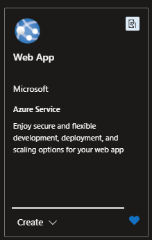

#### Pricing

As of `2024-10-04`

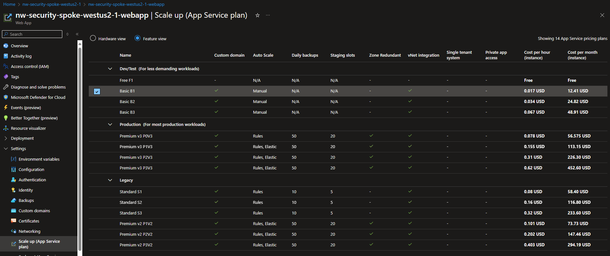

> [!IMPORTANT]
> Free tier won't allow us to create Private Endpoints.

For this excercise, you will go w/ **Basic**

#### Create

##### Basics

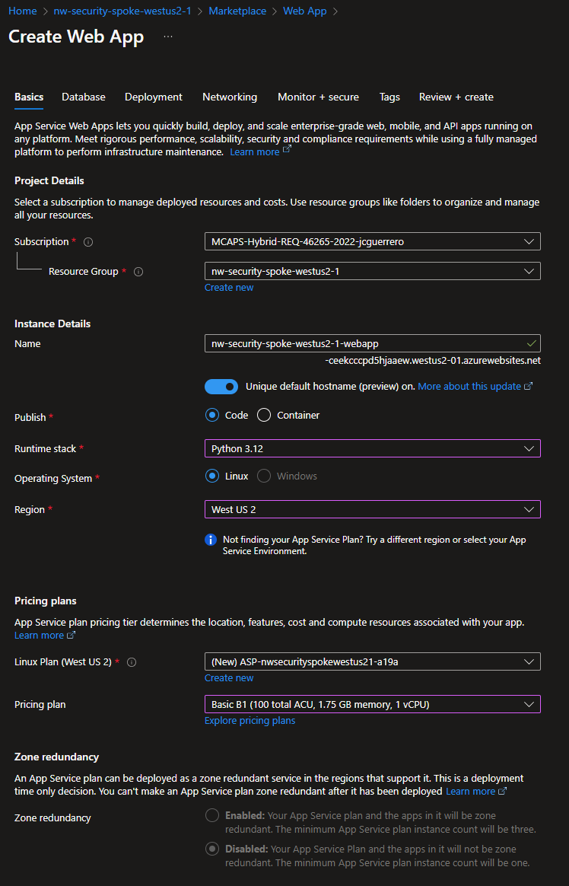

###### Instance Details

- **Name**: `{my-prefix}-spoke-{region}-{id}-webapp`
- **Publish**:
  - [x] Code: Selected
  - [ ] Container
- **Runtime Stack**: Python 3.x
- **Operating System**:
  - [x] Linux: Selected
  - [ ] Windows
- **Region**: `{region}`

##### Database

Disabled for this excercise

##### Deployment

Disabled for this excercise

###### Pricing Plans

> [!IMPORTANT]
> Free tier won't allow us to create Private Endpoints.

- **Linux Plan ({region})**: Add a new plan.
- **Pricing Plan**: Basic B1

###### Zone Redundancy

Disabled. We don't need it for this excercise.

##### Networking

> [!NOTE]
> It's a private website. If you want to access it from the outside world, we would need to setup something like **Front-door**, or **App Gateway**.

> [!IMPORTANT]
> We could Enable network injection, which would allow us to create the **Private Endpoint** and **Virtual Network Integration**. But we will do that manually, to make sure our **Private Endpoint** uses our **Private DNS Zone**.

- **Enable public access**: Off.
- **Enable network injection**: Off.

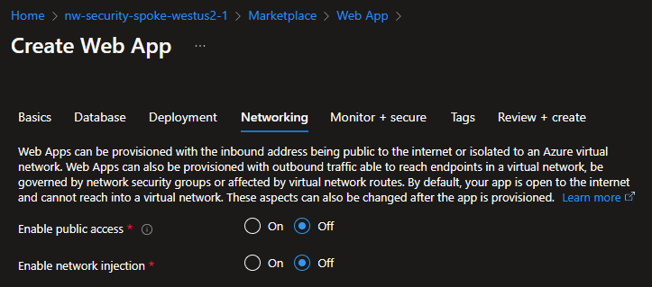

##### Review + Create

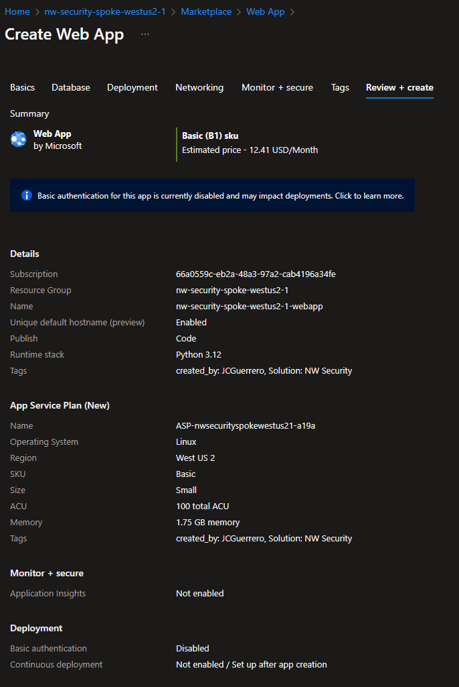

#### Diagram

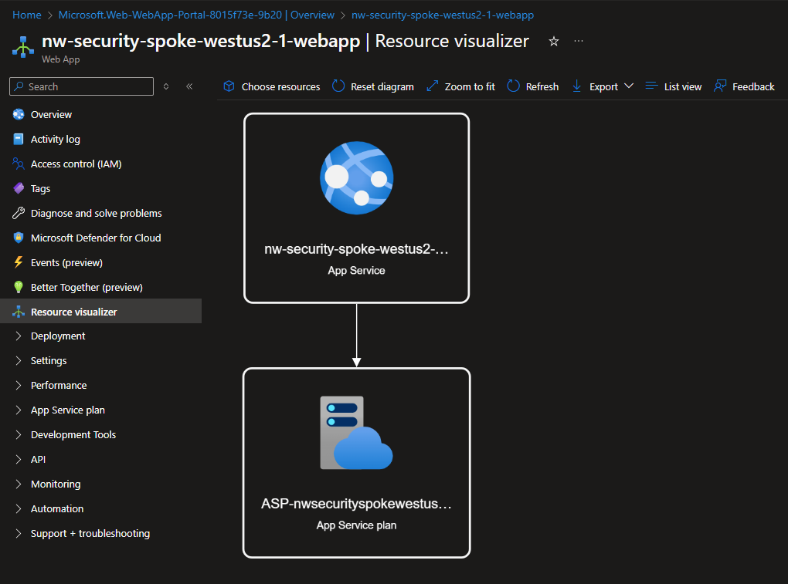

#### Overview

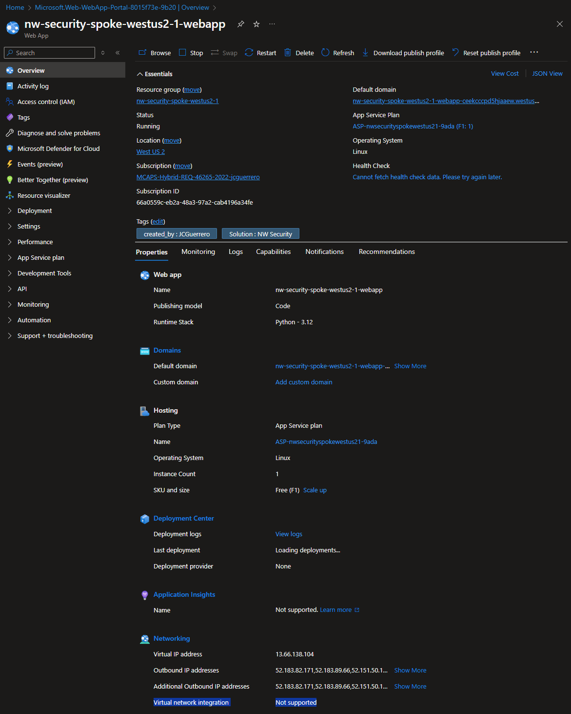

#### Virtual Network Integrations

Because we closed the **backdoor** for the `webapp` to get any kind of traffic from/to the **WWW**, we now need to redirect the traffic via our Private Virtual Networks & subnets infrastructure.

Remember that **delegated** `subnet` we created in the previous step, called `snets-webapp`?

We'll tell the WebApp to use that subnet to create IPs (NICs?) it can use for any outbound traffic.

##### Add

1. Go to Settings > Networking > Virtual Network Integration

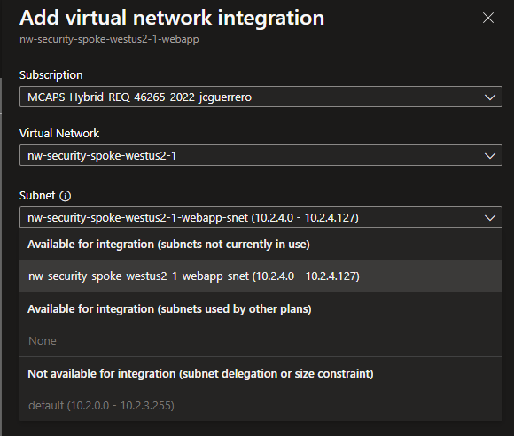

- [x] **Outbound Internet Traffic**: Checked. Ensure it goes through our delegated `webapp` subnet and not directly to the internet. Will aalso

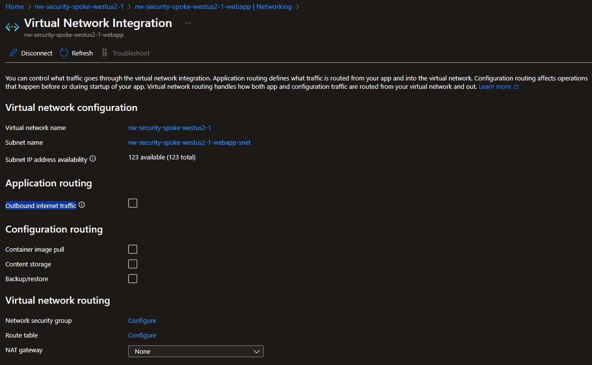

### Private Endpoint

The **Virtual Network Integrations** helps us with outgoing traffic. But we want the most important part, the **incoming** traffic! (otherwise you end up with a very expensive paper-weight).

#### Create

##### Basics

- **Name**: `{my-prefix}-spoke-{region}-{id}-webapp-pep`
- **Network Interface**: `{my-prefix}-spoke-{region}-{id}-webapp-pep-nic`
- **Region**: `{region}`

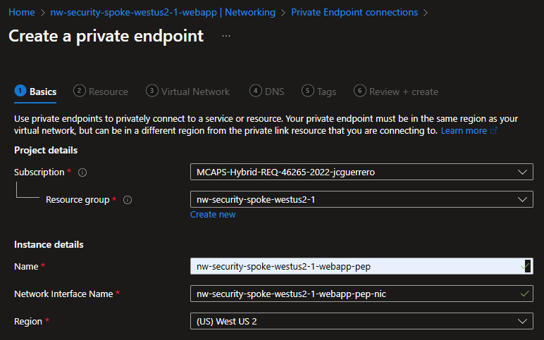

##### Resource

- **Resource type**: `Microsoft.Web/sites`
- **Resource**: `{my-prefix}-spoke-{region}-{id}-webapp`, the one you just created.
- **Target Sub-resource**: `sites`

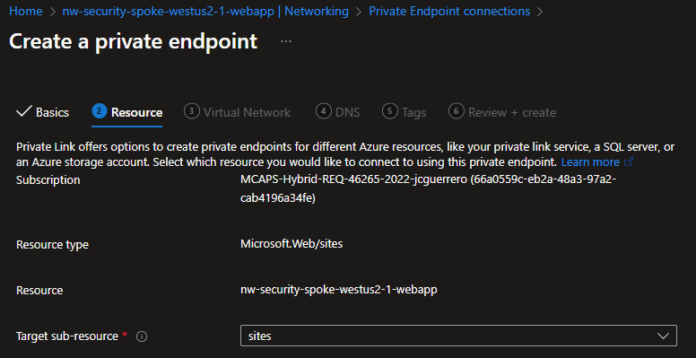

##### Virtual Network

###### Networking

- **Virtual Network**: `{my-prefix}-spoke-{region}-{id}-vnet`
- **Subnet**: `default` (NOT `webapp`, since we do NOT control that)

###### Private IP Configuration

- [x] Dynamically allocate IP address: Selected
- [ ] Static IP address

###### Application Security Groups

##### DNS

> [!NOTE]
> Eventho our `webapp` will use the **delegated** `subnet` for outgoing traffic, we still need to create a Private Endpoint for the `webapp` to use.

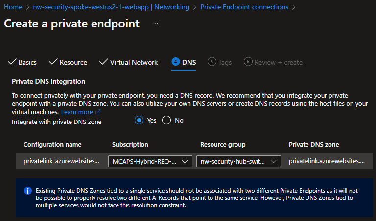

##### Review + Create

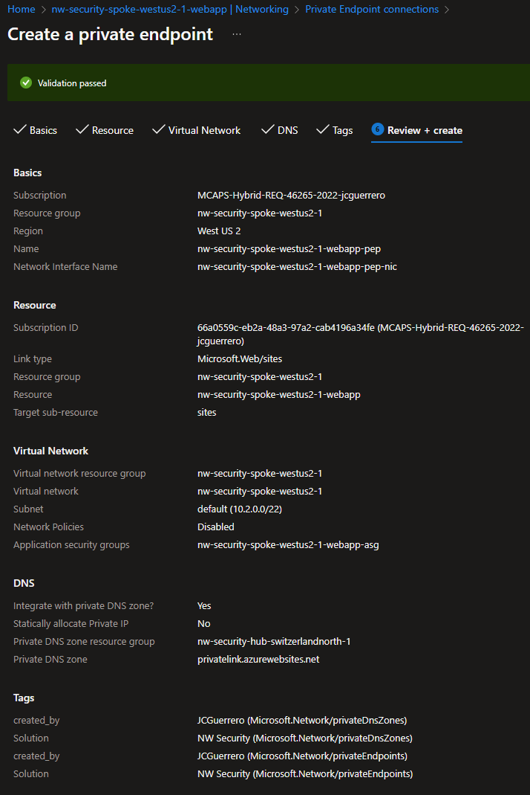

## Next Steps

[Go back to parent](./README.md)
