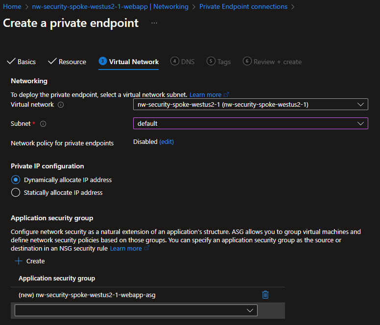

# Module 4: Create a Private WebApp in the Spoke VNet

## Goal

1. A regional Private WebApp only accessible from the Jumpbox that can access the Storage Account.
1. We will also shutdown access to the regional storage account, so only the WebApp can access it.

## Networking

- **Inbound**: From `jumpbox@default.hub`
  - via Private Endpoint
- **Outbound**: To the regional storage account
  - Via `webapp.{region}.spoke`
    - DNS Resolution
  - Through `default` subnet

## Resources

- [R]esource [G]roup (already exists): `{my-prefix}-spoke-{region}-{id}-rg`
  - [V]irtual [Net]work (already exists): `{my-prefix}-spoke-{region}-{id}-vnet`
    - Subnets
      - `default`: (already exists)
      - WebApp: `webapp` **delgated** `subnet`
    - [WebApp] resources: `{my-prefix}-spoke-{region}-{id}-webapp`
      - Service: `{my-prefix}-spoke-{region}-{id}-webapp-{os}`
      - [P]rivate [E]nd[p]oint: `{my-prefix}-spoke-{region}-{id}-webapp-pep`
        - [N]etwork [I]nterfa[c]e: `{my-prefix}-spoke-{region}-{id}-webapp-pep-nic`
        - [A]pplication [S]ecurity [G]roups: `{my-prefix}-spoke-{region}-{id}-webapp-pep-asg`
      - Virtual Network Integration: To `{my-prefix}-spoke-{region}-{id}-vnet-snet-webapp`

Where:

- `{some-short-prefix}`: Your username (i.e. `johndoe`)
- `{region}`: The region of your Hub VNet (i.e. `wesutus2`)
- `{id}`: The unique identifier of the spoke VNet (i.e. `1`)
- `{os}`: `linux|windows`

### WebApp

#### Market

Go to the Azure Portal and search for `WebApp` and click on `Create`.

#### Pricing

As of `2024-10-04`

> [!IMPORTANT]
> Free tier won't allow us to create Private Endpoints.

For this excercise, you will go w/ **Basic**

#### Create

##### Basics

###### Instance Details

- **Name**: `{my-prefix}-spoke-{region}-{id}-webapp`
- **Publish**:
  - [x] Code: Selected
  - [ ] Container
- **Runtime Stack**: Python 3.x
- **Operating System**:
  - [x] Linux: Selected
  - [ ] Windows
- **Region**: `{region}`

##### Database

Disabled for this excercise

##### Deployment

Disabled for this excercise

###### Pricing Plans

> [!IMPORTANT]
> Free tier won't allow us to create Private Endpoints.

- **Linux Plan ({region})**: Add a new plan.
- **Pricing Plan**: Basic B1

###### Zone Redundancy

Disabled. We don't need it for this excercise.

##### Networking

> [!NOTE]
> It's a private website. If you want to access it from the outside world, we would need to setup something like **Front-door**, or **App Gateway**.

> [!IMPORTANT]
> We could Enable network injection, which would allow us to create the **Private Endpoint** and **Virtual Network Integration**. But we will do that manually, to make sure our **Private Endpoint** uses our **Private DNS Zone**.

- **Enable public access**: Off.
- **Enable network injection**: Off.

##### Review + Create

#### Diagram

#### Overview

#### Virtual Network Integrations

Because we closed the **backdoor** for the `webapp` to get any kind of traffic from/to the **WWW**, we now need to redirect the traffic via our Private Virtual Networks & subnets infrastructure.

Remember that **delegated** `subnet` we created in the previous step, called `snets-webapp`?

We'll tell the WebApp to use that subnet to create IPs (NICs?) it can use for any outbound traffic.

##### Add

1. Go to Settings > Networking > Virtual Network Integration

- [x] **Outbound Internet Traffic**: Checked. Ensure it goes through our delegated `webapp` subnet and not directly to the internet. Will aalso

### Private Endpoint

The **Virtual Network Integrations** helps us with outgoing traffic. But we want the most important part, the **incoming** traffic! (otherwise you end up with a very expensive paper-weight).

#### Create

##### Basics

- **Name**: `{my-prefix}-spoke-{region}-{id}-webapp-pep`
- **Network Interface**: `{my-prefix}-spoke-{region}-{id}-webapp-pep-nic`
- **Region**: `{region}`

##### Resource

- **Resource type**: `Microsoft.Web/sites`
- **Resource**: `{my-prefix}-spoke-{region}-{id}-webapp`, the one you just created.
- **Target Sub-resource**: `sites`

##### Virtual Network

###### Networking

- **Virtual Network**: `{my-prefix}-spoke-{region}-{id}-vnet`
- **Subnet**: `default` (NOT `webapp`, since we do NOT control that)

###### Private IP Configuration

- [x] Dynamically allocate IP address: Selected
- [ ] Static IP address

###### Application Security Groups

##### DNS

> [!NOTE]
> Eventho our `webapp` will use the **delegated** `subnet` for outgoing traffic, we still need to create a Private Endpoint for the `webapp` to use.

##### Review + Create

## Next Steps

[Go back to parent](./README.md)
