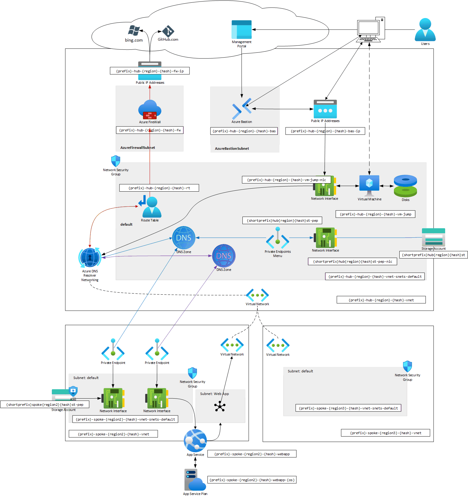

# azure-secure-networking-for-devs

## Table of Contents

> [!TIP]
> Please fully read the following sections before starting the tutorial.

- [Before you begin](../README.md)
- [Virtual Networks & IP addresses](#virtual-networks--ip-addresses)
- [Goal](#goal)
- [The Tutorial](#the-tutorial)

## Virtual Networks & IP addresses

For simplicity of this excercise, your VNets will look something like:

| Subnet   | Address range | Location           | Notes                         |
| -------- | ------------- | ------------------ | ----------------------------- |
| Hub      | `10.1.x.x`    | `switzerlandnorth` |                               |
| US Spoke | `10.2.x.x`    | `westus2`          |                               |
| EU Spoke | `10.3.x.x`    | `westeurope`       | Not included in this tutorial |

## Goal

## The Tutorial

Throughout this tutorial, you'll be creating the resources via the following modules:

1. [VNets](./01/README.md)
1. [Jump Box](./02/README.md)
1. [Blob Storage accounts](./03/README.md)
1. [Web App](./04/README.md)

Each will contain a series of Excercises that will guide you through the process of creating the resources.

**Excercises**:

1. Do this
1. Other resource
   1. Do that

When each module is completed, you'll be taken back to the Module's main page, with something like this.-

**Next Steps**:

[Go to parent](#the-tutorial)
